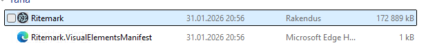
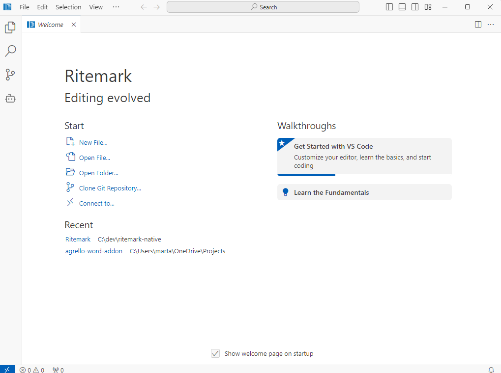
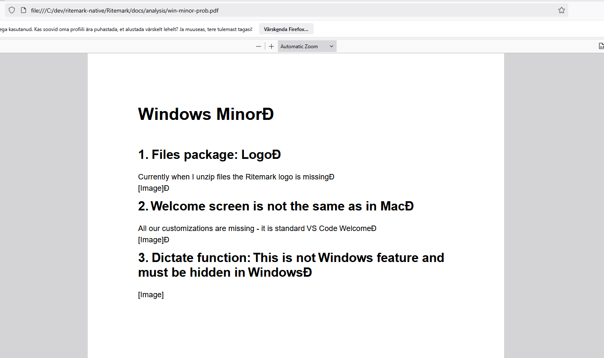
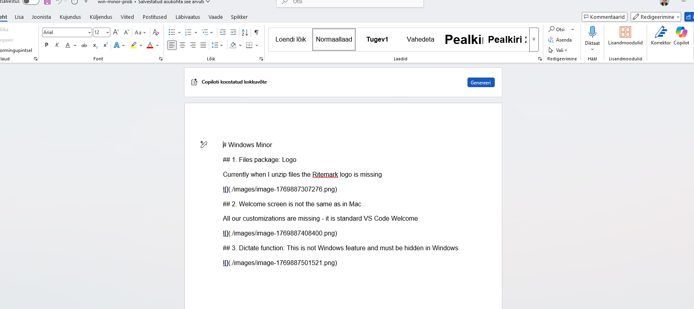

# Windows Minor Problems

## 1\. Files package: Logo

Currently when I unzip files the Ritemark logo is missing



**Analysis:** The `icon.ico` exists in `branding/icons/` (143KB), but it's not being embedded into the Windows executable during build. Need to check how the build script handles Windows icon embedding - likely in `vscode/build/gulpfile.vscode.js` or `product.json` win32 icon path.

* * *

## 2\. Welcome screen is not the same as in Mac

All our customizations are missing - it is standard VS Code Welcome



**Analysis:** RiteMark has a custom walkthrough defined in `extensions/ritemark/package.json` (see "walkthroughs" section), but VS Code's default Welcome page is separate from extension walkthroughs. Mac probably has different default behavior. Need to check if there's a product.json setting or patch needed to point the welcome screen to our walkthrough.

* * *

## 3\. Dictate function: This is not Windows feature and must be hidden in Windows


**Analysis:** The feature flag is correctly defined in `extensions/ritemark/src/features/flags.ts`:

```ts
'voice-dictation': {
  platforms: ['darwin'],  // darwin only!
  status: 'stable',
}
```

The webview is NOT checking the platform before showing the Dictate button. Need to send feature availability to webview and hide UI when `isEnabled('voice-dictation')` returns false.

* * *

## 4\. First open - Dark theme flash

When I open new Ritemark Window, it momentarily loads Dark theme and then switch back to RiteMark default light theme. It should NOT load the dark theme but light immediately.

**Analysis:** VS Code loads its internal default theme (Dark Modern) before applying extension configuration defaults. The `package.json` sets:

```json
"workbench.colorTheme": "Default Light Modern"
```

But this is applied AFTER initial load. This is a common VS Code issue. Fix options:

1.  Set default theme in `product.json` (affects initial load)
    
2.  Create a VS Code patch to change the hardcoded default theme
    

## 5. PDF Export: kummalised karakterid ja pildid puudu



**Kasutaja ootus:**
- PDF peaks olema puhtalt vormindatud
- Pildid peaksid olema embed'itud
- Tekst peaks olema loetav, ilma "garbage" karakteriteta

**Analüüs:** See on **CROSS-PLATFORM** probleem, mitte Windows-spetsiifiline.

Vaadates `extensions/ritemark/src/export/pdfExporter.ts`:

1. **Pildid** - Kood asendab pildid tekstiga `[Image]` (rida 344):
   ```ts
   .replace(/!\[.*?\]\(.+?\)/g, '[Image]')
   ```
   pdfkit toetab pilte, aga neid tuleb eraldi fetch'ida ja embed'ida.

2. **Kummalised karakterid** - Võivad olla:
   - Unicode checkboxid (☑ ☐) mis ei renderda Helvetica fondiga
   - Backslash escape'ide probleem
   - Encoding issue Windowsis (UTF-8 vs system encoding)

**Fix vajalik:** Piltide embed'imine + fondi/encoding kontrollimine.

---

## 6. Word Export: salvestab raw Markdowni



**Kasutaja ootus:**
- Word dokument peaks olema vormindatud (pealkirjad, listid, bold/italic)
- Mitte näitama `#`, `**`, `- [ ]` jne märgistust

**Analüüs:** See on **CROSS-PLATFORM** probleem.

Vaadates `extensions/ritemark/src/export/wordExporter.ts`:
- Kood tegelikult parsib markdown'i ja konverteerib docx formaati
- Headingud, listid, code blockid, bold/italic on implementeeritud

**Võimalikud põhjused:**
1. Eksporditakse vale content (TipTap HTML asemel raw markdown?)
2. Markdown parsing ebaõnnestub mingil sisendil
3. Regex'id ei matchi - nt Windows line endings (`\r\n` vs `\n`)

**Debugging vajalik:** Kontrollida, mis content jõuab `exportToWord()` funktsioonini.

---

## Kokkuvõte

| Issue | Windows-specific? | Prioriteet |
|-------|-------------------|------------|
| 1. Logo | JAH | Kõrge |
| 2. Welcome | JAH | Keskmine |
| 3. Dictate | JAH | Kõrge |
| 4. Theme flash | JAH | Madal |
| 5. PDF export | EI (cross-platform) | Keskmine |
| 6. Word export | EI (cross-platform) | Keskmine |

**Soovitus:** Issues 5-6 võiks eraldi sprinti panna, sest need on export funktsionaalsuse bugid, mitte Windows polish.