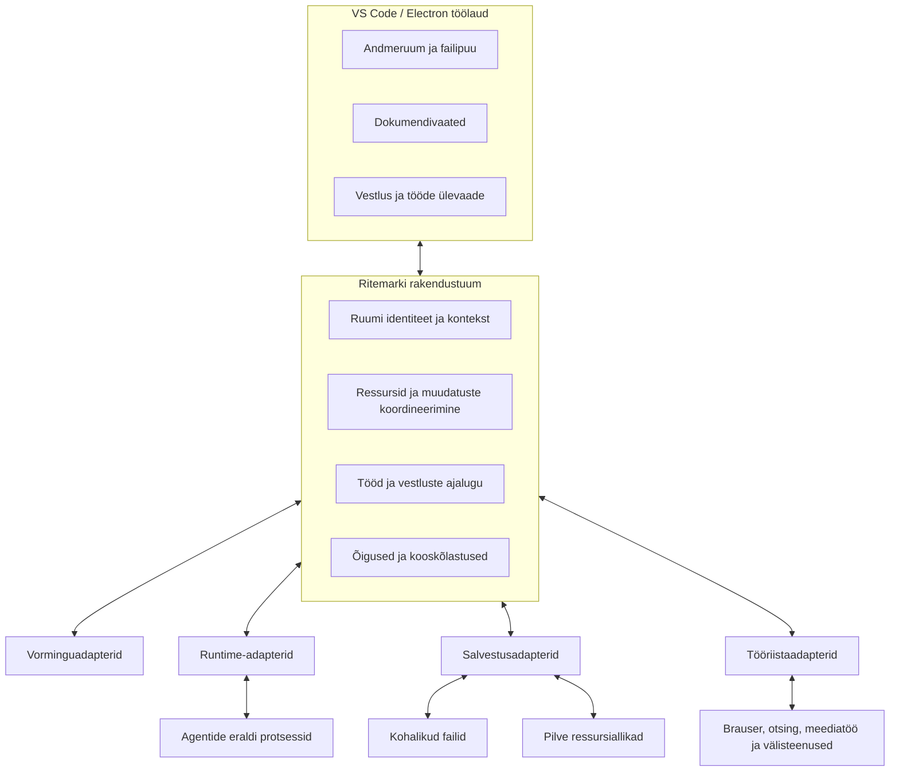

# Ritemarki sihtarhitektuur ja üleminekustrateegia

Arhitektuuriauditi strateegiline järeldus · 2026-09-13
Auditeeritud alus: `30ea2ab32d15be161991d1bb8924a4c4ca331f8c`.
Praeguse süsteemi hinnang lähtub olemasolevast auditist. Sihtarhitektuur ja
üleminek on soovitus, mitte juba teostatud lahendus.

## 1. Põhisoovitus

**Arendada Ritemarki andmeruumi ümber korraldatud, lokaalselt toimiva
modulaarse rakendusena. Selle tuum koordineerib ressursse, muudatusi ja töid;
agentide runtime’id, failivormingud ning salvestusallikad liituvad adapteritena.**

Praegune dokumendi ja failipuu keskne töölaud sobib tootevisiooniga. Ühine
agendisessiooni liides, runtime’ist sõltumatu vestlusajalugu ning olemasolevad
dokumendi sünkroniseerimise lahendused annavad edasiarendamiseks hea aluse.
VS Code’i/Electroni väljavahetamiseks audit strateegilist põhjust ei leidnud.

Peamine arhitektuuriline puudujääk on ühiste reeglite hajumine eri editoride,
UI-provider’ite, runtime’ide ja taustatööde vahel. Uus võimekus nõuab seetõttu
sageli samu otsuseid uuesti: millises ruumis töö toimub, kes omab olekut,
millist versiooni muudetakse ja millal töö loetakse lõpetatuks. Soovitatud
arhitektuur koondab need otsused ning jätab erivõimekused adapteritesse.

## 2. Tootevisioonist tulenevad põhimõtted

| Toote lubadus | Arhitektuuriline tagajärg |
| --- | --- |
| Koostöö nähtava dokumendi ja failipuu ümber | Inimene ja agent kasutavad samu ressursiidentiteete ning arusaadavat muudatuste ajalugu |
| Runtime’ist sõltumatus | Ritemark omab töö eesmärki, konteksti, lubasid ja tulemi tähendust; runtime oma mudelisessiooni ning teostusviisi |
| Vormingutest sõltumatu teadmustöö | Ressurssidel on ühine elutsükkel; vaatamise, muutmise, koostöö ja ekspordi võimekused võivad vorminguti erineda |
| Kohalikud ja pilvepõhised andmeruumid | Ruumi identiteet ja õigused on salvestuskohast lahutatud; võrgu puudumine ja sünkroonimise seis on mudelis selgelt esitatud |
| Inimese ja mitme agendi samaaegne töö | Muudatusel on autor, alusversioon, ulatus ja kinnitus; üks vaade ei otsusta kogu jagatud ressursi seisu |
| Kiire ja arusaadav töökeskkond | Vaade laadib vajalikud võimekused nõudmisel; tööde eluiga ei sõltu paneeli nähtavusest |

## 3. Ühine põhimudel

Kuus mõistet moodustavad süsteemi ühise keele. Need ei tähenda kuut uut
protsessi ega kohustust muuta iga mõiste eraldi andmebaasitabeliks.

| Mõiste | Mida see määrab |
| --- | --- |
| **Andmeruum** | Püsiv identiteet, ressursiallikad, osalised ja õigused. Töö võib kasutada kogu ruumi või selle valitud alamhulka |
| **Ressurss ja dokument** | Ressursil on identiteet, asukoht ja versioon; dokument on selle vormingupõhine tõlgendus. Mitu vaadet võivad esitada sama ressurssi |
| **Tööversioon** | Inimese või agendi pooleliolev muudatus kindla alusversiooni suhtes; see eristub salvestatud ja teistele avaldatud sisust |
| **Muudatus** | Autor, alusversioon, puudutatud ressursid, muudatuse sisu ning rakendamise tulemus. Nõusolek ja versiooni sobivus on eraldi tingimused |
| **Töö** | Eesmärk, ruumi ulatus, täitja, load, edenemine, katkestus ja väljundressursid. Vestlus võib töö algatada ning seda selgitada |
| **Osaline** | Inimene, agent või väline kirjutaja koos tema teadaolevate õiguste ja päritoluga |

Oleku autoriteet jaguneb kolmeks. Dokumendi salvestatud sisu asub valitud
ressursiallikas; pooleliolev tööversioon kuulub redigeerimissessioonile.
Ritemarki vestluste, tööde ja muudatuste metaandmetel on koordineeritud püsiv
salvestus. UI kuvab neist saadud olekut ja hoiab enda käes vaate-eelistusi.
Vestluse paneel ega vormingu renderer ei pea omama kogu töö ajalugu.

## 4. Soovitatud süsteemi ülesehitus

Skeem näitab vastutusi, mitte üks-ühele protsessipaigutust. Rakendustuum on
modulaarne kohalik kood, mille ärireeglid on UI-st ja konkreetsest runtime’ist
sõltumatud. VS Code jääb akende, editorite ja platvormi failiteenuste aluseks.

**Akendeülese omandi jaoks soovitan üht kohalikku koordineerivat
­taustaprotsessi**, mida akende laiendusprotsessid kasutavad. See vastutab
jagatud metaandmete kirjutamise ja tööde omandi eest. Renderdus ning rasked
agendi- ja meediaülesanded jäävad eraldi. Kompromiss on IPC ja taastamise
lisakeerukus; kasu on üks selge omanik. Koordinaatori seis peab taastuma
püsivast salvestusest. Rakenduse sulgemise järel töötav OS-teenus on eraldi
tootevõimekus, mitte selle ettepaneku vaikimisi eeldus.

Flow on tööde kompositsioon, transkriptsioon üks töö liik ja brauser üks
tööriistaressurss. Nad kasutavad ühiseid õiguste, edenemise, katkestuse ja
tulemi reegleid, säilitades oma eripärase teostuse.

## 5. Olulisemad arhitektuurivalikud

Üldise arengusuuna alternatiivid:

| Suund | Tugevus ja kompromiss | Hinnang |
| --- | --- | --- |
| Jätkata UI/provider’ite ümber koondatud äriloogikaga | Väike lähiaja ümberkorraldus; uued vormingud ja runtime’id peavad endiselt arvestama paljude ühiste vastutustega | Ei soovita pikaajaliseks mudeliks |
| Ühine modulaarne kohalik tuum koos adapteritega | Selged vastutused ja lokaalne töö; nõuab koordineerimise ning moodulipiiride teadlikku rajamist | Soovitatud põhisuund |
| Viia ühine tuum kohe pilveteenustesse | Jagatud ruumide keskne haldamine; varasem serveri-, identiteedi- ja offline-sünkroonimise keerukus | Lisada jagatud ruumide vajaduse järgi, mitte kogu toote lähte-eeldusena |

**Koostöö: ühine muudatuste alus ja vormingupõhine reaalajas töö.**
Soovitan kõigile ressurssidele versioonitud muudatusi. Reaalajas teksti
ühisredigeerimine lisandub seda toetavale dokumendimudelile. Keerukate
binaarvormingute puhul võivad sobida tööversioonid, muudatuste võrdlus või
redigeerimise reserveerimine. CRDT/OT ei pea muutuma kõigi failide sisemiseks
vormiks. Kompromiss on vorminguti erinev koostöö sügavus, mille UI peab
kasutajale arusaadavaks tegema.

**Agendi kirjutused: sama muudatuste tee, erinevad integratsiooniviisid.**
Ritemarki vahendatud failitööriistad esitavad muudatuse tuumale. Otsest kohalikku
failisüsteemi vajavale runtime’ile soovitan hallatud töökoopiat, kust muudatused
tuuakse ühisesse dokumendivoogu. Koopia sisaldab tööks vajalikku ulatust ning
selle haldamisel on ketta-, sünkroonimis- ja ühilduvuskulu. Töökoopia pole ise
turvasandbox: kirjutusõigused tuleb täitmiskeskkonnas eraldi jõustada.
Väliseid kontrollimatuid kirjutajaid saab jälgida ja konflikte taastada;
neile ei saa lubada sama ennetavat garantiid. Automaatrežiim võib muudatusi
kinnitada poliitika alusel; inimeselt ei pea küsima kinnitust igale sammule.

**Kohalik ja pilv: üks ressursimudel, erinev avaldamine.**
Soovitan kohaliku tööversiooni ja sünkroonimisvõimeliste salvestusadapterite
mudelit. Kohalik kinnitamine ning pilve/jagatud ruumi avaldamine on erinevad
olekud. Mitme seadme koostöö vajab ruumi tasemel jagatud koordineerimist;
ühe masina koordinaator seda ei asenda. Võrgu puudumisel lubatakse kohalikke
tööversioone seal, kus allika õigused ja võimekused seda võimaldavad, ning
taasühendumisel kooskõlastatakse versioonid. Pilvepakkuja SDK jääb adapterisse.

**Vormingud ja runtime’id: ühine leping koos erivõimekustega.**
Adapter deklareerib, mida ta oskab. Vormingul võivad olla lugemine, muutmine,
eelvaade, eksport ja koostöö; runtime’il tööriistad, manused, jätkamine ja
katkestus. Tuum juhib ühist töövoogu ning UI arvestab tegelikke võimekusi.
Sellega saab piirata vendor-loogika levikut, säilitades eristuvad võimalused.

**Jõudlus: tarne- ja tööpiir vastavalt kasutatavale võimekusele.**
Soovitan lahutada dokumendipindade, AI ja töövoogude käivitusteed ning laadida
rasked vorminguteegid esmakasutusel. Väikesed ühised osad võivad jääda jagatuks.
Raske parsimine ja arvutus viiakse sobival juhul vaate põhiloogikast worker’isse
või eraldi protsessi. Kompromiss on mõne funktsiooni pikem esmakasutus, mida
saab juhtida vajaduspõhise eellaadimisega. Töölaua algse paaniseisundi üle
otsustab üks koht; hiline käivitus austab kasutaja vahepealseid valikuid.

Õigused jäävad läbivalt tuuma jõustada: sisu esitamine ei anna sisule õigust
juhtida rakendust ning runtime’i vahetamine ei muuda ruumi õigusi. Adapterite
versioonid, sõnumilepingud ja andmemigratsioonid kuuluvad väljalaske terviklikkuse
kontrolli. Diagnostika seob ruumi, ressursi, muudatuse ja töö üle protsessipiiride;
dokumendi sisu logimine pole selleks vaikimisi vajalik.

## 6. Üleminek üldisest üksikule

| Etapp | Arhitektuuriline tulemus | Kuidas hinnata, et piir on saavutatud |
| --- | --- | --- |
| **1. Ühine mudel ja vastutuspiirid** | Põhimõistete tähendus ja omanikud on kokku lepitud; olemasolevad moodulid on nende vastutustega seostatud | Inimene ja agent viitavad samale dokumendile ning alusversioonile; iga püsiva oleku omanik on teada |
| **2. Üks terviklik kasutusjuht** | Nähtava dokumendi ja agendi koostöö viiakse tuuma kaudu algatusest muudatuse ning salvestatud tulemini; akendeülene koordineerimine on olemas | UI, runtime ja salvestus kasutavad sama muudatuse identiteeti ning tulemust; teekond töötab üle kahe akna |
| **3. Olemasolevate võimekuste üleviimine** | Sama mudelit rakendatakse teistele runtime’idele, vormingutele ja taustatööle; eraldatakse vaadete laadimispiirid | Järgmine adapter lisandub ühiseid reegleid dubleerimata; vana ja uus tee ei kirjuta sama olekut iseseisvalt |
| **4. Pilv ja mitme osalise koostöö** | Lisanduvad pilveadapter, sünkroonimine ja sobivate dokumentide reaalajas koostöö | Sama ressursi- ja muudatusemudel töötab eri seadmetes; offline-töö ja ühise versiooni taastamine on määratud |

Esimeseks terviklikuks teekonnaks sobib Markdown: olemasolev sünkroniseerimine
on tugev lähtekoht. Mudeli kavandamisel tuleb arvestada ka ühe binaarse
vormingu vajadusi, et ühine tuum ei muutuks varjatult tekstispetsiifiliseks.
Jõudluse laadimispiire saab eraldada selle üleminekuga paralleelselt.

Üleminek rajab ühised piirid olemasolevate komponentide ümber. Kõike korraga
ümber kirjutada pole põhjendatud. Konkreetne andmebaas, koostööalgoritm ja
pilveteenus valitakse seal, kus vastav etapp vajab teostusotsust; nende valimine
praegu ei lisaks strateegiale vajalikku kindlust.

## 7. Mida audit võimaldab otsustada

Soovitatud suund on **säilitada töölaud ja toimivad komponendid, koondada
ühised reeglid Ritemarki tuuma ning muuta laiendused adapteripõhiseks**.
See seob samaaegse koostöö, runtime’ist sõltumatuse ja pilveruumid ühe
arhitektuurse arenguteega.

Nõrga Windowsi täpsed jõudluseelarved, native-runtime’ide piirangud ja vormingute
reaalajas redigeerimise ulatus vajavad hilisemaid sihitud teostusotsuseid.
Need määravad adapteri ja etapi detaili ega takista praegu vastutusmudeli
valimist. Üksikvigade diagnoos ja paranduste plaan ei ole selle dokumendi ülesanne.

Tõendus: [praeguse süsteemi kaart](system-map.md),
[tootevisiooniga vastavuse analüüs](audit-report.md),
[alamsüsteemide katvus ja muutmisproovid](coverage.md),
[tehniliste leidude register](findings.md).
