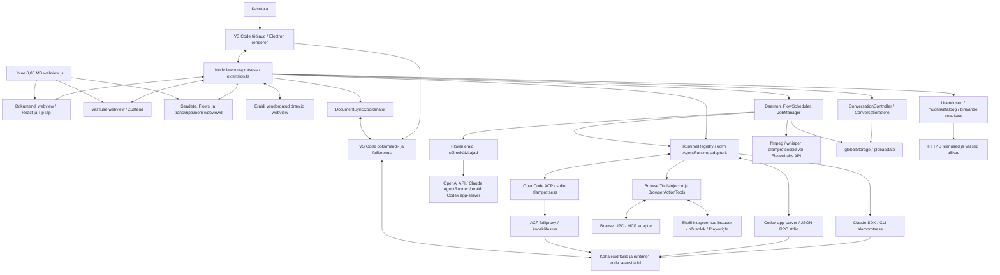
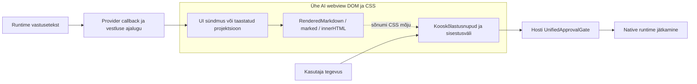
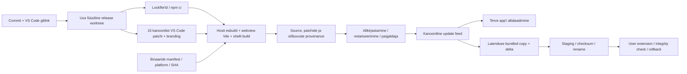

# Ritemarki tegelik süsteemikaart

Seis: lähtekoodi, sõltuvusgraafi, komponentkatsete ning macOS-i protsessi- ja webview-vaatlusega kontrollitud kaart. Kuue sooja Markdowni avamise mõõtmine eristab rendereri skriptitööd kohalikust laadimisest; [meetod](performance-observations.md) kirjeldab CPU-aeglustuse ja eraldi profiili piire. Windowsi, külmkäivituse ja browser/GPU ressursikasutuse mõõtmine on pooleli.
Alus: `30ea2ab32d15be161991d1bb8924a4c4ca331f8c`, 2026-09-13.
Viited on selle worktree lähtekoodile. Nool ei tähenda automaatselt eraldi protsessi, tehingut või õiguste kontrolli.

## Komponendid ja protsessid

Electron sisaldab ka main-, GPU-, utility- ja brauseri renderdusprotsesse; siin on Ritemarki kontrollitavad piirid. Webview on isoleeritud veebikontekst, mitte lubadus üks-ühele OS-protsesside arvust. [Tegelik inventuur](evidence/live-runtime-inventory-probe.json) salvestab kontrollitud macOS-i käivituse PID/PPID ja RSS-i. Käivituse esimeses snapshot'is oli 12 järeltulijatega protsessi, dokumendikatsete järel 15. Tingimused erinesid; see pole lekketest ega unikaalse füüsilise mälu summa.

Laienduse sisenemispunkt impordib registreerimise kõrval kõik suuremad teenusealad. Rasked agendikäivitused toimuvad hiljem alamprotsessides; import, binaari/auth-oleku uurimine ja päris mudelipäring on erinevad tegevused. Teekide olemasolu ühises failis ei tõesta nende kõigi renderdamist käivitusel.

[Native ühenduse katsed](native-runtime-observations.md) kontrollisid sama
protsessipiiri väljaspool GUI-d: Codexi kolm samaaegset algatust jagasid üht
handshake'i; ACP-l avaldati client enne selle valmimist (A15). Mõlemal lõpetas
native protsessi krahh ootel juhtpäringu veaga ja pärast tegelikku lõppemist sai
luua uue ühenduse. See ei tõenda käimasoleva mudelivooru või failitööriista taastamist.

## Oleku omanikud ja püsivus

| Mõiste | Praegune omanik / autoriteet | Püsivus ja identiteet | Piir või tagajärg |
| --- | --- | --- | --- |
| Teadmusruum | VS Code workspace; vestluses projectScope | Normaliseeritud URI-d, workspace-fail või juurkataloogid | Ühist teadmusruumi teenust ei ole. Runtime, Flows ja daemon saavad valdavalt esimese juure kohaliku path'i |
| Markdown/CSV dokument | VS Code TextDocument; koordinaator haldab disk/model/base suhet | Faili URI; VS Code save/hot-exit; elus koordinaatori konfliktisnapshotid | Koordinaator elab ühe hosti sees; välised kirjutajad ei osale järjekorras |
| Markdown/CSV nähtav vaade | TipTap või tabel; host määrab sünkroniseerimisrevisjoni | Sessioon, view epoch, revision, payload hash ja ACK | Vaade ei ole ainus tõeallikas; vananenud sõnumid on eristatavad. CSV renderer rikub siiski täieliku mudeli piiri: 10 000-ni kärbitud read saadetakse täisasendusena (A14) |
| XLSX dokument | ExcelDocument täisbinaarpuhver / Excel provider | Kohalik fsPath; custom-editor save/revert/backup | Eraldi protokoll; välise versiooni eeltingimus salvestusel puudub |
| draw.io dokument | VS Code tekstimudel + vendordatud graafi olek | SVG-s XML; täisteksti WorkspaceEdit ja save | Lõuend ei järgi väliselt uuendatud TextDocument'i; autosave eemaldas välise kujundi (A16) |
| PDF/DOCX eelvaade | Readonly custom document Buffer ja viewer | Kohalik fail; base64 bridge; watcher postitab change/delete | Teadete tarbija puudub (A17); DOCX käsitsi Refresh ja PDF reopen laadivad uue puhvri. Eelvaade, teisendus ja algvormingu redigeerimine on eri võimekused |
| Vestluse kanooniline ajalugu | ConversationController / ConversationStore | globalStorage JSON-recordid, indeks, tombstone'id, karantiin | Mutex on ühe Store'i piires. Kahe sama skoobi tegeliku hosti juhitud põimumisel kustutas eelistuse salvestus kinnitatud vastuse; uus protsess ei taastanud seda (A06) |
| Vestluse nähtav olek | AI Zustand store + hosti projektsioon | Osaliselt taastuv UI-olek; legacy storage'i migratsioon | UI-projektsioon ja runtime'i native ajalugu ei asenda kanoonilist ajalugu |
| Aktiivne agenditöö | RuntimeSession + provider'i turn/session kaardid | Vestluse ID, runtime'i opaque continuation descriptor | Host salvestab jätkamise viiteid; native session'i sisu ja tööriistakeskkond jäävad runtime'ile |
| Kooskõlastus | Runtime'i ootel päring + UnifiedApprovalGate + UI kaart | Elus promise/requestId, vestluse routing | Luba ei kinnita dokumendi versiooni; gate'il pole oma cancel/dispose API-t |
| Kavandatav failimuudatus | Native tööriista sisend või editori täispuhver | Ühine püsiv change-set puudub | Puudub kõigile kirjutajatele ühine read-version / proposal / commit / recovery leping |
| Brauseri siht | Shelli brauserimudel / aktiivne sakk ja consent | BrowserHistoryStore; sakkide elus olek | L: sama pageId-ga A→B navigeerimise järel muutis A kirjutus B lehte (A18). Queue ja ootel locatori tühistamine töötasid; keelatud fill tagastas siiski read-share'ita meta (A19) |
| Flow definitsioon | .ritemark/flows/*.flow.json; FlowStorage või avatud TextDocument | Projekti fail | Editorist jooks käib avatud mudelilt; scheduler loeb salvestatud faili |
| Flow jooks | FlowExecutor või FlowEditorProvider'i teine teostus | Elus context/outputs; ajastuse märk workspaceState'is | Sama füüsilise Flow faili tähised võivad workspace-aliastes paikneda eri andmebaasides; kaks akent käivitasid sama slot'i. Ühine ressursiomanik/claim puudub |
| Daemoni töö | Scheduler + task handler | Workspace consent; failidest loetud ajastus; DaemonResultStore | Töötab avatud rakenduse hostis; ei ole eraldi alati töötav OS-teenus |
| Transkriptsioonitöö | JobManager, engine ja AbortController | globalState inflight tähis; globalStorage SessionStore | L: uus host nimetas teise hosti elusa töö katkenuks (A20); puudub omaniku elusoleku kontroll. Töö eluiga on eraldatud webviewst ja algne host sai töö lõpetada |
| Transkripti dokument | SessionStore'i JSON; eraldi eksporditud Markdown | Audio path'i ID/fingerprint, session ID, exportPath | L: kaks kinnitatud speaker-rename'i kaotasid ühe nime ka ilma tempfaili kokkupõrketa (A06); täieliku snapshot'i baas pole kontrollitud. JSON ja eksport on eraldi olekud |
| Seaded ja võtmed | VS Code configuration / SecretStorage | Kasutaja- ja workspace-seaded, credential store | Native auth, rakenduse API võtmed ja feature flagid on eraldi kihid |
| Rakenduse versioon | Bundled app + võimalik user-extension | Product version, extension version, feed, provenance | Laienduse asendamine ja shelli paigaldamine on eri tehingud |

Tõendus: [editor coordinator](../../../../extensions/ritemark/src/editorSync/DocumentSyncCoordinator.ts), [ConversationStore](../../../../extensions/ritemark/src/conversations/ConversationStore.ts), [runtime contract](../../../../extensions/ritemark/src/runtime/AgentRuntime.ts), [UnifiedViewProvider](../../../../extensions/ritemark/src/views/UnifiedViewProvider.ts), [speech SessionStore](../../../../extensions/ritemark/src/speech/SessionStore.ts), [FlowScheduler](../../../../extensions/ritemark/src/flows/FlowScheduler.ts).

Vestluse omanikupiir on nüüd kontrollitud ka päris protsessidega:
[sama no-folder scope'i katse](shared-store-observations.md) seostas kaks elusat
kontrollerit sama failiga. Mõlemad said enne rename'i läbida revisjonikontrolli.
Sama objekti järjestus töötas; teise hosti täiskirje võis siiski kinnitatud
sündmuse asendada. Eri workspace-descriptor'ite vestlused jäävad eri scope'idesse.

## Peamised andmevood

### Inimene muudab Markdowni või CSV-d

Webview edastab kohaliku muudatuse ja sünkroniseerimisidentiteedi → host kontrollib sessiooni/vaate/revisjoni → koordinaator muudab TextDocument'i → VS Code salvestus kirjutab kettale → save receipt ja kettavaatlus kooskõlastavad baasi → host saadab vajadusel vaate snapshoti → vaade kinnitab täpse payload'i rakendamist. Kolme seisundi võrdlus säilitab konflikti, kui kohalik ja väline muutus erinevad. Auditi split-vaate ning eraldi kahe hosti katsed kinnitasid kohaliku töö säilimist ja eksplitsiitset konfliktivalikut; CSV ridade kadumise katse näitas, et õige protokoll ei tuvasta sisuliselt kärbitud täisasendust. Hosti WorkspaceEdit-undo ja TipTapi lokaalne ajalugu on eraldi: konfliktivaliku tagasivõtmine töötas hosti käsu, mitte editori Cmd-Z kaudu. See on sünkroniseerimisprotokoll; mitme osapoole ühisredigeerimise operatsioonimudel puudub.

### Agent muudab kasutaja dokumenti

Prompt + aktiivse faili/valiku kontekst → ConversationController'i aktsepteeritud turn ja dispatch receipt → vestlusele seotud RuntimeSession → native failitööriist või ACP proxy → failisüsteem → koordinaatori vaatlus → nähtava dokumendi uuendus või konflikt. Vastuse tekst/tegevussündmused naasevad eraldi vestluse salvestusse ja UI-projektsiooni.

Ühe agenditurni dokumendimuudatus ja vestluse sündmuse salvestus ei moodusta ühist tehingut. Agent võib muuta ketast enne hosti eduteadet või katkestamist. Salvestatud inimversiooni peale tehtud vana täisasendus võib välja näha tavalise välise uuendusena; dirty-buffer konflikti kaitse ei tõesta selle vältimist.

### Agendi vastuse esitamine ja tegevusnupud

[Päris webview katse](security-observations.md) tõendab punktjoonega piiri:
assistendi style-element mõjutas sõnumist väljaspool olevaid nuppe ja textarea't.
Katse kasutas sünteetilisi UI-sõnumeid; hosti gate'i ega native käivitamist ei
läbitud. Sisu CSS-i autoriteet ulatub selles webview's usaldatud tegevusnuppudeni,
kuigi nonce CSP blokeeris mõlemad proovitud inline-sündmusekäsitlejad. Eraldi
workbench'i DOM ei saanud style-elementi. Renderduse lubatud HTML/URL-i piir ja
hosti tegevuste õiguskontroll on seega kaks eri kaitset, mida tuleb säilitada.

### Taustatöö

FlowScheduler loeb due slot'i ja märgib selle running-olekusse → FlowExecutor täidab sõlmi järjest → runtime või otsene API → SaveFile node kirjutab tulemuse → ajastuse olek ja UI saavad tulemuse. Kaks scheduler'i saavad sama slot'i lugeda enne kummagi märgistust. Kahe päris akna katses olid sama füüsilise Flow faili tähised lisaks eraldi workspaceState andmebaasides: teise akna edu ei sulgenud esimese akna slot'i. Daemoni ajastus ja transkriptsiooni tööjärjekord on sellest sõltumatud, oma nõusoleku, katkestuse ja taastamise reeglitega.

### Faili eelvaade ja eksport

Provider loeb faili tervikuna → base64 sõnum → vormingupõhine parser/renderdaja. PDF/DOCX → Markdown on teisendus uude faili, mitte algdokumendi round-trip. Editor → HTML/export payload → ühine HTML pipeline → PDFKit või DOCX generaator → valitud fail. Ekspordipipeline eemaldab Ritemarki kommentaarid; pildi resolver piirab tüüpe ja jätab vigased pildid vahele. Võimekuse leping peab kirjeldama ka tähendust, päritolu ja võimalikku infokadu.

[Vormingukatsed](format-observations.md) eristavad kahte puuduvat sidet:
draw.io canvas ei järgi hosti tekstimudeli välismuudatust ning PDF/DOCX vaade ei
tarbi saabunud change/delete sündmust. PDF-i lehtede esmane renderdamine on
edasi lükatud, kuid kord renderdatud canvas'ed säilivad vaate eluea jooksul;
seda cache'i piiri ei kirjelda ühise JS faili suurus.

## Sõltuvused ja muutuste koondumine

[dependency-graph.json](evidence/dependency-graph.json) kasutab TypeScript AST-d: 384 tootmismoodulit (deklaratsioonid ja testid välja jäetud), staatilised ja literaalsed edasilükatud impordid, tüübiseoste eristus. CSS import on teadlikult väljaspool TS resolverit. Graaf ei näe arvutatud new Function laadimisi ega alamprotsessi protokollist tekkivaid sõltuvusi; need on kaardis käsitsi.

Oluline tsükkel ühendab extension.ts, ritemarkEditor.ts ja UnifiedViewProvider.ts. Tagasiservad sisaldavad meetodi sees tehtud lazy require'i: see ei tõesta moodulite laadimise riket. See tõendab, et editori send-to-agent käik jõuab kompositsiooni juure eksporditud singletonini.

[change-history.json](evidence/change-history.json) vaatleb 198 mitte-merge commit'i alates 2026-06-01 kuni aluscommit'ini. UnifiedViewProvider muutus 39, AI store 34 ja ChatInput 21 commit'is. 2–20 failiga commit'ide hulgas muutusid provider ja store koos 18 korral. See toetab vastutuste koondumise uurimist, kuid ei tõesta iseseisvalt halba arhitektuuri ega põhjenda faili tükeldamist rea-arvu järgi. Tegelikud vastutused hõlmavad auth'i, bootstrap'i, vestluse püsivust, runtime'i valikut, kooskõlastusi ja dokumendikonteksti.

[webview-build.json](evidence/webview-build.json) kinnitab ühe tegeliku IIFE, millel ei ole chunk-importide ega dynamicImports loendit. Lukustatud sõltuvustega tootmise build andis täpselt repo SHA-256 ja 8 844 955 baiti. Suurimad Rollupi renderdatud moodulipanused enne minifitseerimist on Mermaid, ELK, Mermaid parser, Cytoscape, SheetJS ja PDF.js. Need numbrid ei ole lõpliku minifitseeritud faili protsendid ega RAM-i kasutus.

## Ehitamise ja levitamise piir

Repo kontrollib platvormibinaaride manifesti, täpset source commit'i, patchitud puu päritolu, ehituse väljundi värskust, allkirju ja N-1 tagasipööramist eraldi. QA fixture'id kontrollivad nii lubatud kui keelatud olukordi. Need on tugevused. Selle auditi source-worktree ei ole release kandidaat ning edukas QA ei tõenda uusi Windowsi või macOS-i paigaldajakatseid.

Püsiva taastamise oluline keskkonnapiir: VS Code ei registreeri extension development akent kettavarukoopiatele. See selgitab auditi dev-restart'i negatiivset taastamistulemust. [Allikas ja analüüs](evidence/live-restart-mode-analysis.json). Järgnevas [tavarežiimi katses](normal-mode-observations.md) olid Markdowni/XLSX-i püsivad varukoopiad olemas, salvestamata töö taastati CDP-sulgemise järel ning tavaline Save säilitas selle. Kõiki native Quit/OS-crash/katkestatud kirjutuse juhtumeid sellest ei järeldata.

Järgmine tasand: [alasüsteemide katvus](coverage.md), [leiud](findings.md) ja [tervikhinnang](audit-report.md).
