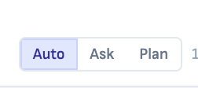
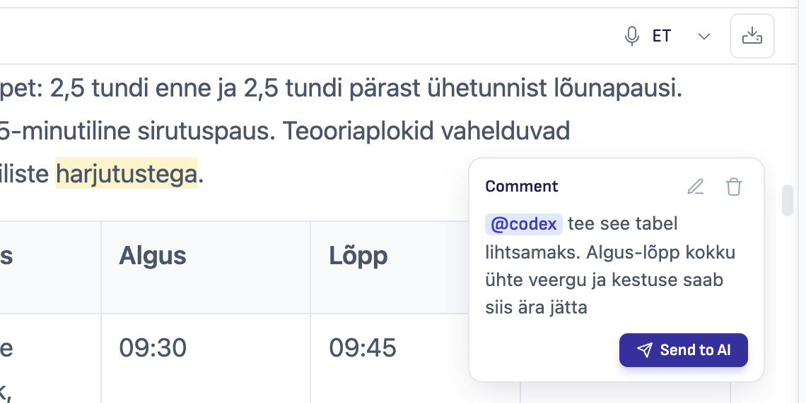
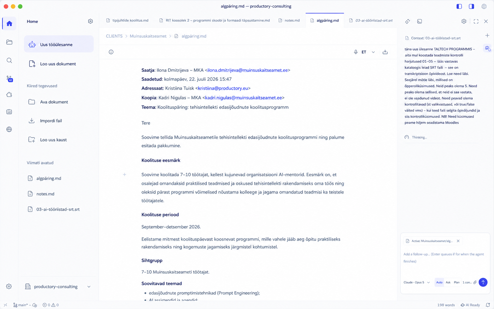
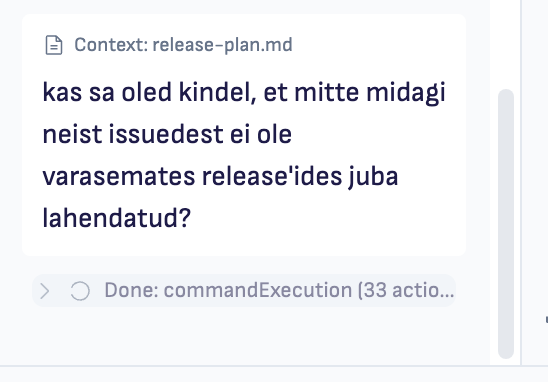

# Release Plan — v1.8.6

**Status:** In progress — Sprint 102 started 2026-08-03  
**Target:** v1.8.6  
**GitHub milestone:** [v1.8.6](https://github.com/ProductoryHQ/ritemark-native/milestone/7) — open, milestone #7  
**Release type:** Undecided — extension-only remains subject to normal release preflight and a release-specific canary; Home may still require a full app release if exact Activity Bar placement needs a VS Code shell patch  
**Release owner:** Jarmo  
**Created:** 2026-08-03  
**Depends on:** v1.8.5 (published 2026-07-29)

## Jarmo's Notes

Add raw ideas here. They do not need to be fully scoped yet.

- [ ] EU AI compliance analysis and adding necessary info to AI Chat panel and Terms and conditions. Codex/Claude - do the research!
- [ ] Claude Plan mode and plan presentation is really broken - sometimes it shows plans, sometimes it does not and does not even respond. Review how actually runtimes behave! and perhaps we should remove explicit "Auto/Ask/Plan" mode buttons? Research how ChatGPT Work and Claude Code/Cowork UI works! 
- [ ] Show a Comments button with a count badge in the editor toolbar. Open it for document-wide actions, including **Send assigned comments to AI**. 
- [ ] Home tab in railbar on left. See the visual ideas below. The user problem is confusion how to create "default markdown" documents... Think as a user and help them to get going. 
- [ ] Let users queue several follow-up prompts per chat, so rapid comment-to-agent requests wait their turn instead of being dropped.
- [ ] Improve “What’s going on?” feedback: distinguish a finished turn from approvals, questions, and background work so the UI never says “Done” while work is still active. 

## Release Thesis

**Working draft — “Clear Start, Trustworthy AI.”** v1.8.6 should remove four moments of uncertainty in the everyday Ritemark experience:

1.  **Where do I start?** Give users a persistent, task-oriented Home entry with an obvious Markdown document action.
    
2.  **What needs attention in this document?** Surface the comment workload and turn assigned comments into deliberate AI tasks.
    
3.  **What will the agent do?** Make planning, approval, and queued work reliable, truthful, and understandable across runtimes.
    
4.  **What AI am I using, and what happens to my data?** Add clear AI disclosure in the product and align the Terms and Privacy Policy with the product that actually ships.
    

This is one coherent trust-and-onboarding release, not a grab bag of unrelated features. The common promise is: **Ritemark makes the next step clear before the user commits.**

## Candidate Scope

| Candidate | Why it belongs in v1.8.6 | User impact | Delivery tier | Recommendation | Decision |
| --- | --- | --- | --- | --- | --- |
| EU AI transparency + accurate legal/privacy information | Article 50 applies from 2026-08-02, and the live Productory Terms/Privacy copy no longer matches the current app | Users can see that they are interacting with AI, which provider/model is involved, what context leaves the device, and what they must review | Extension UI + website/legal content | Include — urgent correctness work | Include |
| Reliable Plan flow + simpler agent controls | The current three-way control overpromises parity that does not exist across Claude, Codex, and OpenCode | Users can ask for a plan, always receive a reviewable result, and know when changes may happen | Extension host + AI sidebar; architecture update only if contracts change | Include — bug/safety work before visual polish | Include |
| Comments overview + assigned-comment actions | Comments are visible in the margin one at a time, but the document has no obvious total or document-level action surface | Users can see the remaining comment workload and send all comments assigned to each agent as one deliberate task | Editor webview + existing editor-to-agent relay; architecture update only if a new batch contract is required | Include as a focused comments workflow improvement | Include |
| Multi-prompt queue for composer and comments | Each chat currently holds only one queued composer prompt, while comment submissions bypass that queue and can be silently ignored by a busy runtime | Users can line up several follow-ups or comment tasks and trust that they will run in order without losing context | AI sidebar state + comment routing; no runtime-interface change expected | Include with the comments workflow — correctness before richer controls | Include |
| Persistent Home / first-task launcher | The startup Welcome already creates real Markdown documents, but users lack an obvious way back once they are working | “New document” becomes permanently discoverable; returning users get quick actions and recent work | Prototype as extension-contributed Activity Bar view; shell-tier only if exact first-position pinning requires a patch | Include if the extension-only path is good enough | Include |

Decision values: `Include`, `Defer`, `Reject`, or `Discuss`.

## Pull Request Intake Audit

Audit performed 2026-08-03 against `ProductoryHQ/ritemark-native`:

-   **Open pull requests:** 0
    
-   **Pull requests merged after v1.8.5:** 0
    
-   `main` **compared with tag** `v1.8.5`**:** identical (0 commits ahead)
    

There is currently no open or already-merged PR to include automatically in v1.8.6. New scope should come from the idea list above, GitHub issue intake, or a new sprint.

## GitHub Issue Sweep

The initial 2026-08-03 sweep reviewed all **26 issues that were open at the start**. After validating them against release history and current `main`, Jarmo accepted the delivered baseline for the 10 partial/stale issues and closed them as `completed`, with the residual scope recorded in a final comment on each issue.

**Current GitHub state after mapping:** **21 open issues**, **10 issues closed during this sweep**, and **0 open PRs**. The new [v1.8.6 milestone](https://github.com/ProductoryHQ/ritemark-native/milestone/7) contains the **7 included issues**.

### Closed as completed during the sweep

These issues are no longer release debt. Their closing comments document the narrower work that was not carried forward. If that work becomes valuable later, it starts as a new issue with current scope and acceptance criteria.

| Closed issue | Accepted delivered baseline | Residual scope recorded in the closing comment |
| --- | --- | --- |
| [#142](https://github.com/ProductoryHQ/ritemark-native/issues/142) | Semver-floor correction, watchdog, safe copy-then-overlay installation, and proven `ext.N` precedence | A release-specific end-to-end canary remains normal release validation, not unfinished issue scope. |
| [#140](https://github.com/ProductoryHQ/ritemark-native/issues/140) | Subagent lifecycle/cards plus v1.8.5 per-thread running and attention badges | Parent “Done” versus authoritative background-work truth needs a new issue if selected for v1.8.6. |
| [#124](https://github.com/ProductoryHQ/ritemark-native/issues/124) | Draw.io creation/editing and v1.8.1 export support | Additional entry points, existing-diagram insertion, and rename/reference updates need separate future issues. |
| [#123](https://github.com/ProductoryHQ/ritemark-native/issues/123) | Native `YYYY-MM-DD` picker for the canonical `date` property | Label detection, date+time, and ISO round-tripping need a new focused issue if requested. |
| [#121](https://github.com/ProductoryHQ/ritemark-native/issues/121) | Shared model catalog, discovery/resolution/provenance, and the Flows Codex-default sentinel | Chat provider-default and cache-age policy are not carried into v1.8.6 automatically. |
| [#117](https://github.com/ProductoryHQ/ritemark-native/issues/117) | Microphone-permission repair and the five-second dictation chunk baseline | VAD, streaming/process reuse, AudioWorklet, binary transport, and platform expansion must return as smaller issues. |
| [#109](https://github.com/ProductoryHQ/ritemark-native/issues/109) | Shared model discovery, resolution, catalog provenance, and selection infrastructure | Shared auth/retry/errors/telemetry need new issues against the current three-runtime architecture if revisited. |
| [#108](https://github.com/ProductoryHQ/ritemark-native/issues/108) | esbuild output, bundle guards, staged completeness checks, and extension install/activate smoke coverage | Any additional purge, parse, or production-app smoke requirement should be filed from a concrete release failure. |
| [#100](https://github.com/ProductoryHQ/ritemark-native/issues/100) | Agent-level scheduling and functional schedule frontmatter | FlowExecutor convergence is not accepted architecture; revisiting it requires a new architecture decision and issue. |
| [#87](https://github.com/ProductoryHQ/ritemark-native/issues/87) | Browser Activity Bar entry, **New Browser Tab** command, and one-click launcher | Exact native editor tab-strip placement is not retained as unfinished scope. |

### Pre-mapping open backlog verified against `main`

-   **AI and comments:** [#156](https://github.com/ProductoryHQ/ritemark-native/issues/156) has no completion-to-comment reply/status path; [#155](https://github.com/ProductoryHQ/ritemark-native/issues/155) has no chat-selection quote flow; [#132](https://github.com/ProductoryHQ/ritemark-native/issues/132) still renders the three-button `Auto / Ask / Plan` control; [#53](https://github.com/ProductoryHQ/ritemark-native/issues/53) has no agent-improvement action.
    
-   **Editor and workspace:** [#153](https://github.com/ProductoryHQ/ritemark-native/issues/153) has no footnote parser/rendering extension; [#74](https://github.com/ProductoryHQ/ritemark-native/issues/74) has no Project Home view, pinned files, or git-sync surface.
    
-   **Platform and delivery:** [#139](https://github.com/ProductoryHQ/ritemark-native/issues/139) has no configured native shell `updateUrl`; [#133](https://github.com/ProductoryHQ/ritemark-native/issues/133) is still gated to macOS with no Windows Whisper binary.
    
-   **New subsystems / architecture:** [#119](https://github.com/ProductoryHQ/ritemark-native/issues/119) has no `TaskProvider`; [#112](https://github.com/ProductoryHQ/ritemark-native/issues/112) still has only browser Recents; [#107](https://github.com/ProductoryHQ/ritemark-native/issues/107) still ships a ~7.8 MB single IIFE with `inlineDynamicImports`; [#106](https://github.com/ProductoryHQ/ritemark-native/issues/106) still exposes `sendToExtension(type: string, ...)`; [#98](https://github.com/ProductoryHQ/ritemark-native/issues/98) has no public-sharing client/backend; [#92](https://github.com/ProductoryHQ/ritemark-native/issues/92) has no Cursor runtime; [#85](https://github.com/ProductoryHQ/ritemark-native/issues/85) still routes DevTools attachments only to upstream `IChatWidgetService`.

-   **External confirmation:** [#143](https://github.com/ProductoryHQ/ritemark-native/issues/143) is an account-side Microsoft submission and clean-machine reputation check. Jarmo must confirm it before closure because repository evidence cannot prove completion.

### Mapped v1.8.6 intake

| Sprint | Included issues | Boundary |
| --- | --- | --- |
| Sprint 102 | [#163 — AI transparency and policy alignment](https://github.com/ProductoryHQ/ritemark-native/issues/163) | In-product disclosure, counsel decision, and live Terms/Privacy accuracy. |
| Sprint 103 | [#132 — truthful compact approval/Plan controls](https://github.com/ProductoryHQ/ritemark-native/issues/132), [#161 — truthful activity/background state](https://github.com/ProductoryHQ/ritemark-native/issues/161) | Safety semantics and authoritative status before visual polish. |
| Sprint 104 | [#162 — bounded multi-prompt queue](https://github.com/ProductoryHQ/ritemark-native/issues/162) | Successor to closed #95; all prompt sources share one queue. |
| Sprint 105 | [#164 — Comments command center](https://github.com/ProductoryHQ/ritemark-native/issues/164), [#165 — comment task correlation/status](https://github.com/ProductoryHQ/ritemark-native/issues/165) | Automatic AI-authored replies remain deferred in #156. |
| Sprint 106 | [#74 — Home launcher MVP](https://github.com/ProductoryHQ/ritemark-native/issues/74) | Pins, git sync, and TODO aggregation were removed from this issue. |

### Release validation and operational follow-ups

| Item | Treatment | Why |
| --- | --- | --- |
| Extension-only canary | **Normal release check, no open issue** | [#142](https://github.com/ProductoryHQ/ritemark-native/issues/142) is completed. If extension-only delivery is selected, validate the actual candidate end-to-end during release execution. |
| Shell build integrity | **Normal preflight, no open issue** | [#108](https://github.com/ProductoryHQ/ritemark-native/issues/108) is completed. Run the repository’s current QA and release preflight rather than carrying its superseded acceptance list. |
| [#143 — Windows Smart App Control reputation](https://github.com/ProductoryHQ/ritemark-native/issues/143) | **Complete as release operations, not feature scope** | Manual Microsoft submission and clean-Windows verification remain open for a confident Windows installer. |

### Deferred after mapping

| Issue | Decision | Reason |
| --- | --- | --- |
| [#156 — automatic short AI reply in source comments](https://github.com/ProductoryHQ/ritemark-native/issues/156) | **Defer** | Split from #165; requires a persisted reply/thread schema beyond the v1.8.6 status foundation. |
| [#155 — quote chat selection into composer](https://github.com/ProductoryHQ/ritemark-native/issues/155) | **Defer** | Useful parity, but unrelated to the mapped correctness path. |

### Explicitly keep out of v1.8.6

-   **Already reserved for later delivery:** [#98](https://github.com/ProductoryHQ/ritemark-native/issues/98) public cloud sharing belongs to v1.9.0; [#139](https://github.com/ProductoryHQ/ritemark-native/issues/139) native shell auto-update needs its own shell-tier release.
    
-   **Large architectural programs:** [#106](https://github.com/ProductoryHQ/ritemark-native/issues/106) typed bridge and [#107](https://github.com/ProductoryHQ/ritemark-native/issues/107) webview code-splitting each need isolated sprints.
    
-   **New subsystems or runtime expansion:** [#119](https://github.com/ProductoryHQ/ritemark-native/issues/119) task boards and [#92](https://github.com/ProductoryHQ/ritemark-native/issues/92) Cursor runtime do not fit this patch. #92 also predates the current three-runtime `AgentRuntime` architecture and must be rewritten before future consideration.
    
-   **Unrelated open extras:** [#133](https://github.com/ProductoryHQ/ritemark-native/issues/133), [#112](https://github.com/ProductoryHQ/ritemark-native/issues/112), [#85](https://github.com/ProductoryHQ/ritemark-native/issues/85), [#153](https://github.com/ProductoryHQ/ritemark-native/issues/153), and [#53](https://github.com/ProductoryHQ/ritemark-native/issues/53) remain valuable but unrelated to the current release thesis.
    

## Initial Research and Recommendations

### 1\. EU AI transparency and current policy drift

This is time-sensitive. The European Commission states that Article 50 transparency obligations generally apply from **2 August 2026**. Providers of systems that directly interact with people must design them so users are informed that they are interacting with AI, clearly and no later than the first interaction. The “it is obvious” exception should be interpreted restrictively. The Commission's July 2026 materials also describe a limited transition for some Article 50(2) marking obligations concerning systems placed on the market before that date; counsel must decide whether it affects Ritemark. See the Commission’s [Article 50 guidelines](https://digital-strategy.ec.europa.eu/en/library/guidelines-transparency-obligations-providers-and-deployers-ai-systems), [quick facts](https://digital-strategy.ec.europa.eu/en/factpages/quick-facts-transparency-rules-ai-systems), and [official Q&A](https://digital-strategy.ec.europa.eu/en/faqs/transparency-obligations-under-article-50-ai-act).

Preliminary product reading — **not legal advice**:

-   Productory is likely not merely a passive distributor: Ritemark packages interactive AI runtimes under the Ritemark product name. Confirm Productory’s exact `provider` / `deployer` role with EU counsel.
    
-   A compact, explicit disclosure in the AI panel is the safest product baseline even though the panel already says “AI”.
    
-   A visible disclaimer alone may not resolve Article 50(2). Counsel must decide whether Ritemark has a machine-readable marking/detectability obligation for generated text, whether upstream provider markings already satisfy it, and whether Ritemark preserves or strips them.
    
-   Users who publish AI-generated text on matters of public interest may have deployer labelling duties unless meaningful human review/editorial control applies. Ritemark should explain this; it should not claim that merely opening or spell-checking a draft is sufficient review.
    
-   AI literacy obligations also remain relevant. The Commission explicitly cites hallucination awareness as an example for organisations using ChatGPT. See the [official AI literacy Q&A](https://digital-strategy.ec.europa.eu/en/faqs/ai-literacy-questions-answers).
    

#### Current live-policy mismatch found on 2026-08-03

The linked [Productory Terms](https://www.productory.ai/en/terms/) and [Privacy Policy](https://www.productory.ai/en/privacy/) are dated 2026-01-27 and are materially behind the product:

-   They describe Ritemark as a **macOS-only** application, while Ritemark now ships cross-platform.
    
-   They describe **OpenAI as the only AI service**, while the app supports Claude Code/Anthropic, Codex/OpenAI, and OpenCode with several BYOK providers and OpenRouter.
    
-   The Privacy Policy says Ritemark has **no analytics or tracking** and that telemetry may be added in the future. The current extension enables opt-out PostHog analytics by default and shows a first-launch notice (`extensions/ritemark/src/analytics/posthog.ts`; `ritemark.analytics.enabled` defaults to `true`).
    
-   “Files always stay on your Mac” is too broad. Files remain local as files, but prompts, selected/active-file context, attachments, browser context, and tool results may be transmitted to the chosen AI runtime/provider when the user invokes AI.
    

**Recommendation:** treat Terms **and** Privacy Policy alignment as a release requirement, not only a marketing/legal follow-up.

#### Proposed in-product baseline

1.  Add a compact, always-accessible **AI information** entry in the chat header/composer area.
    
2.  At first use, clearly state: “You are interacting with AI.” Name the selected runtime, provider, and model.
    
3.  Explain what is sent for the current turn: prompt, explicitly attached context, active file/selection unless dismissed, and browser context when shared.
    
4.  Add a short reliability cue: AI output can be wrong; review important facts and all file/tool changes.
    
5.  Link directly to updated Ritemark AI/Privacy information and the relevant third-party provider terms.
    
6.  Keep the disclosure accessible and non-modal after first use; do not repeat a blocking warning on every message.
    

### 2\. Runtime mode audit: the control currently conflates two different concepts

The current segmented control presents `Auto / Ask / Plan` as three equivalent cross-runtime modes. The code does not provide that equivalence:

| Runtime | `Auto` today | `Ask` today | `Plan` today | Main concern |
| --- | --- | --- | --- | --- |
| Claude Code | SDK `bypassPermissions` | SDK `default`; mutating tools route to Ritemark approvals | Still `bypassPermissions`, plus a prompt reminder asking Claude to call `ExitPlanMode` | Plan is a prompt convention rather than native SDK plan mode; if the model does not call `ExitPlanMode`, there is no plan card and writes are not technically blocked |
| Codex | `approvalPolicy: never` + configured sandbox | `untrusted` + `read-only` to force approvals | Native app-server collaboration mode `plan`, with `approvalPolicy: never` | Plan transport is the strongest of the three, but plan presentation/continuation still needs end-to-end tests |
| OpenCode / ACP | Permission/write requests auto-approved | Permission/write requests shown | Same approval behavior as Ask; no plan instruction, plan event, or plan-review state | The Plan label is misleading because OpenCode does not implement a plan-first flow |

The upstream products separate these ideas more clearly:

-   **Claude Code** uses a mode selector, but its documented modes have precise safety semantics: `Manual`, `Edit automatically`, `Plan`, and (when supported) `Auto`. Native Plan blocks edits until approval; native Auto uses safety checks. Ritemark’s `Ask` and `Auto` labels do not map cleanly to those meanings. See [Claude Code permission modes](https://code.claude.com/docs/en/permission-modes).
    
-   **ChatGPT Work** treats Plan as a work phase: gather context, ask questions, present a step-by-step plan, then let the user revise or approve it. It is not presented as the third member of a permission-policy trio. See [ChatGPT Work](https://openai.com/chatgpt-work/).
    
-   **Claude Cowork** is outcome-first: users hand off a task, see steps, redirect work, and approve consequential actions. The primary product choice is Chat versus Cowork, not a permanent three-button permission rail. See [Claude Cowork](https://claude.com/product/cowork).
    
-   **Codex app-server** exposes native plan items and `turn/plan/updated` events for rich clients. Ritemark should consume and test that protocol rather than simulate Codex plans with final-answer text. See the [official app-server protocol](https://github.com/openai/codex/blob/main/codex-rs/app-server/README.md).
    

#### Recommendation for v1.8.6

Do **not** begin with a cosmetic redesign. First make the behavior safe and truthful:

1.  Treat **autonomy/approval** and **plan-first collaboration** as separate axes in the internal model.
    
2.  Use each runtime’s native plan mechanism where one exists; do not run Claude Plan on `bypassPermissions` with only a prompt reminder.
    
3.  Hide unsupported choices per runtime. OpenCode should not show Plan until it has a real plan contract.
    
4.  Make **Plan first** a one-task/session action that ends in a review surface with `Approve and continue`, `Keep planning`, and `Cancel`.
    
5.  Move persistent safety choice into one compact, accurately labelled menu (for example `Manual review` versus `Work automatically`) rather than three tiny peer buttons.
    
6.  Add a live runtime matrix test covering: plan produced, no writes before approval, refine plan, approve/continue, reject/cancel, timeout/error, and runtime switch.
    

### 3\. Comments should become a document task list, not just margin markers

Ritemark already has the important foundations: anchored and standalone comments, `@claude` / `@codex` / `@opencode` assignment, stable comment IDs, and an individual **Send to AI** action. See [Comments](../../../user/features/comments.md). The missing layer is document-level awareness and orchestration.

The count must represent **unique comments**, not rendered mark fragments. One anchored comment can span multiple blocks and appear as several DOM marks with the same `data-comment-id`; counting elements would overstate the workload. The existing margin-rail indexing and ID deduplication should become shared comment-index logic rather than being reimplemented in the toolbar.

#### Recommended v1.8.6 interaction

1.  Show a **Comments** icon with a total-count badge in the editor toolbar whenever the active document has comments.
    
2.  Open a compact document overview showing total, assigned, and unassigned counts, plus the distribution by agent.
    
3.  Use the bulk-action label **Send assigned comments to AI**. Unassigned comments are not sent.
    
4.  Group assigned comments by agent and create **one ordered task per agent**, not one chat per comment. Include each instruction, its anchored text or standalone position, stable comment ID, and the active document path.
    
5.  If several agents are targeted, show the per-agent counts before sending so the user knowingly starts multiple tasks and can avoid the parallel-chat cap.
    
6.  Keep every comment unchanged after dispatch. Sending is not resolving, accepting, deleting, or automatically applying an agent response.
    
7.  Route both individual and aggregated comment tasks through the shared prompt queue described below. Do not call a runtime send function directly when its target conversation is busy.
    

The current individual “Sent” indicator is temporary UI feedback, not persistent document state. Therefore the overview should not promise “unsent comments” in v1.8.6. Persistent sent/resolved workflow state is a separate feature.

### 4\. The prompt queue must cover every prompt source

Ritemark already queues one composer follow-up per chat while an agent is running. The queue is correctly scoped per conversation, but it is still a `conversationId → string` slot: after one item is queued, the composer is disabled until that item sends.

Comment dispatch has a more serious gap. `comment:submit` bypasses the composer queue, switches the active conversation’s pending runtime, and calls `sendAgentMessage`, `sendCodexMessage`, or `sendOpenCodeMessage` directly. Those send functions return early when the target runtime is already running. Rapid individual **Send to AI** actions can therefore disappear without a queued item or user-visible failure.

GitHub issue [#95 — Composer queue actions](https://github.com/ProductoryHQ/ritemark-native/issues/95) describes multiple queued prompts plus edit, reorder/promote, and remove. It was closed by the Sprint 99 merge on 2026-07-22, but the Sprint 99 documents and current source explicitly say that the redesign was deferred. Treat the issue as **closed but unresolved**; reopen it or create a correctly scoped successor before mapping the release.

#### Recommended v1.8.6 queue contract

1.  Replace the single string slot with an ordered, bounded `QueueItem[]` per conversation.
    
2.  Send composer follow-ups, individual comment tasks, and bulk comment tasks through the same enqueue/dequeue path.
    
3.  Snapshot each item’s prompt, source, target runtime/agent, mode, document and comment IDs, attachments, and relevant context when it is queued. Later thread or runtime switches must not retarget it.
    
4.  Drain FIFO only when the conversation is truly ready for a new turn. A pending approval, question, or plan review is **not** idle and must pause the queue.
    
5.  Show a compact **Queued (n)** list with preview, edit, remove, and reorder controls. Keep the next item and its target clear.
    
6.  Route a comment task to a stable conversation for its assigned agent. Never change the active chat’s runtime merely because a document comment targets another agent.
    
7.  If an item fails, retain it with `Retry` / `Remove`; do not silently drop it or discard the remaining queue.
    
8.  Keep the first version session-local and bounded. A suggested cap is 10 items per chat with an explicit “Queue full” state; durable background work across app restarts is separate scope.
    

This is more than composer polish. It is the delivery guarantee behind rapid comment actions and should be implemented in store-level conversation orchestration, not in a React effect that only observes the currently visible composer.

### 5\. Home should be a re-entry point, not a second onboarding system

Sprint 43 already implemented one canonical Welcome surface with a real `ritemark.newDocument` command, recent files, `New table`, `New flow`, and launch checks. See the [Welcome onboarding summary](../../sprints/sprint-43-welcome-onboarding/README.md) and [locked principles](../../sprints/sprint-43-welcome-onboarding/research/welcome-onboarding-principles.md).

The remaining user problem is therefore not “Ritemark cannot create a Markdown document.” It is: **after the Welcome page is gone, users do not know how to get back to a task-oriented starting point.**

Recommended Home MVP:

-   Persistent Home icon in the left Activity Bar.
    
-   One dominant action: **New document** with explicit helper copy “Markdown (.md)”.
    
-   Secondary action: **New AI task** (opens a fresh agent chat without inventing a second task system).
    
-   Quick actions: Open document, Import file, New folder.
    
-   Recently opened documents/folders.
    
-   Reuse the existing `ritemark.newDocument`, `ritemark.newChat`, and open-folder commands; do not fork document-creation logic.
    
-   Do not duplicate the full Welcome hero, training content, or launch checks in the sidebar.
    

**Delivery recommendation:** prototype Home as an extension-contributed Activity Bar view first. If the view is usable but cannot be pinned reliably as the first icon through supported extension APIs, make “first position” a deliberate full-app tradeoff rather than casually adding another VS Code patch.

## User-Facing Headlines

*Working copy; approve after scope is selected.*

1.  **A clear place to start** — create a Markdown document or start an AI task from Home.
    
2.  **Comments and follow-ups that stay in line** — queue assigned feedback and additional prompts without losing work.
    
3.  **Plans you can actually review** — agents plan first when asked and never silently cross into execution.
    
4.  **Know your AI** — see which runtime, provider, model, and context are involved before relying on the answer.
    

## Scope Envelope

### In scope

-   AI transparency/product disclosure baseline in the AI panel.
    
-   Live Terms and Privacy Policy correction, with provider/data-flow/analytics accuracy.
    
-   Audit-first repair of Plan and approval semantics across Claude, Codex, and OpenCode.
    
-   Simplified, capability-aware mode UI after the runtime behavior is fixed.
    
-   Document-level Comments button with a unique-comment count and overview.
    
-   **Send assigned comments to AI**, grouped into one task per assigned agent.
    
-   Bounded multi-item queue per chat, shared by composer and comment submissions, with item preview/edit/remove/reorder.
    
-   Queue items retain their original runtime, source, attachments, and context and pause at human-review checkpoints.
    
-   Extension-first Home prototype that reuses existing document/chat commands.
    

### Out of scope / explicitly deferred

-   Turning Ritemark into a high-risk-domain compliance system or offering legal conclusions to users.
    
-   Building a custom machine-readable AI-content marking scheme before counsel and standards research establish Ritemark’s obligation and the correct interoperable format.
    
-   Pretending all three runtimes have identical capabilities.
    
-   Cross-document comment batching, automatic comment resolution, persistent sent/read status, threaded discussions, or automatic application of agent output.
    
-   Destructive document-wide comment actions such as “Delete all”.
    
-   A global priority scheduler across chats, durable background execution after app restart, or an unbounded queue.
    
-   The full [#74](https://github.com/ProductoryHQ/ritemark-native/issues/74) Project Home scope: pinned files, git push/pull, and project-wide TODO aggregation.
    
-   Automatic AI-authored replies or a threaded reply schema inside comments from [#156](https://github.com/ProductoryHQ/ritemark-native/issues/156), unless Jarmo explicitly expands the comments candidate.
    
-   A second full-screen onboarding/Welcome implementation.
    
-   Pulling Ritemark Cloud scope forward from v1.9.0.
    

## Feature-Complete Definition

- [ ] Release thesis and user-facing headline are agreed.
- [x] EU counsel confirms Productory’s AI Act role and the Article 50(1)/(2)/(4) measures required for Ritemark.
- [x] AI panel clearly identifies the AI interaction, runtime/provider/model, shared context, and reliability limitations by first interaction; the one-time notice has an explicit **Don’t show again** action and AI information remains reachable from the sidebar and Settings.
- [ ] Live Terms and Privacy Policy match current platforms, AI providers, authentication paths, context sharing, analytics, and user controls.
- [ ] Claude and Codex Plan flows are proven end-to-end; unsupported Plan UI is absent for OpenCode.
- [ ] No runtime can mutate files while a genuine Plan-first review is pending.
- [ ] The toolbar badge matches the active document's unique anchored and standalone comment count, including multi-block comments.
- [ ] “Send assigned comments to AI” excludes unassigned comments, previews per-agent counts, and creates at most one ordered task per assigned agent.
- [ ] Bulk sending never deletes, resolves, or edits a source comment and remains scoped to the active document.
- [ ] Each chat can hold several ordered prompts; composer, individual-comment, and bulk-comment submissions use the same queue.
- [ ] No busy-runtime submission is silently dropped, duplicated, or sent to a different thread/runtime than the one captured at enqueue time.
- [ ] Queue draining pauses for approvals, questions, and plan review; failed items remain visible with recovery actions.
- [ ] Queued items can be reviewed, edited, reordered, and removed without affecting another chat's queue.
- [ ] Home exposes one obvious “New document — Markdown (.md)” action and reuses the existing creation command.
- [x] Every included item is linked to a GitHub issue and release sprint.
- [x] GitHub milestone `v1.8.6` exists and contains the included issues.
- [ ] Sprint tracker lists every included PR as merged or explicitly deferred.
- [ ] User-facing behavior has release notes and changelog coverage.
- [ ] Required QA and release gates are completed for the chosen delivery tier.

## Sprint Map

The critical path is **Sprint 103 → Sprint 104 → Sprint 105**: truthful lifecycle state must exist before queue auto-drain, and comments must consume the shared queue rather than invent another send path. Sprint 102’s counsel work and Sprint 106’s extension prototype can progress independently, but each sprint still uses its own branch and approval gate.

| Sprint | Purpose | Issues | Dependency | PR | Status |
| --- | --- | --- | --- | --- | --- |
| [Sprint 102 — AI Transparency and Policy Alignment](./sprint-102-ai-transparency/sprint-plan.md) | AI information UI, first-interaction disclosure, accurate Terms/Privacy, counsel decision | #163 | v1.8.5 + Productory policy publishing | [native #166](https://github.com/ProductoryHQ/ritemark-native/pull/166) ready; [web #77](https://github.com/jarmo-productory/ritemark-web/pull/77) merged | Review ready |
| [Sprint 103 — Truthful Agent Plans and Activity State](./sprint-103-agent-truth/sprint-plan.md) | Enforced Plan behavior, compact capability-aware control, truthful completion/background state | #132, #161 | v1.8.5 | TBD | Planned |
| [Sprint 104 — Reliable Multi-Prompt Queue](./sprint-104-prompt-queue/sprint-plan.md) | Bounded per-chat queue shared by composer and comment prompts | #162 | Sprint 103 | TBD | Planned |
| [Sprint 105 — Comments Command Center](./sprint-105-comments-command-center/sprint-plan.md) | Unique comment count, overview, per-agent batch dispatch, comment task status foundation | #164, #165 | Sprint 104 | TBD | Planned |
| [Sprint 106 — Home and First-Task Launcher](./sprint-106-home-launcher/sprint-plan.md) | Extension-first Home MVP reusing document/chat commands | #74 | v1.8.5; delivery-tier decision during prototype | TBD | Planned |

## Issue Intake

| Issue | Candidate | Decision | Sprint | Notes |
| --- | --- | --- | --- | --- |
| [#163](https://github.com/ProductoryHQ/ritemark-native/issues/163) | AI transparency + policy alignment | Include | Sprint 102 | Counsel decision and live policy publication are part of done. |
| [#132](https://github.com/ProductoryHQ/ritemark-native/issues/132) | Reliable Plan flow + simpler controls | Include | Sprint 103 | Rescoped to truthful runtime semantics plus compact UI. |
| [#161](https://github.com/ProductoryHQ/ritemark-native/issues/161) | Truthful completion/activity state | Include | Sprint 103 | New successor for the residual idea after completed #140. |
| [#162](https://github.com/ProductoryHQ/ritemark-native/issues/162) | Multi-prompt queue | Include | Sprint 104 | New successor to closed #95 covering every prompt source. |
| [#164](https://github.com/ProductoryHQ/ritemark-native/issues/164) | Comments command center | Include | Sprint 105 | Count, overview, per-agent confirmation, and queue-based dispatch. |
| [#165](https://github.com/ProductoryHQ/ritemark-native/issues/165) | Comment task correlation/status | Include | Sprint 105 | Split from #156; automatic AI replies remain deferred. |
| [#156](https://github.com/ProductoryHQ/ritemark-native/issues/156) | Automatic AI reply in comments | Defer | n/a | Reply/thread schema explicitly excluded from v1.8.6. |
| [#74](https://github.com/ProductoryHQ/ritemark-native/issues/74) | Home / first-task launcher | Include | Sprint 106 | Rescoped to launcher/recent-work MVP; pins, git sync, and TODOs removed. |
| [#143](https://github.com/ProductoryHQ/ritemark-native/issues/143) | Windows release reputation | Discuss | n/a | Manual release operation, not an implementation sprint. |

## Sprint / Issue / PR Tracker

| Sprint | Branch | PR | Issues | Merge status | QA status | Release-note status |
| --- | --- | --- | --- | --- | --- | --- |
| sprint-102-ai-transparency | `sprint-102-ai-transparency` | [native #166](https://github.com/ProductoryHQ/ritemark-native/pull/166); [web #77](https://github.com/jarmo-productory/ritemark-web/pull/77) | #163 | web merged and live; native ready for review | Automated QA passed; CDP verified notice persistence and Settings entry; Jarmo confirmed OpenCode/offline/link checks; counsel approval received; web production Playwright passed 86/86 | Sprint 102 draft complete |
| sprint-103-agent-truth | `sprint-103-agent-truth` | TBD | #132, #161 | not started | not run | not drafted |
| sprint-104-prompt-queue | `sprint-104-prompt-queue` | TBD | #162 | not started | not run | not drafted |
| sprint-105-comments-command-center | `sprint-105-comments-command-center` | TBD | #164, #165 | not started | not run | not drafted |
| sprint-106-home-launcher | `sprint-106-home-launcher` | TBD | #74 | not started | not run | not drafted |

## Risks and Constraints

| Risk | Severity | Retirement plan | Status |
| --- | --- | --- | --- |
| Live Terms/Privacy copy is factually behind the product | High | Update both policies with counsel and verify every product/data-flow claim against the shipping app before release. | Open |
| Article 50 role and machine-readable marking scope are unresolved | High | Counsel review completed; detailed legal analysis is retained outside the repository. | Retired |
| Claude Plan currently uses `bypassPermissions` | High | Replace prompt-only planning with a technically enforced no-write plan phase and adversarially test it. | Open |
| Mode names imply parity that does not exist | High | Capability-map the UI and hide unsupported modes; test every visible choice against every runtime. | Open |
| Comment badge overcounts split or multi-block anchors | Medium | Build the badge and margin rail on one ID-deduplicated comment index; test anchored, standalone, split, added, and deleted comments. | Open |
| Bulk comment dispatch creates chat/context noise or exceeds the parallel-chat cap | Medium | Preview per-agent counts, group comments into one task per agent, and let the user cancel before fan-out. | Open |
| “Sent” is mistaken for “resolved” or durable workflow state | Medium | Leave comments intact, use dispatch-only wording, and explicitly defer persistent sent/resolved state. | Open |
| Busy-runtime comment submissions are silently dropped | High | Route every prompt source through one store-level queue and add rapid multi-submit regression tests for all three runtimes. | Open |
| Queue auto-drain crosses an approval, question, or plan-review boundary | High | Define “ready for next turn” explicitly and block dequeue while any human checkpoint is pending. | Open |
| Queued work is retargeted after a thread/runtime/context switch | High | Store target conversation, runtime, mode, source context, and attachments on each immutable queue item. | Open |
| The old #95 is completed but the new queue contract has no issue yet | Medium | Retired by creating and mapping successor #162. | Retired |
| Extension-only delivery is not validated for the actual v1.8.6 candidate | High | Run a release-specific end-to-end canary during release execution; fall back to a full app release if it fails. | Open |
| Closed legacy issues are accidentally treated as current release debt | Medium | Retired for mapping: #161–#165 were created where fresh scope was required; closed issues stay closed. | Retired |
| Home duplicates the canonical Welcome surface | Medium | Scope Home to quick re-entry and reuse existing commands/data; no second onboarding content stack. | Open |
| Exact Home icon placement may force shell-tier scope | Medium | Prototype supported extension contribution first; escalate to patch/full-app only with an explicit decision. | Open |
| v1.9.0 Cloud Sharing is already planned separately | Medium | Keep v1.8.6 focused and avoid silently pulling cloud scope out of the v1.9.0 release plan. | Open |

## Documentation / Release Assets

- [ ] `docs/CHANGELOG.md`
- [ ] `docs/releases/v1.8.6/release-notes.md`
- [ ] `docs/releases/v1.8.6/github-release-notes.md`
- [ ] `docs/releases/v1.8.6/TEST-CHECKLIST.md`
- [ ] Supporting user documentation, if behavior changes
- [ ] Live Productory Terms of Service
- [ ] Live Productory Privacy Policy
- [x] In-app AI information/disclosure copy approved by counsel
- [x] Live EN/ET Ritemark AI-information pages and localized footer links
- [ ] Screenshots and social/announcement assets, if needed

## Decisions Needed

- [x] Approve the working thesis: “Clear Start, Trustworthy AI.”
- [x] Include the five mapped candidates and defer the unmapped backlog.
- [x] Counsel review of Productory/Ritemark’s role and Article 50 treatment is complete; detailed legal analysis is retained outside the repository.
- [x] Counsel raised no additional Article 50 implementation change for the approved Sprint 102 scope.
- [ ] Should the user-facing safety menu say `Manual review / Work automatically`, or use another two-state vocabulary?
- [ ] Is “Plan first” a one-turn action or a session state? Recommendation: session state that resets after approval/cancel.
- [x] Comments badge shows the total unique-comment count; the overview shows assigned and unassigned subsets.
- [x] Use **Send assigned comments to AI** and one ordered task per selected agent.
- [x] Let the confirmation exclude agent groups before dispatch.
- [x] Create [#162](https://github.com/ProductoryHQ/ritemark-native/issues/162) as the successor to closed #95 for composer and comment-originated prompts.
- [x] Use a per-chat queue cap of 10 items with a clear full state.
- [x] Support edit, remove, reorder, and retry; drag-and-drop polish is optional.
- [x] Do not persist queued work across app restart in v1.8.6; warn before closing with unsent items.
- [ ] Where should an assigned comment open? Recommendation: reuse an idle matching-agent chat or create one after confirmation; never retarget an unrelated active chat.
- [x] Split #156: include correlation/status in [#165](https://github.com/ProductoryHQ/ritemark-native/issues/165); defer automatic replies/thread schema in #156.
- [x] Include newly scoped background-work truth issue [#161](https://github.com/ProductoryHQ/ritemark-native/issues/161); do not reopen completed #140.
- [x] Limit #74 to the Home launcher/recent-work MVP; pinned files, git sync, and TODOs are removed.
- [ ] Is extension-contributed Home sufficient, even if exact first-icon placement is not guaranteed?
- [ ] If extension-only delivery is selected, run a release-specific production canary as a normal release check; otherwise choose a full app release.
- [ ] If Home forces a full app release, run current QA/release preflight and complete #143 Windows reputation operations.
- [ ] Confirm whether #143 was already completed in Microsoft’s portal; repository evidence cannot answer this.
- [x] Create and milestone all seven included GitHub issues: #74, #132, and #161–#165.
- [x] Defer #156 automatic replies, #155 chat quoting, Cloud Sharing, and the unrelated open backlog.
- [x] Keep the first-use AI notice one-time; replace the ambiguous dismiss X with an explicit **Don’t show again** action.
- [x] Add an **AI information** link at the end of Ritemark Settings.

## Next Planning Actions

1.  Publish the counsel-approved Productory Terms and Privacy corrections and verify them from the packaged release candidate.
    
2.  Review and merge native PR #166 after its ready-for-review handoff; keep Sprint 102 open until the approved live policy pages are verified.
    
3.  Author and approve Sprint 103’s SDD artifacts before its branch/code phase.
    
4.  Execute the critical engineering path one sprint/branch at a time: Sprint 103 → Sprint 104 → Sprint 105.
    
5.  During Sprint 106’s first phase, decide whether supported extension placement is sufficient; update the release tier before any shell patch is attempted.
    
6.  After all included sprints merge, satisfy the feature-complete checklist, run release preflight, and choose extension-only versus full-app execution.
    

## Decision Log

| Date | Decision | Source |
| --- | --- | --- |
| 2026-08-03 | Open v1.8.6 for joint idea intake; do not prefill scope without Jarmo's priorities. | Jarmo |
| 2026-08-03 | No open or post-v1.8.5 merged PRs are available for automatic inclusion. | GitHub audit |
| 2026-08-03 | Frame five scoped candidates around four trust moments: clear start, actionable comments, reliable agent behavior/queued work, and transparent AI use. | Initial synthesis |
| 2026-08-03 | Treat Terms and Privacy Policy correction as release scope because the live text is materially behind the shipping product. | Product/legal audit |
| 2026-08-03 | Do not redesign the Auto/Ask/Plan control until native runtime behavior and no-write guarantees are audited end-to-end. | Runtime code audit |
| 2026-08-03 | Frame comments as a document-level workload: count unique comments and dispatch assigned feedback as one task per agent without auto-resolving it. | Comments workflow audit |
| 2026-08-03 | Replace the one-slot composer queue with a shared per-chat prompt queue; current comment dispatch can be dropped when its target runtime is busy. | Queue/routing audit |
| 2026-08-03 | Treat issue #95 as closed but insufficient for the new queue contract; create a successor before mapping. | GitHub + source audit |
| 2026-08-03 | Build Home as re-entry into existing commands, not as a second onboarding system. | Welcome/Home audit |
| 2026-08-03 | Recommend #132, the MVP subset of #74, and a new successor to #95 for intake; keep #156 and a freshly scoped background-work indicator as product decisions. | GitHub issue sweep |
| 2026-08-03 | Re-audit all 26 open issues against current code and releases: none is demonstrably fully complete; 10 are partial/stale, 15 remain unimplemented, and #143 needs external confirmation. | GitHub closure validation |
| 2026-08-03 | Accept the delivered baseline for #100, #87, #142, #140, #124, #123, #121, #117, #109, and #108; add residual-scope comments and close all 10 as completed. Any future residual work gets a new issue. | Jarmo + GitHub cleanup |
| 2026-08-03 | Draft five release-bound sprints: AI transparency; agent truth; prompt queue; comments command center; Home launcher. Critical path is Sprint 103 → 104 → 105. | Sprint planning |
| 2026-08-03 | Jarmo approved the five-sprint map; move v1.8.6 to `Mapped`. | Jarmo |
| 2026-08-03 | Create GitHub milestone v1.8.6 (#7); map #74, #132, and new issues #161–#165. Rescope #74/#132, split #156, and keep #156 outside the milestone. | GitHub mapping |
| 2026-08-03 | Start Sprint 102 on `sprint-102-ai-transparency` in both `ritemark-native` and `ritemark-web`; existing unrelated working-tree changes remain outside sprint commit scope. | Jarmo + sprint start |
| 2026-08-03 | Implement Sprint 102 disclosure UI and accuracy fixes, publish paired EN/ET AI-information content on the web branch, and draft Productory policy corrections for counsel. No feature flag or architecture-contract change is needed. | Sprint 102 implementation |
| 2026-08-03 | Merge ritemark-web PR #77, verify both localized AI-information pages and footer links live, and record 86/86 production Playwright coverage. Productory Terms/Privacy remain an external counsel/publication gate. | Sprint 102 web publication |
| 2026-08-03 | Keep the first-use disclosure one-time, expose its persistence as an explicit **Don’t show again** action, and add a stable **AI information** link at the end of Settings. | Jarmo + Sprint 102 follow-up |
| 2026-08-03 | Approve the final **Don’t show again** action and Settings footer link after reviewing them together in the dev build. | Jarmo |
| 2026-08-03 | Record the external publication boundary: `ritemark-web` can host the AI-information routes, but Productory Terms/Privacy live elsewhere and remain blocked on counsel + site-owner publication. | Cross-repo audit |
| 2026-08-03 | Confirm OpenCode, offline, and link-handling manual QA; record that counsel approval was received. Productory policy publication and packaged-candidate verification remain external release gates. | Jarmo |
