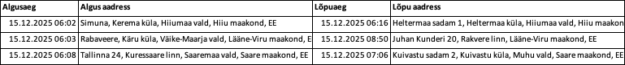

Testing table pasting

# Google Docs

| Column 1 | Column 2 | Column 3 |
| --- | --- | --- |
| Value | Value | Value |
| Value | Value | Value |

# MS Word

Copies table as image!

# Excel

Copies as image

# Wikipedia

| # | Nimi | Asus ametisse | Lahkus ametist | Partei | Asepresidendid |
| --- | --- | --- | --- | --- | --- |
| 1 | .jpg) [George Washington](https://et.wikipedia.org/wiki/George_Washington) | [1789](https://et.wikipedia.org/wiki/1789) | [1797](https://et.wikipedia.org/wiki/1797) | parteitu | [John Adams](https://et.wikipedia.org/wiki/John_Adams) |
| 2 |  [John Adams](https://et.wikipedia.org/wiki/John_Adams) | [1797](https://et.wikipedia.org/wiki/1797) | [1801](https://et.wikipedia.org/wiki/1801) | [föderalist](https://et.wikipedia.org/wiki/Ameerika_%C3%9Chendriikide_F%C3%B6deralistide_Partei?action=edit&redlink=1) | [Thomas Jefferson](https://et.wikipedia.org/wiki/Thomas_Jefferson) |
| 3 |  [Thomas Jefferson](https://et.wikipedia.org/wiki/Thomas_Jefferson) | [1801](https://et.wikipedia.org/wiki/1801) | [1809](https://et.wikipedia.org/wiki/1809) | [demokraat-vabariiklane](https://et.wikipedia.org/wiki/Demokraatlik-Vabariiklik_Partei?action=edit&redlink=1) | [Aaron Burr](https://et.wikipedia.org/wiki/Aaron_Burr) ja [George Clinton](https://et.wikipedia.org/wiki/George_Clinton) |