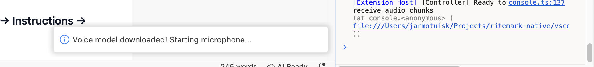
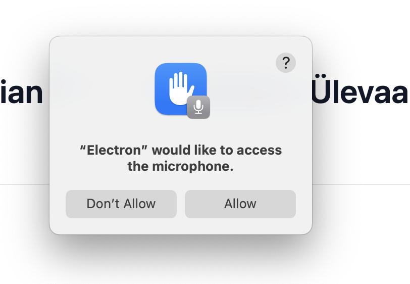

# Sprint 23: Estonian STT - Hetkeseisu Ülevaade

Eringinna, Marda vexa, Mætska vexa, Mónar hús og maður vissum mætsum við það varum. Sörmijaketi mõtles, kui tore alaks, kui kogu tema vana kool koreksi jõmetsan.

**Kuupäev:** 2025-01-18

* * *

## Mis on arendatud

**Backend (Extension side):**

-   `voiceDictation/controller.ts` - Dikteerimise koordinaator
    
-   `voiceDictation/whisperCpp.ts` - Whisper binary wrapper (temp file lähenemine)
    
-   `voiceDictation/modelManager.ts` - Mudeli allalaadimine (~244MB)
    
-   `utils/platform.ts` - Platvormi tuvastus
    
-   `binaries/darwin-arm64/` - Whisper binary + dylib failid (~3.3MB)
    

**Frontend (Webview side):**

-   `hooks/useVoiceDictation.ts` - Web Audio API heli salvestamine
    
-   `components/VoiceDictationButton.tsx` - Mikrofoni nupp
    
-   `DocumentHeader.tsx` - Nupp lisatud päisesse
    

**VS Code modifikatsioonid:**

-   `webviewElement.ts` - iframe'ile microphone permission
    
-   `app.ts` - Electron media permission
    

* * *

## Kasutaja Flow (nagu peaks olema)

1.  **Kasutaja klikib mikrofoni nuppu** (punane ikoon päises)
    
2.  **Esimene kord:** Dialoog küsib "Download 244MB model?" → \[Download\] / \[Cancel\]
    
3.  **Allalaadimine:** Progress dialoog näitab "Downloading... X%"
    
4.  **Pärast allalaadimist:** Nupp muutub aktiivseks (listening state)
    
5.  **Kasutaja räägib:** Heli salvestatakse 2-sekundiliste chunk'idena
    
6.  **Transkriptsioon:** Tekst ilmub kursorisse
    
7.  **Kasutaja klikib uuesti:** Dikteerimine lõppeb
    

* * *

## Süsteemi Flow (tehniline)

```plaintext
[Webview]                    [Extension]                 [whisper-cli]
    |                             |                            |
    |-- dictation:prepare ------->|                            |
    |                             |-- check model exists       |
    |                             |-- (download if needed)     |
    |<-- dictation:ready ---------|                            |
    |                             |                            |
    |-- getUserMedia (mic) -------|                            |
    |-- AudioContext (16kHz) -----|                            |
    |-- ScriptProcessor ----------|                            |
    |                             |                            |
    |-- dictation:start --------->|-- startDictationWithCallbacks
    |                             |                            |
    |   [every 2 sec]             |                            |
    |-- dictation:audioChunk ---->|-- handleAudioChunk         |
    |   (base64 WAV)              |   |                        |
    |                             |   |-- write temp.wav       |
    |                             |   |-- spawn whisper-cli -->|
    |                             |   |                        |-- transcribe
    |                             |   |<-- stdout text --------|
    |                             |   |-- delete temp.wav      |
    |<-- dictation:transcription -|                            |
    |                             |                            |
    |-- dictation:stop ---------->|-- stopDictation            |
```

* * *

## Testimise Staatus

| Komponent | Testitud | Tulemus |
| --- | --- | --- |
| Mikrofoni nupp ilmub | ✅ | Töötab |
| Nupu klikk käivitab flow | ✅ | Töötab |
| Mudeli allalaadimise dialoog | ✅ | Töötab (Cancel fix tehtud) |
| Mudeli allalaadimine | ✅ | Töötab |
| Mikrofoni permission | ✅ | Töötab |
| getUserMedia success | ✅ | Konsool näitab SUCCESS |
| AudioContext loomine | ❓ | Pole logidest näinud |
| WAV chunk'ide saatmine | ❓ | Pole logidest näinud |
| Extension võtab chunk'i vastu | ❓ | Pole logidest näinud |
| Whisper binary käivitub | ❓ | Pole testitud |
| Transkriptsioon tuleb tagasi | ❓ | Pole testitud |
| Tekst ilmub editorisse | ❓ | Pole testitud |

* * *

## Järeldus

**Valideeritud:** Mudeli allalaadimine töötab, mikrofoni permission töötab.

**POLE valideeritud:** Kogu heli töötlemise ahel pärast "mic is active" staatust. Me ei tea kas:

-   WAV chunk'id üldse tekivad
    
-   Extension neid vastu võtab
    
-   Whisper binary käivitub
    
-   Transkriptsioon töötab
    

**Järgmine samm:** Vajan konsooli logisid pärast seda kui mic on aktiivne ja sa räägid. Praegu logid lõppevad "getUserMedia SUCCESS" juures.

# JARMO TESTING

## Session 1

1.  Clicked on mic
    
2.  Prompted to download model and I see this in console
    

```plaintext
[Dictation] Received dictation:error: Downloaded model failed validation
webview.js:1467 [Dictation] stopDictation called
console.ts:137 [Extension Host] [Extension] Received dictation:stop (at console.<anonymous> (file:///Users/jarmotuisk/Projects/ritemark-native/vscode/out/vs/workbench/api/common/extHostConsoleForwarder.js:45:22))
console.ts:137 [Extension Host] [Controller] stopDictation called (at console.<anonymous> (file:///Users/jarmotuisk/Projects/ritemark-native/vscode/out/vs/workbench/api/common/extHostConsoleForwarder.js:45:22))
```

Then nothing...

as a user I expected a dialog or message telling me that model is downloaded, successfull installed and now I can press Mic button again...

3.  When I click on the mic again - it restarts model download.
    

## Session 2

Fixed the model downloadin and user feedback. Mic becomes active (good!). However nothing happens when I start talking.



Since nothing happened - I closed mic.

console log

```plaintext
[Dictation] Sending dictation:start to extension
webview.js:1467 [Dictation] Now listening - speak!
console.ts:137 [Extension Host] [Extension] Received dictation:start (at console.<anonymous> (file:///Users/jarmotuisk/Projects/ritemark-native/vscode/out/vs/workbench/api/common/extHostConsoleForwarder.js:45:22))
console.ts:137 [Extension Host] [Extension] handleStartDictation called, language: et (at console.<anonymous> (file:///Users/jarmotuisk/Projects/ritemark-native/vscode/out/vs/workbench/api/common/extHostConsoleForwarder.js:45:22))
console.ts:137 [Extension Host] [Extension] Starting dictation via controller... (at console.<anonymous> (file:///Users/jarmotuisk/Projects/ritemark-native/vscode/out/vs/workbench/api/common/extHostConsoleForwarder.js:45:22))
console.ts:137 [Extension Host] [Controller] startDictationWithCallbacks called, language: et (at console.<anonymous> (file:///Users/jarmotuisk/Projects/ritemark-native/vscode/out/vs/workbench/api/common/extHostConsoleForwarder.js:45:22))
console.ts:137 [Extension Host] [Controller] Ready to receive audio chunks (at console.<anonymous> (file:///Users/jarmotuisk/Projects/ritemark-native/vscode/out/vs/workbench/api/common/extHostConsoleForwarder.js:45:22))
webview.js:1467 [Dictation] stopDictation called
webview.js:1467 [Dictation] stopDictation called
console.ts:137 [Extension Host] [Extension] Received dictation:stop (at console.<anonymous> (file:///Users/jarmotuisk/Projects/ritemark-native/vscode/out/vs/workbench/api/common/extHostConsoleForwarder.js:45:22))
console.ts:137 [Extension Host] [Controller] stopDictation called (at console.<anonymous> (file:///Users/jarmotuisk/Projects/ritemark-native/vscode/out/vs/workbench/api/common/extHostConsoleForwarder.js:45:22))
console.ts:137 [Extension Host] [Extension] Received dictation:stop (at console.<anonymous> (file:///Users/jarmotuisk/Projects/ritemark-native/vscode/out/vs/workbench/api/common/extHostConsoleForwarder.js:45:22))
console.ts:137 [Extension Host] [Controller] stopDictation called (at console.<anonymous> (file:///Users/jarmotuisk/Projects/ritemark-native/vscode/out/vs/workbench/api/common/extHostConsoleForwarder.js:45:22))
```

## Session 3

Reloaded window

Then clicked a cursor to markdown file location (where the text should be added)

Then clicked Mic

Then started to talk

BUT nothing happened.  
\*\*\*  
What I was expecting

-   Mic is active (should be color Green not Red)
    
-   When I talk, I will see the dictated text appearing from the cursor position in markdown file.
    

## Session 4

Whisper is running! But transcription is garbled - "Tõmmele põhle" regardless of what I say.

**Identified issues:**

1.  Audio format was wrong (WebM/Opus instead of WAV/PCM)
    
2.  whisper.cpp needs temp file, not stdin
    
3.  Sample rate mismatch (browser uses 48kHz, whisper needs 16kHz)
    

## Session 5

Fixed resampling from 48kHz → 16kHz. Still getting "Tõmmele põhle".

**Root cause discovered:** The saved debug WAV file is **SILENT**!

## Session 6 - MICROPHONE PERMISSION ISSUE

**The Real Problem:** VS Code webviews don't have actual microphone access!

**What happens:**

1.  `getUserMedia()` returns SUCCESS (no error)
    
2.  But the MediaStream contains **silent audio** (all zeros)
    
3.  No orange mic indicator appears in macOS menu bar
    
4.  Electron bug #42714: getUserMedia returns zeros instead of throwing error when permissions denied
    

**Why this happens:**

-   VS Code webviews are iframes
    
-   Iframes need explicit `allow="microphone"` permission policy
    
-   Even with that, macOS requires `systemPreferences.askForMediaAccess('microphone')` to be called from Electron main process
    
-   Dev mode Electron is unsigned, so macOS won't show permission dialog
    

**Fixes applied:**

1.  Added `'media'` to allowed webview permissions in `app.ts`
    
2.  Added `systemPreferences.askForMediaAccess('microphone')` call at startup
    
3.  But dev mode still fails because Electron binary is unsigned
    

**Solution:** Must test with **production build** (signed `Ritemark.app`), not dev mode.

## Technical Notes: macOS Microphone Access in Electron

### Requirements

1.  `NSMicrophoneUsageDescription` in Info.plist ✅ (already present)
    
2.  `systemPreferences.askForMediaAccess('microphone')` called from main process ✅ (added)
    
3.  App must be **code-signed** for macOS to show permission dialog ❌ (dev mode is unsigned)
    

### Dev Mode Limitation

```plaintext
[Microphone] Current status: not-determined
[Microphone] Requesting access...
[Microphone] Access granted: false  ← Returns false immediately, no dialog shown
```

Unsigned apps cannot trigger macOS permission dialogs. Must use production build for testing.

### References

-   [Electron systemPreferences API](https://www.electronjs.org/docs/latest/api/system-preferences)
    
-   [Electron bug #42714 - silent microphone](https://github.com/electron/electron/issues/42714)
    
-   [Requesting mic permissions in Electron](https://www.bigbinary.com/blog/request-camera-micophone-permission-electron)
    

## Session 7

When clikcing on Mic icon I see this:



I turn on dictation, but still nothing... no text recognition!

```plaintext
[Dictation] Audio pipeline connected, starting 5-second interval
webview.js:1467 [Dictation] Sending dictation:start to extension
webview.js:1467 [Dictation] Now listening - speak!
workbench.desktop.main.js:230926 [Extension Host] [Extension] Received dictation:start
workbench.desktop.main.js:230926 [Extension Host] [Extension] handleStartDictation called, language: et
workbench.desktop.main.js:230926 [Extension Host] [Extension] Starting dictation via controller...
workbench.desktop.main.js:230926 [Extension Host] [Controller] startDictationWithCallbacks called, language: et
workbench.desktop.main.js:230926 [Extension Host] [Controller] Ready to receive audio chunks
5webview.js:1467 [Dictation] Interval fired, buffer chunks: 0
workbench.desktop.main.js:608804 Using standard dev tools to debug iframe based webview
workbench.esm.html:1 Refused to load the stylesheet 'https://fonts.googleapis.com/css2?family=Sofia+Sans:wght@300;400;500;600;700&family=Space+Grotesk:wght@400;500;600;700&display=swap' because it violates the following Content Security Policy directive: "style-src 'self'
                    'unsafe-inline'". Note that 'style-src-elem' was not explicitly set, so 'style-src' is used as a fallback.

15webview.js:1467 [Dictation] Interval fired, buffer chunks: 0
```