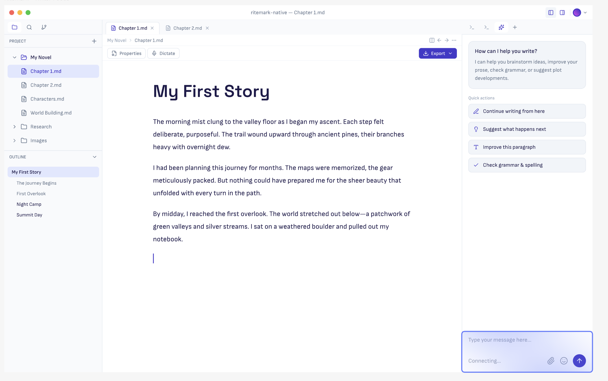
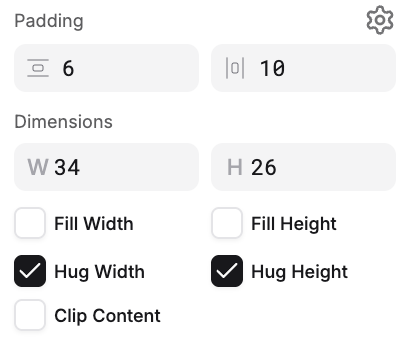
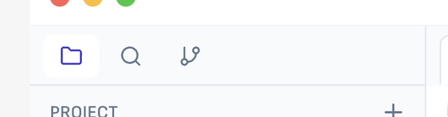
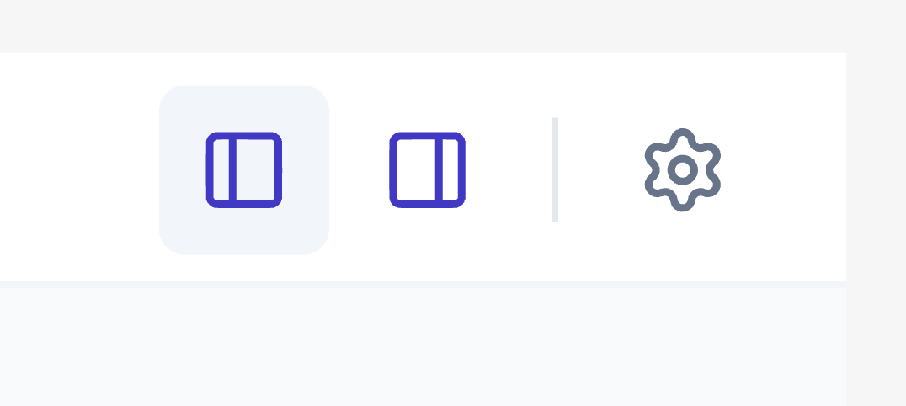

# Sprint 34: Ritemark GUI Customization

**Status:** Phase 0 - Ideation  
**Date Started:** 2026-02-13

Related execution guide: `workbench-iterative-workflow.md`

## Vision

-   Simplification
    
-   Nicer and friendlier aesthetics
    
-   Less for coder, more for writer
    

## Pain Points

-   Too much VS Code burden (seems tech-y)
    
-   AI assistant is in the same screen-estate where explorer is — they compete
    
-   Vertical tab-bar on left side takes screen estate (too prominent)
    
-   Cognitive overload in menus and VS Code buttons
    

## Reference Design

* * *

## Implementation Checklist

### 1\. Color Theme

> Create `ritemark-light.json` color theme with brand colors. No patches needed — instant reload.

- [x] Create theme file with all color tokens
  - [x] Brand primary: `#4338ca` (indigo-700)
  - [x] Light grey bg: `#f8fafc` (sidebar, panels)
  - [x] Dark grey: `#64748b` (icons, folder names)
  - [x] Muted grey: `#94a3b8` (breadcrumb parents)
  - [x] Stroke grey: `#e2e8f0` (borders, dividers)
  - [x] Editor text: `#1e1b4b` (indigo-950)
  - [x] White areas: `#ffffff`
- [x] Set as default theme in product.json
- [x] Test in dev mode

### 2\. Fonts

> Bundle Sofia Sans (.woff2) and apply to workbench UI. Editor uses Mac system font.

- [x] Download Sofia Sans from Google Fonts
- [x] Bundle .woff2 files in `browser/media/fonts/` (latin + latin-ext)
- [x] Patch workbench CSS: `@font-face` + CSS variable `--ritemark-ui-font-family`
- [x] Remove Google Fonts `@import` from welcome page CSS
- [x] Wire production build: `.woff2` esbuild loader + gulpfile resource globs
- [x] Patch 015 created with all font changes
- [x] Test in dev mode (verified Sofia Sans renders in UI)
- [x] Webview: `@font-face` + Tailwind config (`font-ui`, `font-editor` aliases)
- [x] Editor (ProseMirror): keeps system font (`--ritemark-editor-font-family`)
- [x] Webview bundle verified (woff2 files included in build output)
- [ ] Verify in production build

### 3\. Left Sidebar Tabs

> Move activity bar tabs to top of sidebar as horizontal tab bar.

- [ ] Tab bar height: 36px
- [ ] Tab height: 26px
- [ ] Background: `#f8fafc`
- [ ] Active tab: white bg, icon in brand primary (`#4338ca`)
- [ ] Inactive tabs: transparent bg
- [ ] Bottom border: stroke grey (`#e2e8f0`)
- [ ] Research: patch vs theme vs extension API

### 4\. Titlebar (Mac)

> Add layout controls and sidebar toggles to titlebar right side.

- [ ] Layout toggle buttons (single/split)
- [ ] Settings button (gear icon)
- [ ] Sidebar toggle buttons
- [ ] Research: custom titlebar feasibility (Mac + Windows)

## Explorer