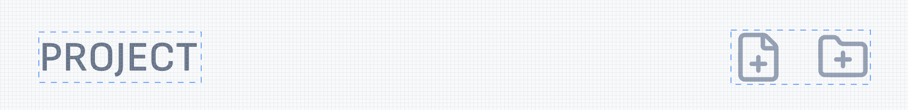
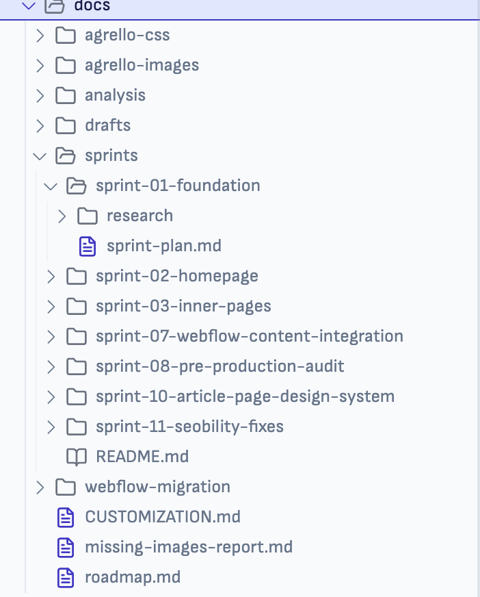
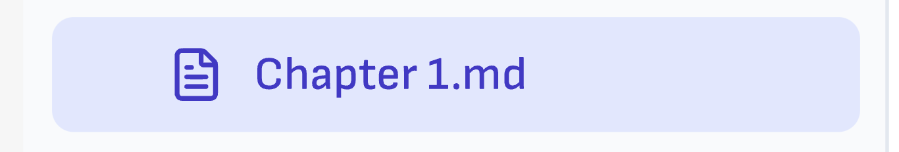
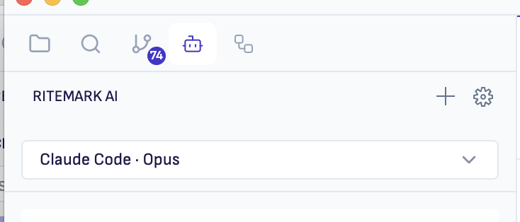
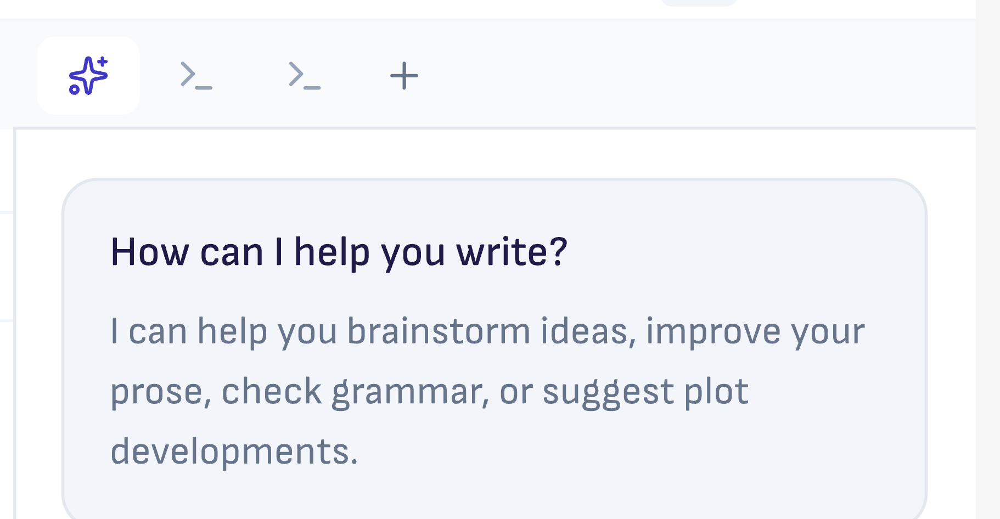

# Sprint 35 Workbench Iterative Workflow

**Date:** 2026-02-13  
**Scope:** VS Code workbench-level GUI customization in `vscode/` with patch workflow in `patches/vscode/`.

## Why This Workflow

-   Keep iteration fast: edit and visually validate without full production build after each tweak.
    
-   Keep changes safe: all persistent `vscode/` customizations end up as patch files.
    
-   Keep reviews clear: one patch = one logical UI slice.
    

## Patch Plan for Sprint 34

Use this grouping to avoid giant mixed patches.

1.  `015-workbench-font-and-typography-base.patch`  
    Files:  
    `vscode/src/vs/workbench/browser/media/style.css`  
    `vscode/src/vs/workbench/contrib/welcomeGettingStarted/browser/media/gettingStartedGuide.css` (remove remote font import if switching to local fonts)
    
2.  `016-workbench-sidebar-top-tabs-layout.patch`  
    Files:  
    activity bar and sidebar layout files touched for horizontal top tabs
    
3.  `017-workbench-titlebar-controls.patch`  
    Files:  
    titlebar/action layout files for mac/windows behavior
    
4.  `018-workbench-explorer-ui.patch`  
    Files:  
    Explorer component UI styling and layout
    
5.  `019-workbench-right-sidebar.patch`
    Files:
    Right sidebar layout — terminal tabs + Ritemark AI panel

6.  `020-icon-harmonization.patch`
    Files:
    Replace remaining VS Code codicons with Lucide in sidebar headers.
    Ensure all Lucide icons use 1px stroke-width globally.

7.  `021-breadcrumbs-ribbon-height-icons.patch`
    Files:
    `vscode/src/vs/workbench/browser/parts/editor/breadcrumbsControl.ts`
    `vscode/src/vs/workbench/browser/parts/editor/media/editortitlecontrol.css`
    Breadcrumbs ribbon height 22→40px to match sidebar heading.
    File icons desaturated (grayscale) to match sidebar heading icon style.
    Separator/chevron icons softened with reduced opacity.


## `018-workbench-explorer-ui.patch`

`I want following "heading" for a explorer:`



1.  Rename to PROJECT
    
2.  Only two actions (icon buttons): add file, add folder.
    
3.  Simplified tree view styles
    
    1.  Remove vertical lines in nested trees/folders  
        Current wrong design:
        
        
    2.  Active element background style (add rounded corners and left-right spacings)  
        New design:
        
        
        
          
        

## `019-workbench-right-sidebar.patch`

1.  I want to move Ritemark AI to right side bar where terminal is. It must be in front of terminal and opened by default!
    
2.  Instead of text "Ritemark AI" in heading, move the model selection to top instead.
    
3.  New AI icon pls! Lucide > Sparkles
    
4.  If it is possible I would like to see options for more than 1 Ritemark AI and 1 Terminals tab... (add more Agent (sessions) - but this is not hard requirement if that needs deeper wor
    

CURRENT:



New:



## `020-icon-harmonization.patch`

### Goal
Replace all remaining VS Code codicons with Lucide icons in sidebar/panel headers. Enforce 1px stroke-width for all Lucide icons globally.

### Already using Lucide (activity bar)
| View | Lucide icon | File |
|------|------------|------|
| Explorer | `Lucide.folder` | `explorerViewlet.ts` |
| Search | `Lucide.search` | `searchIcons.ts` |
| Source Control | `Lucide.gitBranch` | `scm.contribution.ts` |
| Open Editors | `Lucide.bookOpen` | `explorerViewlet.ts` |

### Still using Codicons (need replacement)
| View | Current codicon | Suggested Lucide | File |
|------|----------------|-----------------|------|
| Terminal | `Codicon.terminal` | `Lucide.terminal` | `terminalIcons.ts` |
| Output | `Codicon.output` | `Lucide.fileOutput` | `output.contribution.ts` |
| Markers/Problems | `Codicon.warning` | `Lucide.alertTriangle` | `markers.contribution.ts` |
| Outline | `Codicon.symbolClass` | `Lucide.list` | `outline.contribution.ts` |
| Timeline | `Codicon.history` | `Lucide.clock` | `timeline.contribution.ts` |

### Stroke-width: 1px enforcement

**Webview (lucide-react SVGs) — DONE:**
- Global CSS rule `svg.lucide { stroke-width: 1px !important; }` in `index.css`
- Fixed inline SVGs in `Editor.tsx` (plus button, drag handle)
- Fixed flow edge `strokeWidth` in `FlowCanvas.tsx`

**VS Code (lucide-static font):**
- Font glyphs have stroke-width baked in at build time
- Cannot change via CSS — stroke-width is part of the glyph outline
- Acceptable: font icons already appear lighter than webview SVGs at 16px

### Files to change (VS Code side)
1. `iconRegistry.ts` — add new Lucide icon entries (terminal, alertTriangle, clock, list, fileOutput)
2. `terminalIcons.ts` — swap codicon to Lucide
3. `output.contribution.ts` — swap codicon to Lucide
4. `markers.contribution.ts` — swap codicon to Lucide
5. `outline.contribution.ts` — swap codicon to Lucide
6. `timeline.contribution.ts` — swap codicon to Lucide

## How Dev Mode Works (Critical Knowledge)

Dev mode (`./scripts/code.sh` from `vscode/` dir) serves from the `out/` **directory**, not `src/`.

-   TypeScript: `src/*.ts` → compiled by `tsc` → `out/*.js` (automatic with `--watch`)
    
-   **CSS: NOT auto-copied.** Editing `src/.../style.css` does NOT update `out/.../style.css`.
    
-   **Static assets (fonts, images): NOT auto-copied.**
    

### CSS Loading in Dev Mode

1.  On startup, `CSSDevelopmentService` uses ripgrep to find all `.css` files in `out/`
    
2.  Creates an ES import map so `import './media/style.css'` → `@import url(vscode-file://...out/.../style.css)`
    
3.  CSS `url()` paths (fonts, images) resolve **relative to the CSS file** in `out/`
    

This means `url("./fonts/SofiaSans-latin.woff2")` resolves to `out/vs/workbench/browser/media/fonts/SofiaSans-latin.woff2`.

### Consequence

**Cmd+R (Reload Window)** re-reads CSS content but does NOT copy files from `src/` to `out/`. You must copy manually or restart fully.

## Iterative Loop (Workbench Level)

1.  Ensure baseline is healthy:  
    `./scripts/apply-patches.sh --dry-run`
    
2.  Start dev run from `vscode/` dir:  
    `./scripts/code.sh`
    
3.  Edit files in `vscode/src/vs/...`.
    
4.  **Copy changed CSS and static assets to** `out/`**:**
    

```bash
# CSS
cp src/vs/workbench/browser/media/style.css out/vs/workbench/browser/media/style.css

# Fonts (first time only, or when changed)
mkdir -p out/vs/workbench/browser/media/fonts
cp src/vs/workbench/browser/media/fonts/*.woff2 out/vs/workbench/browser/media/fonts/
```

5.  **Restart dev instance** (close window + `./scripts/code.sh` again).  
    Cmd+R may work for CSS content changes, but a full restart is needed if the import map must be regenerated (new CSS files added).
    
6.  Visual check. Repeat steps 3-5.
    
7.  When one logical slice is stable, create patch once:  
    `./scripts/create-patch.sh "workbench-sidebar-top-tabs-layout"`
    
8.  Continue next slice in same session; do not create a patch for every tiny tweak.
    
9.  Before commit, run:  
    `./scripts/apply-patches.sh --dry-run`  
    `./scripts/validate-patches.sh`
    

## Production Build Font Wiring

Font files in `browser/media/` are **not automatically included** in production builds. Two extra changes are needed in `vscode/`:

1.  `build/lib/optimize.ts` — Add `.woff2` to esbuild loader so it processes font references in CSS:
    

```js
loader: {
    '.ttf': 'file',
    '.woff2': 'file',  // ← added
    '.svg': 'file',
    '.png': 'file',
    '.sh': 'file',
},
```

2.  `build/gulpfile.vscode.js` — Add font globs to `vscodeResourceIncludes` (both ESM and AMD paths):
    

```js
'out-build/media/*.woff2',                              // esbuild may place here
'out-build/vs/workbench/browser/media/fonts/*.woff2',   // or here
```

Both globs are needed because esbuild's `assetNames: 'media/[name]'` output path depends on the bundling context. Verify exact location after first production build.

## Rules of Thumb (Best Practices)

1.  Keep patch intent single-purpose.  
    Bad: fonts + titlebar + menu cleanup in one patch.  
    Good: one patch per clearly reviewable concern.
    
2.  Avoid broad selectors early.  
    Start from narrow workbench areas, then widen only when stable.
    
3.  Prefer tokenized colors over hardcoded one-offs.  
    It keeps theme and state behavior coherent.
    
4.  Preserve accessibility states.  
    Do not remove visible focus ring behavior without replacement.
    
5.  Test left/right sidebars together.  
    Sprint goal requires explorer and AI panel to coexist without layout conflicts.
    
6.  Check all three OS classes in CSS assumptions.  
    Workbench uses `.mac`, `.windows`, `.linux`; do not ship mac-only assumptions.
    
7.  Keep webview and workbench typography separated.  
    Workbench UI font decisions must not accidentally override editor monospace or code surfaces.
    
8.  Remove network font dependencies.  
    Do not rely on `@import` from Google Fonts in shipped workbench CSS.
    
9.  Prefer finishing one visual slice to 90% before opening a new slice.  
    This reduces rebasing and patch churn.
    
10.  Use patch names as release notes.  
     Patch filename should explain user-visible change in plain language.
     

## Quality Checklist Per Slice

-   Visual target matches design ideation screenshots.
    
-   No overlap/clipping in narrow sidebars.
    
-   Active/inactive/hover/focus states all visible.
    
-   No regression in editor readability.
    
-   Patch applies cleanly on top of current patch stack.
    

## Fast Recovery Playbook

1.  Patch conflict after upstream sync:  
    run `./scripts/update-vscode.sh --check`, then rework only failing patch.
    
2.  Lost track of local `vscode/` edits:  
    create patch immediately with temporary name, then split/rename after.
    
3.  Visual behavior changed but cannot find source:  
    use `rg` in `vscode/src/vs/workbench` scoped by class/selector first, not full repo.
    

## Recommended Daily Cadence

1.  Morning:  
    pick one slice and success criteria.
    
2.  During day:  
    multiple fast edit/reload cycles, no production build.
    
3.  End of slice:  
    create/update patch, dry-run patch application, capture before/after screenshot.
    
4.  End of day:  
    only merged slices with clean patch status.