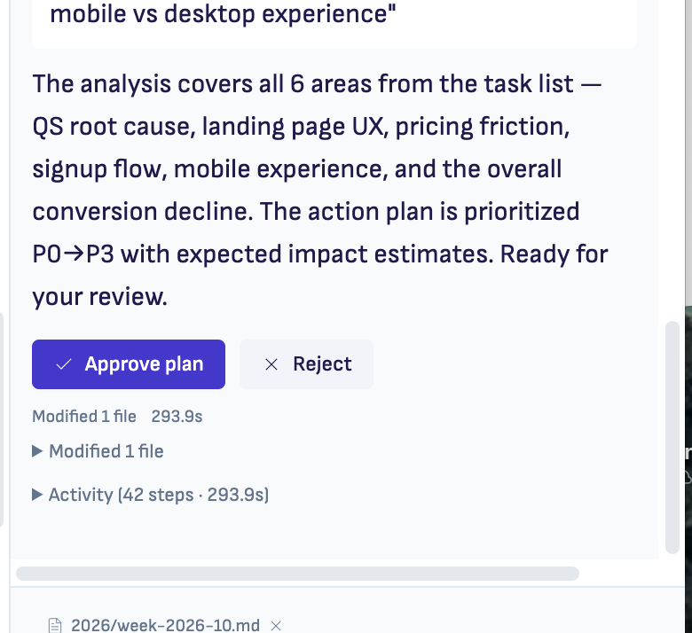
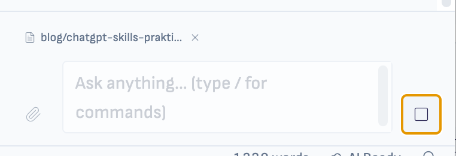

# Issues to solve

But let them use and then once we have sorted it out, starting with it properly.

-   Plan preview is missing
    
    - [ ] 
    
    
    
      
    User only sees Approve plan / Reject buttons, but not the actual plan. Show the plan points in small, concise card above the buttons.
    
-   In AI chat input, there's always a visual pill of the currently in focus tab... user expects that it means that this reference is accompanied by the prompt, but it is not. User thinks like that - if I say "Read this", the actual prompt is "\[file: /blog/chatgpt-skills-praktiline-juhis.md\] read this"
    
    
-   Windows-node-dependency issue /Users/jarmotuisk/Projects/ritemark-native/docs/analysis/[2026-03-06-windows-node-dependency-analysis.md](http://2026-03-06-windows-node-dependency-analysis.md)