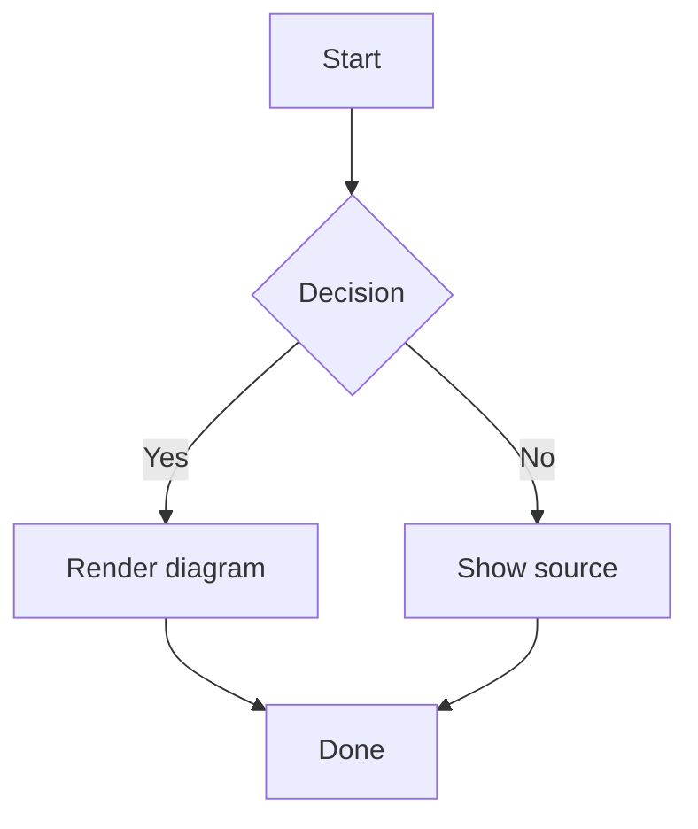
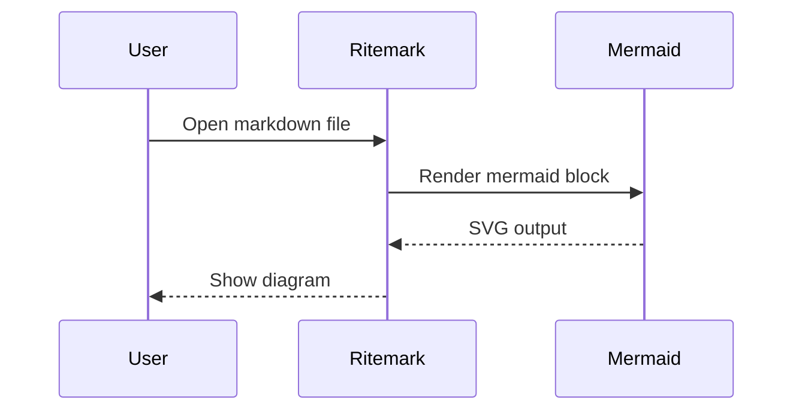
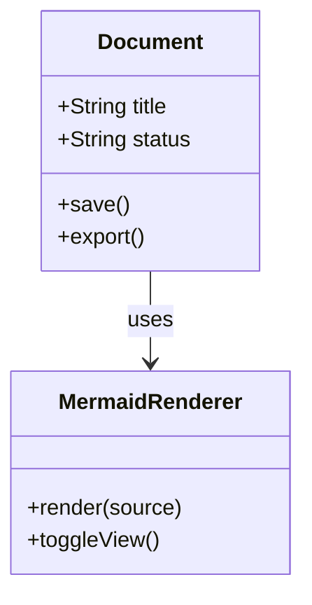
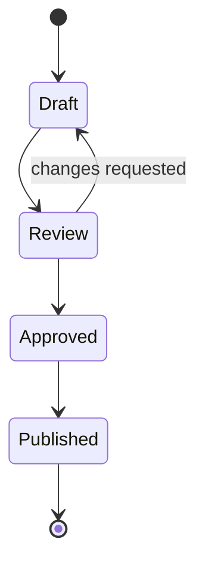
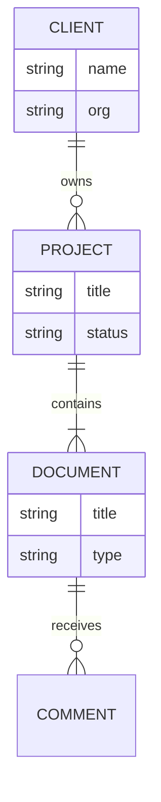
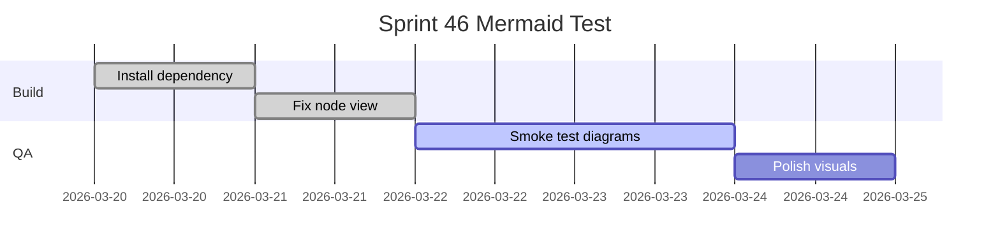
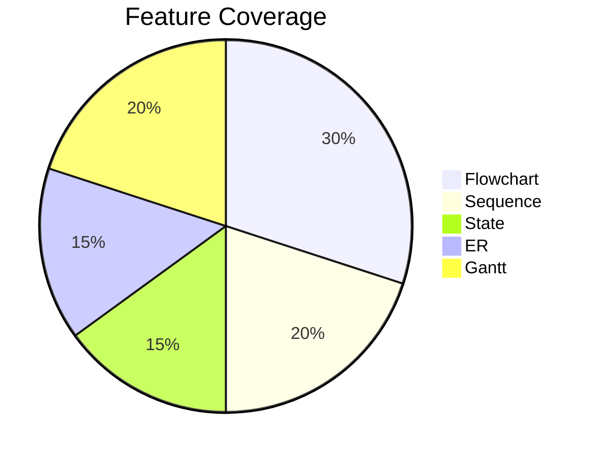

# Mermaid Smoke Test

Open this file in Ritemark after `Developer: Reload Window`.

## Expected Checks

-   The first mermaid block should render as a diagram by default.
    
-   The `Code` button should switch to raw source and back to the diagram.
    
-   The `Copy` button should copy the mermaid source, not SVG.
    
-   The invalid mermaid block should show an error state and still allow source editing.
    
-   Saving and reopening should preserve the fenced `mermaid` blocks unchanged.
    

## Valid Diagram



## Sequence Diagram



## Class Diagram



## State Diagram



## Entity Relationship Diagram



## Gantt Chart



## Pie Chart



## Invalid Diagram

```mermaid
flowchart TD
  A[Broken
  B --> C
```
