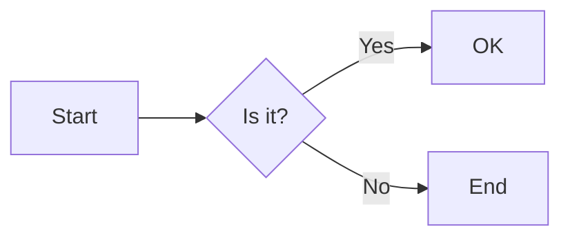
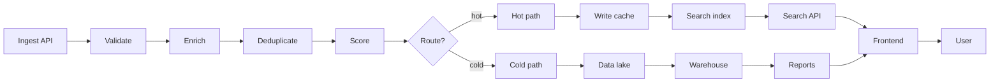
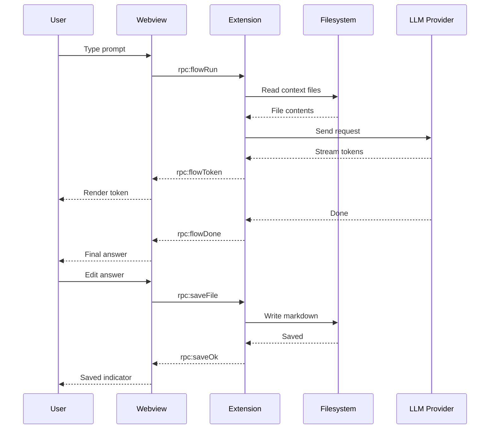
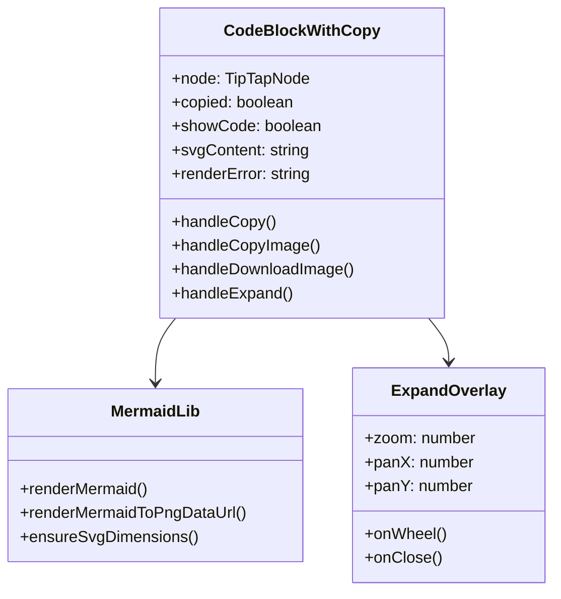

# Sprint 56: Mermaid Test Diagrams

Use this file in Ritemark dev mode to verify inline rendering, expand view, copy/download, and error handling. Open it via `File > Open Folder...` after `./vscode/scripts/code.sh` boots.

---

## 1. Simple flowchart (small)

Should render small and centered, no oversized whitespace.



---

## 2. Wide flowchart (many nodes)

This is the case Kaja reported. Today this gets capped at 680px and shrinks until text is unreadable. After Sprint 56 it should render at content-container width and scroll horizontally if natural width exceeds the column.



---

## 3. Tall sequence diagram

Verifies vertical sizing and `max-height` behavior. Should not be cropped silently.



---

## 4. Class diagram (medium width)



---

## 5. Invalid Mermaid (error state)

Should still show a clear error message and not crash the editor.

```mermaid
flowchart LR
    A --[broken syntax
    --> B
    B -| no closing
```

---

## Validation Checklist

- [ ] Diagram 1: small, centered, NO huge whitespace around it
- [ ] Diagram 2: fills content column width; if natural width is wider, container scrolls horizontally — NOT shrunk to fit
- [ ] Diagram 3: full height visible (within `max-height` cap), readable
- [ ] Diagram 4: medium-width renders cleanly
- [ ] Diagram 5: shows error, editor still functional
- [ ] Toolbar: `Code/Diagram` toggle, `Copy` (source), `Copy Image`, `Download Image`, `Expand`
- [ ] Copy Image → paste into another app produces PNG
- [ ] Download Image → file downloaded as PNG
- [ ] Expand: scroll/pan works; `Cmd/Ctrl+Scroll` zooms; `Escape` closes; focus returns to block
