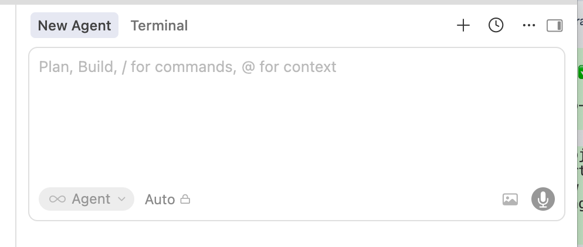
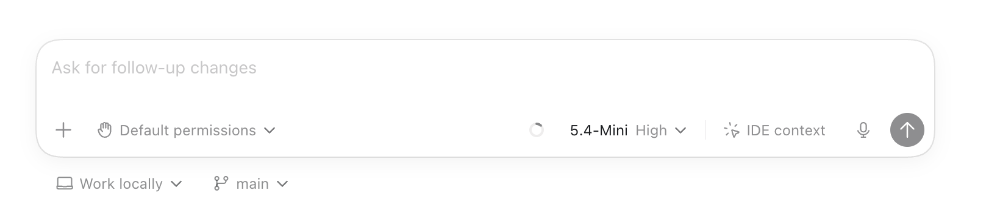
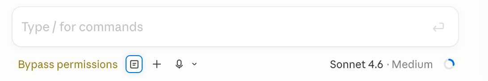

# Sprint 62: Conversation Runtime + Agent Switching

## Vision

Ritemark conversations should be durable user workspaces, not containers owned by one selected agent.

Today the user picks an agent/model before chatting, and the conversation is effectively bound to that choice. This breaks down when part of the work fits another model, one provider hits rate limits, or the user wants to plan with one runtime and execute with another.

The target experience is a conventional global chat input where each run can choose an available runtime:

- Claude
- Codex
- future SDK-backed agents

The conversation stays continuous while agent, model, thinking effort, and Plan/Edit mode can change per turn.

## Current Status

```text
Current phase: audit and architecture planning
Implementation status: not started
Branch: codex/sprint-62-conversation-runtime
Primary decision needed: migration rollout guard and first implementation slice
```

## Goal

Create the foundation for mixed-runtime conversations in the AI sidebar:

- decouple saved conversations from a single `agentId`
- make agent/model/mode a per-turn runtime selection
- preserve clear provenance for every assistant response
- deprecate the legacy Ritemark Document Agent from the primary agent UX
- document how the existing Claude SDK and Codex app-server integrations fit into one conversation model

## Non-Negotiable Runtime Constraint

Do not change how Claude and Codex themselves work unless a small compatibility shim is required.

The preferred implementation keeps current dependencies and runtime paths:

- Claude stays on the existing `@anthropic-ai/claude-agent-sdk` integration.
- Codex stays on the existing Codex app-server/CLI integration.
- Existing Claude/Codex auth, approval, plan, question, attachment, and streaming behavior should remain intact.
- This sprint changes the conversation model and UX shell around those runtimes, not the provider runtimes themselves.

## Product Contract

The working product model for this sprint:

- A conversation is the user's durable thinking context.
- A run is one execution inside that conversation.
- Each run records its runtime, model, mode, reasoning/thinking setting, attachments, active file context, and result.
- Switching runtime does not start a new conversation.
- The UI must show which runtime/model produced each assistant response.
- Plan/Edit mode is a run-level choice, not a separate conversation type.
- The default handoff model is: same visible conversation context, provider-specific session reset or compaction as needed.

## Explicit Scope

### Phase 1: Audit and Architecture

- [x] Capture current code shape for AI sidebar state, history, Claude, Codex, and legacy Ritemark Agent.
- [x] Capture Claude Agent SDK and Codex app-server integration options.
- [x] Capture future Gemini/open-source agent framework research notes.
- [x] Define the target conversation schema.
- [x] Define provider/runtime adapter responsibilities.
- [x] Define migration behavior for existing saved conversations.
- [x] Decide whether runtime switching sends full visible history, summarized history, or provider-local session context.

### Phase 2: Conversation Runtime Model

- [x] Add model/schema tests for legacy conversation migration before wiring UI behavior.
- [x] Add unified conversation/run types and pure migration helpers.
- [x] Store runtime metadata per turn/run.
- [x] Preserve provider-specific details inside typed run payloads.
- [x] Add `schemaVersion: 2` read/write support while preserving old fields.
- [x] Add guarded rollout path for v2 conversation storage.
- [x] Update history list badges to summarize mixed-runtime conversations.
- [x] Ensure cancel, approve, question-answer, and plan-review actions target the active run, not the globally selected agent.

### Phase 3: Ritemark Agent Deprecation

- [x] Remove Ritemark Document Agent from the default agent selector only after v2 migration helpers exist.
- [x] Keep existing saved conversations readable if they contain legacy `ritemark-agent` turns.
- [x] Decide whether RAG chat survives as a tool inside a real runtime or is removed from the agent selector entirely.
- [x] Update onboarding/setup copy so Claude and Codex are the primary visible runtimes.
- [x] Add compatibility notes for old localStorage history records.

### Phase 4: Runtime Switching UX (Narrow First Pass)

- [x] Keep existing Claude and Codex views initially; do not collapse all rendering in one UI pass.
- [x] Add per-run runtime/model picker behavior in the existing input/header area.
- [x] Add Plan/Edit mode control as a first-class run setting for new runs.
- [ ] Add thinking/reasoning effort control only where supported and only after run metadata is stable.
- [x] Show per-message runtime/model provenance in existing message renderers.
- [x] Preserve existing Claude plan approval and Codex plan update UX.
- [x] Defer a full global input-first empty-state redesign to a later UI polish slice unless it is required by the implementation.

### Phase 5: Validation

- [x] Add store tests for switching runtime mid-conversation.
- [x] Add tests for cancel/approval routing with mixed-runtime conversations.
- [x] Run focused AI sidebar tests.
- [x] Run `./scripts/validate-qa.sh` before any ready handoff, commit, push, or merge.

## Rollout Guard

The v2 conversation schema has user-data risk. Do not ship irreversible localStorage migration as an unguarded first patch.

Initial implementation should:

- read legacy and v2 conversations
- write v2 only behind a local feature/config guard or internal compatibility switch
- preserve old fields during the transition
- avoid deleting legacy localStorage records
- include tests before UI behavior depends on v2 records

Feature flag decision:

- Preferred: add a temporary internal feature flag/config key for v2 conversation storage.
- Acceptable fallback: keep v2 as an in-memory normalized view first, then enable persistence after tests and manual validation.

## Likely Touched Files

Planning target files for implementation:

- `extensions/ritemark/webview/src/components/ai-sidebar/types.ts`
- `extensions/ritemark/webview/src/components/ai-sidebar/store.ts`
- `extensions/ritemark/webview/src/components/ai-sidebar/chatHistoryStorage.ts`
- `extensions/ritemark/webview/src/components/ai-sidebar/ChatHistoryPanel.tsx`
- `extensions/ritemark/webview/src/components/ai-sidebar/AgentSelector.tsx`
- `extensions/ritemark/webview/src/components/ai-sidebar/ChatInput.tsx`
- `extensions/ritemark/webview/src/components/ai-sidebar/AISidebar.tsx`
- `extensions/ritemark/webview/src/components/ai-sidebar/AgentView.tsx`
- `extensions/ritemark/webview/src/components/ai-sidebar/CodexView.tsx`
- `extensions/ritemark/webview/src/components/ai-sidebar/conversationReset.test.ts`
- new focused tests for conversation migration/helpers

Avoid changing unless a narrow adapter requires it:

- `extensions/ritemark/src/agent/AgentRunner.ts`
- `extensions/ritemark/src/codex/codexManager.ts`

## Out Of Scope

- Implementing Gemini agent support in this sprint.
- Choosing the final Gemini framework solely by GitHub stars in this sprint.
- Removing Claude or Codex provider-specific session implementations.
- Replacing Codex ChatGPT authentication with OpenAI API-key Agents SDK in this sprint.
- Replacing current Claude/Codex dependencies just to fit a new abstraction.
- Shipping a broad agent marketplace or custom agent builder.

## Future Sprint: Gemini Agent SDK Selection

The next Gemini-oriented sprint should compare open agent frameworks using GitHub stars as one input, not the only input. Initial candidates:

- Google ADK: official Gemini-optimized agent framework, now presented as available for Python, TypeScript, Go, and Java.
- LangGraph: large open-source stateful agent framework with strong durability story.
- CrewAI: very popular multi-agent orchestration framework, but Python-first.
- OpenAI Agents SDK: useful reference for runtime/session abstractions, less directly relevant to Gemini unless provider support is acceptable.

## Risks

- Provider sessions may not accept arbitrary imported history in the same way.
- Mixing runtimes can confuse users if provenance is weak.
- Legacy Ritemark Agent removal can break old history if migration is not explicit.
- Codex app-server and Claude Agent SDK expose different event streams, approval paths, and plan semantics.
- Future Gemini support may push toward Python-first frameworks while Ritemark extension code is TypeScript.

## Definition Of Done

- Sprint research explains the current architecture and SDK choices.
- `ritemark-agent` is deprecated in the primary UX without breaking old saved conversations.
- A unified conversation/run data model exists and is covered by tests.
- Claude and Codex can both contribute turns to one saved conversation.
- Runtime/model/mode selection is per run.
- Existing Claude and Codex plan/approval flows still work.

## References

- Code audit: `research/01-current-ai-sidebar-architecture.md`
- SDK research: `research/02-agent-sdk-options.md`
- Target model: `research/03-target-conversation-model.md`
- Context handoff decision: `notes/context-handoff-decision.md`
- Quiet runtime UI implementation plan: `notes/quiet-runtime-ui-implementation-plan.md`

## UX/UI Inspiration

### Runtime Switcher Direction

- User preference: proceed with Option C, the unified input card.
- Current mockup: `ux-options.html` now compares C1/C2/C3 variants that keep the same card/footer architecture while progressively reducing accent color, borders, focus rings, and message chrome to lower cognitive load.
- Working recommendation after review: C3 “Quiet card” is the preferred base. The mockup also includes C3b showing the same quiet card with current-style screenshot/file attachment previews plus implemented advanced states: current plan, subagents, activity, plan approval, command approval, pending questions, @agent chips, and context chips.
- Implementation plan: `notes/quiet-runtime-ui-implementation-plan.md`.

### Cursor Chat Input



### Codex



### Claude Code


