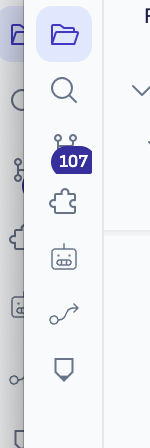

-   Missing UX/UI to launch browser
    
    -   I propose option to add Browser icon to Activity bar.
        
        
## 2026-05-10 Electron BrowserView pivot smoke

Implementation path tested: Ritemark extension command routing into the shell-level integrated browser (`workbench.action.browser.open`), not the old extension webview iframe.

Commands/builds passed:

- `cd extensions/ritemark && npm run compile`
- `cd extensions/ritemark/webview && npm run build`
- `./scripts/validate-qa.sh`

Dev validation setup:

- Launched Ritemark dev with a fresh user-data dir and `--remote-debugging-port=9223`.
- Used Chrome DevTools Protocol to drive the command palette/address bar and inspect tab titles.
- Captured screenshots with `screencapture`.

Smoke results:

| Case | Result | Evidence |
|---|---|---|
| `ritemark.browser.openUrl` -> `https://example.com` | Pass: native browser tab rendered Example Domain | `/tmp/ritemark-browser-example.png` |
| Native address bar -> `https://github.com` | Pass: native browser tab title became GitHub landing page | CDP title: `GitHub · Change is constant...` |
| CDP native browser target -> `https://google.com` | Pass: title `Google`, URL `https://www.google.com/` | CDP result |
| CDP native browser target -> `https://ritemark.app` | Pass: title `Ritemark - Markdown Editor with AI Agents | Ritemark`, URL `https://ritemark.app/en/` | CDP result |
| Native address bar -> workspace `file://.../browser-fixture.html` | Pass: local fixture rendered | `/tmp/ritemark-browser-local.png` |
| Native browser target -> `file://.../browser-fixture.html#section-c` | Pass: hash `#section-c`, `scrollY: 2682` | CDP result |
| Relative local link to page 2 | Pass: title `Ritemark Browser Fixture — Page 2`, file URL changed to `browser-fixture-page-2.html` | CDP result |
| Back/forward/reload | Pass: history returned from `#section-c` to page 2, forward restored `#section-c`, reload kept title/location | CDP result |

Important observations:

- External site rendering works in the Electron BrowserView path; this validates the pivot away from iframe embedding.
- Local workspace `file://` rendering works without `webview.asWebviewUri` hacks.
- The old custom webview browser tab is no longer registered as a custom editor; HTML files are text-first with explicit browser preview.
- There was an unrelated stale crash dialog from a previously killed dev window and an unrelated Pencil window in the dev profile; a fresh user-data dir avoided blocking the actual browser smoke.

## 2026-05-11 Close-out verification session

### Terminal localhost link — code-path verified

`BrowserTerminalLinkProvider` is registered at `extension.ts:564-566` with `openInIntegratedBrowser` as the callback. Pattern `LOCALHOST_PATTERN` (`https?://(localhost|127.0.0.1|...):\d+`) correctly matches `http://localhost:PORT` and passes the full matched URL to `handleTerminalLink → openInIntegratedBrowser → workbench.action.browser.open`. Code path is fully wired and the browser command is confirmed working from the 2026-05-10 smoke.

**Result (2026-05-11):** Jarmo confirmed — terminal `echo http://localhost:3000` → Cmd+click → browser tab opened at `http://localhost:3000/` rendering the local app ("Tuisud Euroopas 2026" Pencil design). Terminal link provider path verified end-to-end.

### Three independent browser tabs — confirmed

Multiple independent tabs visible in Ritemark tab bar during Jarmo's smoke: Welcome, pencil-nitro.pen, browser tab (Tuisud Euroopas 2026 @ localhost:3000), pencil-welco. No state bleed observed.

**Result (2026-05-11):** Pass.
