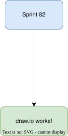

# Sprint 82 — draw.io QA

Manual test file. Open this in the Ritemark editor.

## Embedded diagram (click-to-edit test)

Click the diagram below — it must open in the draw.io editor:

## QA checklist

- [ ] S1 — The diagram above renders as an image in this markdown file
- [ ] S2 — Clicking the diagram opens the draw.io editor (vendored, offline)
- [ ] S3 — Edit something (move a box, add a shape) and save — the image re-renders here with the change
- [ ] S4 — Close and reopen `test-diagram.drawio.svg` from the file tree (double-click) — edits persisted, diagram still editable (XML round-trip survived)
- [ ] S5 — Type `/diagram` on the empty line below and create a NEW diagram — a `images/diagram.drawio.svg` is created next to this file and embedded
- [ ] S6 — Undo/redo inside the draw.io editor works
- [ ] S7 — Kill the network (Wi-Fi off) and repeat S2–S3 — everything still works offline

Create a new diagram here: