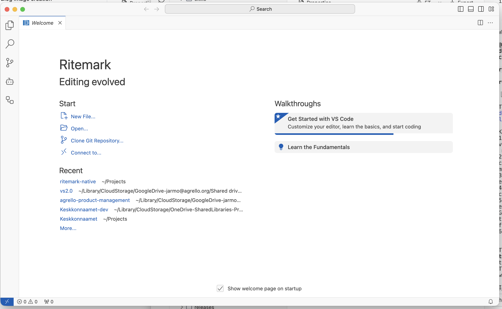
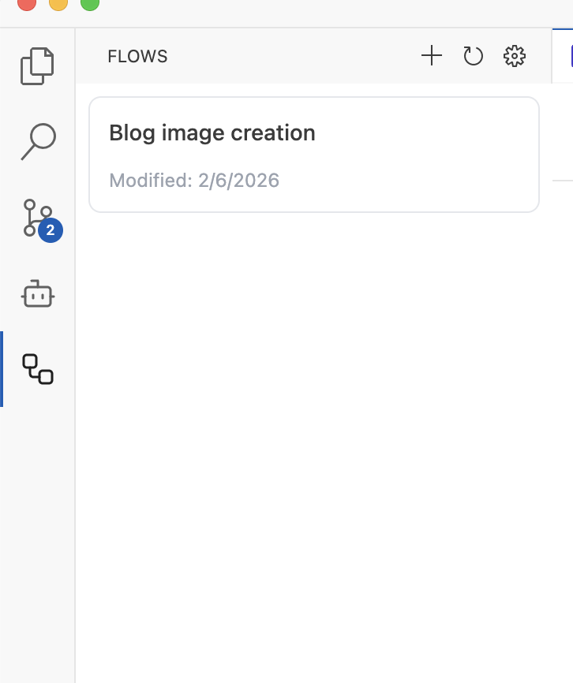
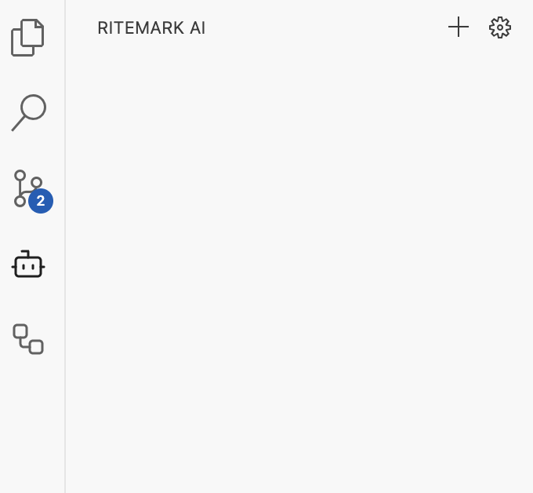

# macOS x64 CI Build Validation Checklist

**Purpose:** Validate that the GitHub Actions CI-built x64 app works correctly on Intel Macs (and via Rosetta 2 on Apple Silicon).  
**Build:** GitHub Actions `build-macos-x64.yml`, run #21725818244 (macos-15-intel runner)  
**Date:** 2026-02-06  
**Version:** 1.3.0  
**Status:** NOT a release -- CI pipeline validation only

* * *

## Pre-Test: Architecture Verification (AUTOMATED)

These checks confirm the CI build produced correct x86\_64 binaries, not accidentally cross-compiled arm64 ones. Run from terminal before manual testing.

```bash
# Electron Framework must be x86_64
file VSCode-darwin-x64/Ritemark.app/Contents/Frameworks/Electron\ Framework.framework/Electron\ Framework
# Expected: Mach-O 64-bit dynamically linked shared library x86_64
```

### Native Module Architecture (ALL must be x86\_64)

| Module | Path | Purpose |
| --- | --- | --- |
| node-pty | `node_modules/node-pty/build/Release/pty.node` | Terminal (THE reason for CI builds) |
| sqlite3 | `node_modules/@vscode/sqlite3/build/Release/vscode-sqlite3.node` | State storage |
| spdlog | `node_modules/@vscode/spdlog/build/Release/spdlog.node` | Logging |
| native-keymap | `node_modules/native-keymap/build/Release/keymapping.node` | Keyboard layout |
| kerberos | `node_modules/kerberos/build/Release/kerberos.node` | Auth |
| parcel-watcher | `node_modules/@parcel/watcher/build/Release/watcher.node` | File watching |
| native-watchdog | `node_modules/native-watchdog/build/Release/watchdog.node` | Process watchdog |
| policy-watcher | `node_modules/@vscode/policy-watcher/build/Release/vscode-policy-watcher.node` | Policy |
| native-is-elevated | `node_modules/native-is-elevated/build/Release/iselevated.node` | Permissions |
| sharp-darwin-x64 | `extensions/ritemark/node_modules/@img/sharp-darwin-x64/lib/sharp-darwin-x64.node` | Image processing |
| ripgrep (claude-agent-sdk) | `extensions/ritemark/node_modules/@anthropic-ai/.../x64-darwin/ripgrep.node` | Search |

```bash
# Quick check: verify ALL .node files are x86_64 (no arm64 contamination)
find VSCode-darwin-x64/Ritemark.app -name "*.node" -type f -exec file {} \; | grep -v x86_64
# Expected: NO output (all should be x86_64)
```

- [ ] **All .node modules are x86\_64** (zero arm64 binaries found)
- [ ] **node-pty is x86\_64** (critical -- this was the cross-compile failure)
- [ ] **sqlite3 is x86\_64**
- [ ] **sharp-darwin-x64 is x86\_64**

* * *

## 1\. App Launch and Basic Functionality

### Launch

- [x] App opens without crash (via Rosetta 2 on Apple Silicon, or native on Intel)
- [x] No "damaged app" or Gatekeeper dialog (expected for unsigned app: may need right-click > Open)
- [x] Welcome tab or editor appears
  - [ ] Welcome screen is wrong : 
  - [ ] Correct welcome screen is different (see arm64)
- [x] About dialog shows version 1.3.0

### Version Verification

- [x] Help > About (or Ritemark > About) shows: -   Version: 1.3.0      -   OS: Darwin x64      -   Node: 20.16.0 (or 20.x)

### Editor Core

- [x] Open a `.md` file -- TipTap rich editor loads (NOT plain text)
- [x] Type text -- characters appear without delay
- [x] Basic formatting works: **bold** (Cmd+B), *italic* (Cmd+I), headings
- [x] Undo/redo (Cmd+Z / Cmd+Shift+Z) works
- [x] Save file (Cmd+S) writes to disk

* * *

## 2\. Terminal (PRIMARY VALIDATION TARGET)

**Why this matters:** Cross-compiling from arm64 produced arm64 `pty.node` binaries that crashed on Intel Macs. The entire reason for CI builds on Intel runners is to get correct x86\_64 node-pty.

- [x] **Open terminal** (Ctrl+\` or Terminal > New Terminal)
- [x] **Terminal shell loads** -- shows prompt (zsh/bash), no errors
- [x] **Type commands** -- `echo hello` produces output
- [x] **Interactive programs work** -- `ls -la` shows file listing
- [x] **No "pty.node" errors** in Developer Tools console (Cmd+Shift+I > Console)
- [x] **Terminal resize** -- drag terminal pane, text reflows correctly
- [x] **Multiple terminals** -- open 2+ terminals, switch between them

### Terminal Failure Indicators (any of these = CI build broken)

-   Terminal panel opens but shows blank/error
    
-   Console shows: `Error: dlopen... wrong architecture`
    
-   Console shows: `Cannot find module 'pty.node'`
    
-   Terminal opens but commands produce no output
    

* * *

## 3\. File Operations

- [x] **File > Open File** dialog works
- [x] **File > Open Folder** works
- [x] **File tree** shows files in sidebar (Explorer)
- [x] **Create new file** (Cmd+N) works
- [x] **Save As** (Cmd+Shift+S) works
- [x] **File watcher** -- edit a file externally, Ritemark detects change

* * *

## 4\. Extension Functionality

- [x] Ritemark extension loaded (check Extensions sidebar -- should show Ritemark)
- [x] `.md` files open with Ritemark editor (not VS Code default)
- [x] Webview renders correctly (TipTap toolbar visible)
- [x] Extension commands available in Command Palette (Cmd+Shift+P, type "Ritemark")

* * *

## 5\. Known Issues (Document, Do Not Block)

These are expected for an unsigned CI build artifact and should NOT block validation:

| Issue | Expected? | Notes |
| --- | --- | --- |
| App icon missing in Dock/Finder | Yes | Unsigned app, icon cache not populated |
| Gatekeeper warning on first launch | Yes | Not code-signed; use right-click > Open |
| "Ritemark.app is damaged" on some systems | Yes | Quarantine attribute; run `xattr -cr Ritemark.app` |
| Rosetta 2 prompt on first launch (Apple Silicon) | Yes | x64 binary running through translation |
| Slower performance than arm64 build | Yes | Rosetta 2 translation overhead on Apple Silicon |

* * *

## 6\. Validation Summary

### Result

| Area | Status | Notes |
| --- | --- | --- |
| Architecture (all x86\_64) |  |  |
| App launch |  |  |
| Editor (TipTap) |  |  |
| Terminal (node-pty) |  |  |
| File operations |  |  |
| Extension loaded |  |  |

### Verdict

- [ ] **PASS** -- CI build produces a working x64 app. Ready to use in release workflow.
- [x] **FAIL** -- Issues found (document below)

### Other Issues Found

**Flows sidebar**

Flows sidebar must have correct grey background

| Current (wrong) | Should be (correct) |
| --- | --- |
|  | Ritemark AI tab has correct grey bg. |
|  |  |

* * *

### Tester Sign-off

| Tester | Date | Platform Tested On | Verdict |
| --- | --- | --- | --- |
| Jarmo | 06.02 | Apple Silicon (Rosetta 2) | Needs fixes |
| Jarmo | 06.02 | Intel Mac (native) |  |