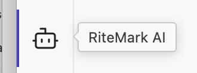
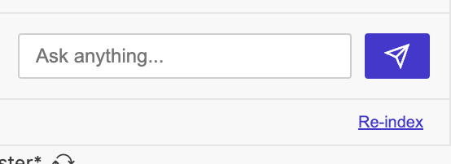

# Document Search - Help & Support

Ask questions about your documents and get AI-powered answers with source citations.

* * *

## What is Document Search?

**Document Search** lets the RiteMark AI assistant search your markdown documents and provide answers based on what you've actually written. Instead of generic AI responses, you get answers grounded in your own notes.

**Example:** Ask "What did I write about the Q3 budget?" and get an answer that references your actual meeting notes.

## How to Use

1.  Open a workspace containing markdown files

2.  Click the **RiteMark AI** icon in the left sidebar
    

3.  Click **Re-index** in the footer
    

4.  Wait for indexing to complete (you'll see "X docs" in the footer)

5.  Ask questions in natural language:
    
    -   "What did I write about X?"
        
    -   "Summarize my notes on Y"
        
    -   "Find mentions of Z"
        

## Understanding the Index

-   Index stored locally: `.ritemark/rag-index.json`
    
-   Only markdown files are indexed (.md, .markdown)
    
-   Index persists between sessions - no need to re-index every time
    
-   Re-index when you add, remove, or significantly change documents
    

## Supported File Types

**Phase 1 (Current):**

-   .md (Markdown)
    
-   .markdown (Markdown)
    

**Coming Soon (Phase 2):**

-   PDF documents
    
-   Word documents (.docx)
    
-   PowerPoint (.pptx)
    

**Future (Phase 3):**

-   Claude Code integration via MCP
    

## Requirements

Document Search uses your existing OpenAI API key. To configure:

1.  Open Command Palette (`Cmd+Shift+P`)
    
2.  Run "RiteMark: Configure OpenAI API Key"
    
3.  Enter your API key
    

## Troubleshooting

### Re-index button does nothing

-   Ensure you have markdown files in your workspace
    
-   Check that your OpenAI API key is configured
    
-   Look for error messages in notifications
    

### AI doesn't reference my documents

-   Make sure you've indexed your workspace (click "Re-index")
    
-   Wait for indexing to complete (footer shows "X docs")
    
-   Try more specific questions that match your document content
    

### Indexing errors

-   Large files with embedded base64 images are automatically handled
    
-   If a specific file fails, check the error message for details
    
-   Very large files may take longer to process
    

### Indexing is slow

-   First-time indexing processes all files
    
-   Large workspaces (hundreds of files) take longer
    
-   Each chunk requires an API call for embeddings
    

## Privacy & Security

**Stays on your computer:**

-   All your document content
    
-   The search index
    
-   Search queries and results
    

**Uses OpenAI API:**

-   Embedding generation (during indexing only)
    
-   AI chat responses (as before)
    

**Note:** Document chunks are sent to OpenAI during indexing to create searchable embeddings. After indexing, all search is local. Review OpenAI's data policies for sensitive content.

## Technical Details

-   Vector database: Orama (local, zero dependencies)
    
-   Embedding model: text-embedding-3-small
    
-   Chunk size: ~256 tokens per chunk
    
-   Index format: JSON
    
-   Location: `{workspace}/.ritemark/rag-index.json`
    

* * *

## FAQ

### Q: Does Document Search need internet?

**A:** Yes, for indexing (embeddings generated via API). After indexing, search is local. Chat still requires API access.

### Q: Is my content sent to the cloud?

**A:** During indexing, text chunks go to OpenAI for embedding generation. The index and search results stay local.

### Q: Which file types are supported?

**A:** Currently markdown only (.md, .markdown). PDF and Word support coming in Phase 2.

### Q: How do I update the index?

**A:** Click "Re-index" in the sidebar footer. Auto-indexing coming in future versions.

### Q: How much disk space does the index use?

**A:** Depends on document count. Typical workspace: 5-10MB. Delete `.ritemark/rag-index.json` to reset.

### Q: Can I use this without an API key?

**A:** No. An OpenAI API key is required for generating embeddings.

### Q: What about Claude Code integration?

**A:** Phase 3 will add MCP (Model Context Protocol) support, allowing Claude Code and other AI tools to search your indexed documents.