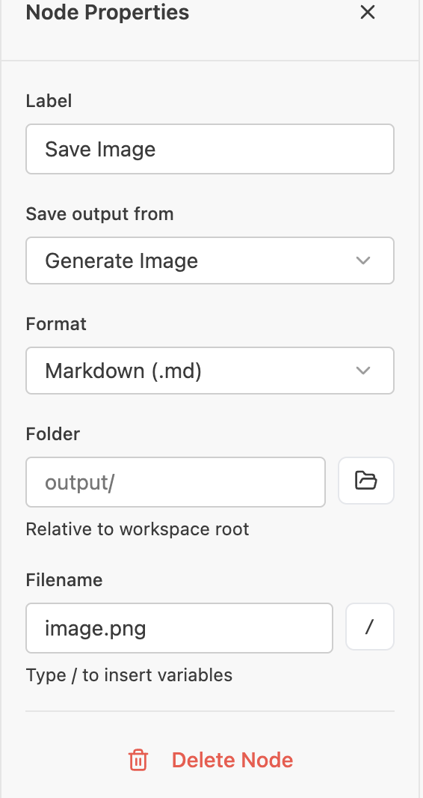

# v1.2.0 Test Checklist

**Release:** Ritemark Flows  
**Date:** 2026-02-02

* * *

## macOS (darwin-arm64)

### New Features

**Ritemark Flows**

- [x] Create new flow (Cmd+Shift+P → "Ritemark: New Flow" --- Test result: more or less OK, except when renaming a flow, the file is reloaded after a few millisecond and that block the renaming procedure (flickering). Minor issue can be fixed in next release (add to [WISHLIST.md](http://WISHLIST.md) as bug fix)
- [x] Add nodes: Text Input, LLM, Output
  - [ ] Minor issue: In trigger node, if file input is enabled, when running a flow user should also be able to select images as input (for image node) in PNG, JPG formats. To be fixed in next release - add to [WISHLIST.md](http://WISHLIST.md) as bug-fix
- [x] Connect nodes with edges
- [x] Run flow → output appears
  - [ ] Minor issue: Save file node seems not to save image files.   
- [x] Save flow → reopen → state preserved
- [x] Delete node → connections update

**Settings Page**

- [x] Open settings (Cmd+,)
- [x] API keys section visible
- [x] Settings persist after restart

### Core Features (Regression)

**Editor**

- [x] Open .md file → editor loads
- [x] Type text → renders correctly
- [x] Formatting: bold, italic, headers work
- [x] Save file (Cmd+S)

**Dictation**

- [x] Start dictation (toolbar or shortcut)
- [x] Speech converts to text
- [x] Stop dictation works

**AI Features** (if API key configured)

- [x] AI assist responds
- [x] Image generation works

### Installation

- [x] DMG opens without Gatekeeper warning
- [x] App runs from /Applications
- [x] No crash on first launch

* * *

## Windows (x64)

### New Features

**Ritemark Flows**

- [ ] Create new flow (Ctrl+Shift+P → "Ritemark: New Flow")
- [ ] Add nodes: Text Input, LLM, Output
- [ ] Connect nodes with edges
- [ ] Run flow → output appears
- [ ] Save flow → reopen → state preserved

**Settings Page**

- [ ] Open settings (Ctrl+,)
- [ ] API keys section visible

### Core Features (Regression)

**Editor**

- [ ] Open .md file → editor loads
- [ ] Type text → renders correctly
- [ ] Formatting works
- [ ] Save file (Ctrl+S)

**Dictation**

- [ ] Dictation works (if microphone available)

### Installation

- [ ] Installer runs without SmartScreen block
- [ ] App launches from Start Menu
- [ ] No crash on first launch

* * *

## Sign-off

| Platform | Tester | Date | Status |
| --- | --- | --- | --- |
| macOS |  |  |  |
| Windows |  |  |  |

**Release approved:** \[ \] Yes / \[ \] No

**Notes:**

```plaintext
(Add any issues or observations here)
```