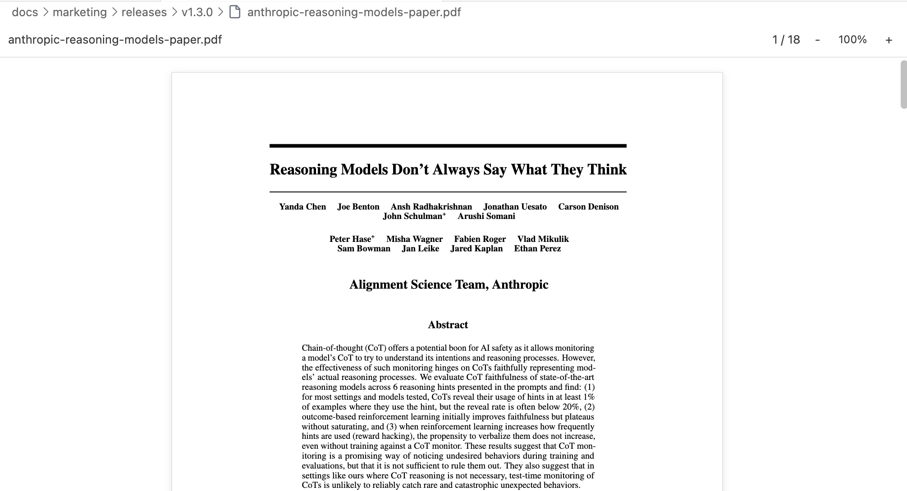
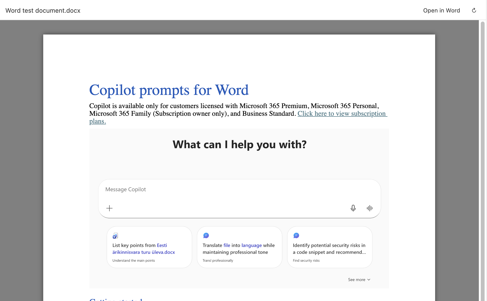
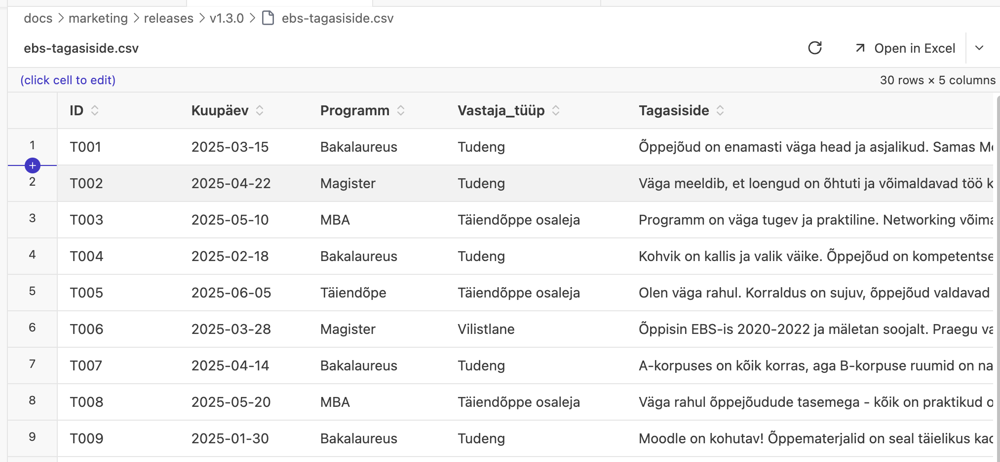
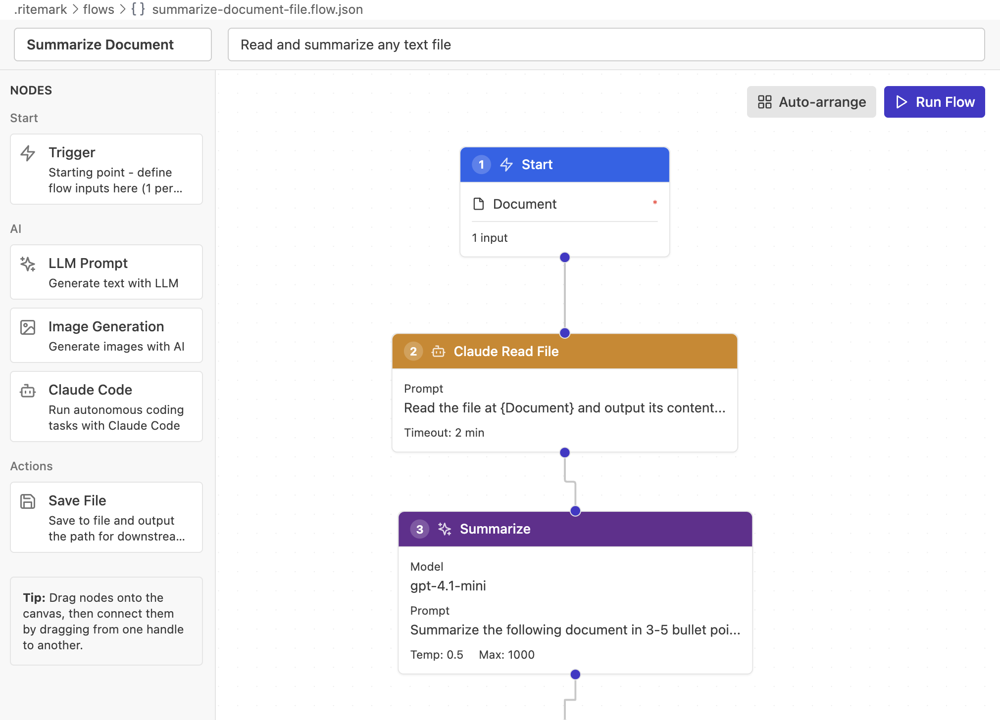

# Ritemark v1.3.0

**Released:** 2026-02-06  
**Type:** Major (new viewers: PDF & DOCX)  
**Download:** [GitHub Release](https://github.com/jarmo-productory/ritemark-public/releases/latest/download/Ritemark.dmg)

## Highlights

Ritemark v1.3.0 expands from a **markdown editor** to a **unified document workspace**. Open PDFs and Word documents alongside your markdown files. Edit CSV data with sorting and row operations. All in one app, without leaving Ritemark.

## What's New

### PDF Preview



Open any PDF file in Ritemark with a clean, document-focused viewer:

-   **Continuous scroll:** All pages in one scrolling view (like reading a document)
    
-   **Text selection:** Select and copy text from PDFs (not just an image)
    
-   **Zoom controls:** 50%, 75%, 100%, 125%, 150%, 200%, Fit Width, Fit Page
    
-   **Page navigation:** Jump to any page with keyboard shortcuts
    
-   **Lazy loading:** Large PDFs render pages as you scroll (performance-optimized)
    

**Technical:** Uses PDF.js with react-pdf for faithful rendering. Text layer overlay enables selection/copy. Worker loaded separately for performance.

### DOCX Preview



Open Microsoft Word documents (.docx) with **basic visual rendering**:

-   **Colors intact:** Text colors, highlights, and backgrounds match the original
    
-   **Layout respected:** Alignment (center, right), columns, and page structure preserved
    
-   **Images included:** Base64-encoded inline images render correctly
    
-   **Tables formatted:** Cell widths, borders, and padding maintained
    

**Known limitations:**

-   Background images are not yet rendered
    
-   Some fonts are missing
    

**Technical:** Uses docx-preview library (same engine as popular VS Code extensions). The `useBase64URL: true` option handles webview security restrictions.

### CSV Editing Enhancements



Building on v1.0.1's CSV preview, v1.3.0 adds interactive data operations:

**Column Sorting:**

-   Click any column header to sort ascending
    
-   Click again for descending
    
-   Click third time to return to original order
    
-   Sort indicators show current state (up/down/unsorted arrows)
    
-   Cell editing works correctly while sorted (original row indices preserved)
    

**Add Rows:**

-   New `[+ Row]` button in spreadsheet toolbar
    
-   Appends empty row with all columns
    
-   Auto-saves to CSV file
    
-   Works with sorted data (new row appears at bottom)
    

**Why it matters:** Quick data exploration without opening Excel. Sort to find patterns, add rows for new entries, all in the same app where you write documentation about that data.

### Claude Code Node (Flows)



Ritemark Flows now includes a **Claude Code** node type for advanced automation:

-   Execute tasks using Claude Code (Anthropic's Agent SDK)
    
-   Pass dynamic inputs from other flow nodes
    
-   Capture outputs (text, file paths) for downstream nodes
    
-   Integration testing included (requires ANTHROPIC\_API\_KEY)
    

**Example workflow:**

```plaintext
Trigger (filename) → Claude Code (analyze file) → LLM (summarize) → Save File (report.md)
```

This enables **agentic workflows** where Claude Code performs complex research/analysis tasks, then LLMs refine the output, all automated.

### Platform Expansion

**Intel Mac Support (darwin-x64):**

-   Ritemark now builds for older Intel-based Macs (2020 and earlier)
    
-   GitHub Actions automated builds for macOS x64
    
-   Separate DMG for Intel architecture
    

**Windows CI:**

-   Automated Windows builds via GitHub Actions
    
-   Triggered on git tags (e.g., `v1.3.0`)
    
-   Setup installer (.exe) built and uploaded to releases
    

**What this means:** More users can run Ritemark, and releases are faster (automated builds reduce manual work).

## Breaking Changes

None. All existing features work as before.

## Known Limitations

### PDF Viewer

-   **Large PDFs:** Files over 50MB may cause performance issues (warning shown at 10MB)
    
-   **Password-protected PDFs:** Not supported (shows error message)
    
-   **Old PDF format:** Very old PDFs (pre-1.4) may not render correctly
    
-   **Forms:** PDF forms are read-only (cannot fill or submit)
    

### DOCX Viewer

-   **Old Word format:** `.doc` files (Word 97-2003) not supported (shows error message)
    
-   **Macros:** VBA macros are ignored (security restriction)
    
-   **Complex layout:** Some advanced layout features (text boxes, SmartArt) may render imperfectly
    
-   **Track changes:** Revision markup not displayed
    

### CSV Enhancements

-   **Multi-line cells:** Not yet supported (deferred to future sprint)
    
-   **Delete row:** Not yet implemented (deferred)
    
-   **Column operations:** Add/delete/rename columns deferred to future sprint
    
-   **Context menus:** Right-click menus deferred (may conflict with VS Code context menus)
    

## Technical Notes

### Bundle Size

-   **Webview.js:** ~3.95MB (includes react-pdf + docx-preview)
    
-   **PDF.js worker:** ~1MB (separate file, not bundled)
    
-   **Total:** ~5MB (at target limit)
    
-   **Previous version:** ~900KB (v1.2.0 before PDF/DOCX)
    

### Content Security Policy (CSP)

PDF and DOCX viewers required CSP updates:

-   `worker-src ${webview.cspSource} blob:` (PDF.js worker)
    
-   `img-src data: blob:` (Base64 images in DOCX)
    
-   `font-src data:` (Embedded fonts in DOCX)
    
-   `style-src 'unsafe-inline'` (docx-preview inline styles)
    

### Dependencies Added

-   `react-pdf@10.3.0` - React wrapper for PDF.js
    
-   `docx-preview@0.3.4` - DOCX rendering with visual fidelity
    
-   `@anthropic-ai/claude-agent-sdk@0.2.29` - Claude Code integration
    

### Build Platform Support

-   macOS Apple Silicon (darwin-arm64) - primary platform
    
-   macOS Intel (darwin-x64) - added in v1.3.0
    
-   Windows 32-bit (win32-x64) - via GitHub Actions
    

## Upgrade Notes

**macOS:**

1.  Download `Ritemark.dmg` from GitHub Releases
    
2.  Open the DMG
    
3.  Drag Ritemark to Applications (replace existing)
    
4.  Launch Ritemark
    

**Windows:**

1.  Download `Ritemark-setup.exe` from GitHub Releases
    
2.  Run the installer
    
3.  Follow setup wizard
    
4.  Launch Ritemark
    

**Intel Macs:**

1.  Download `Ritemark-x64.dmg` from GitHub Releases (separate download for Intel)
    
2.  Open the DMG
    
3.  Drag to Applications
    
4.  Launch Ritemark
    

Your existing documents, settings, Flows, and RAG index are preserved across updates.

## Testing Checklist

For users who want to verify the release:

**PDF Viewer:**

- [ ] Open a PDF file (should open in Ritemark, not external viewer)
- [ ] Scroll through multiple pages
- [ ] Select and copy text from a page
- [ ] Try zoom controls (50%, 100%, 200%, Fit Width, Fit Page)
- [ ] Jump to a specific page number

**DOCX Viewer:**

- [ ] Open a .docx file
- [ ] Verify fonts and colors match Microsoft Word
- [ ] Check that images appear correctly
- [ ] Verify tables have proper alignment and borders

**CSV Enhancements:**

- [ ] Open a CSV file
- [ ] Click a column header to sort
- [ ] Click again to reverse sort
- [ ] Click a third time to unsort
- [ ] Edit a cell while sorted (verify correct row is updated)
- [ ] Click `[+ Row]` button to add a new row
- [ ] Verify new row saves to file

**Regression Testing:**

- [ ] Markdown editing still works
- [ ] Excel preview still works
- [ ] Flows still work
- [ ] AI chat still works
- [ ] Export to PDF/Word still works

## What's Next

**Future enhancements being considered:**

-   CSV multi-line cell editing (Shift+Enter to add line breaks)
    
-   CSV column operations (add/delete/rename columns)
    
-   CSV row deletion with context menu
    
-   PDF annotation support (comments, highlights)
    
-   DOCX editing (not just preview)
    
-   Improved text search across PDF/DOCX content
    

These are not commitments - just ideas based on user feedback and technical feasibility.

## Support

**Issues:** [GitHub Issues](https://github.com/jarmo-productory/ritemark-native/issues)  
**Documentation:** [docs/](https://github.com/jarmo-productory/ritemark-native/tree/main/docs)

* * *

**Sprint Credits:**

-   Sprint 32: PDF/DOCX Preview & CSV Editing
    
-   Sprint 30: Claude Code Node
    
-   Sprint 25: CI/CD Pipeline