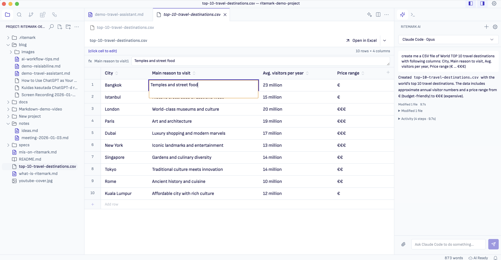

# Ritemark v1.4.0

**Released:** 2026-02-14  
**Type:** Major (agentic AI + visual refresh)  
**Download:** [GitHub Release](https://github.com/jarmo-productory/ritemark-public/releases/tag/v1.4.0)

## Highlights

Ritemark v1.4.0 brings **autonomous AI assistance** to your writing workflow. Claude Code can now read, edit, and organize your files directly from the sidebar — no terminal required. The release also includes a **visual refresh** with cleaner typography and a more writer-friendly aesthetic.

## What's New

### Claude Code Agent in AI Sidebar

The AI sidebar now supports a second agent mode: **Claude Code**. While the original Ritemark Agent helps with writing and research, Claude Code can perform autonomous file operations.

**Why a custom UI for Claude Code?**

We built a dedicated chat interface instead of using the terminal because:

-   **Easier setup:** A guided wizard helps you install Claude Code CLI with visual feedback
    
-   **Non-technical friendly:** Writers and researchers don't feel comfortable in the terminal
    
-   **Better context:** The agent automatically sees your active document — no need to explain what file you're working on
    
-   **Visual feedback:** Real-time activity feed shows what the agent is doing
    
-   **Approachable:** Chat interface feels familiar and less intimidating than command-line tools
    

**Features:**

-   **Multi-turn sessions:** Persistent conversations with fast follow-ups (~2-3s latency)
    
-   **Activity feed:** Real-time visibility into what Claude is doing (reading files, writing, running commands)
    
-   **Image paste:** Cmd+V screenshots directly into chat for visual context
    
-   **Clickable paths:** File paths in responses are clickable — jump to any file mentioned
    
-   **Active file context:** Agent automatically knows what file you're looking at
    
-   **Model selection:** Choose Sonnet (fast), Opus (powerful), or Haiku (lightweight)
    
-   **Excluded folders:** Set boundaries on what the agent can access
    

**How to enable:**

1.  Open Settings (gear icon in sidebar)
    
2.  Navigate to Ritemark Features
    
3.  Enable "Agentic AI Assistant"
    
4.  Select "Claude Code" in the agent dropdown
    

**Requirements:** Claude Code CLI must be installed. The setup wizard will guide you through installation when you first select Claude Code.

### Refreshed Visual Design

Ritemark now looks cleaner and more professional:

-   **Sofia Sans typography:** A friendly, readable UI font replaces the default system font
    
-   **Refined colors:** Softer grays, consistent indigo accents, better contrast
    
-   **Horizontal sidebar tabs:** The activity bar is now a horizontal tab bar at the top of the sidebar to make you more room for writing.
    
-   **Smaller breadcrumbs:** More vertical space for your documents
    
-   **Harmonized icons:** Consistent icon styling throughout
    

These changes make Ritemark feel less like a code editor and more like a writing app.

### Improved CSV Editing

The spreadsheet experience is now closer to Excel:

-   **Full-text editing:** See the entire cell contents while editing (no more truncation)
    
-   **Clear active cell:** Excel-like blue border on the selected cell
    
-   **Column operations:** Add, rename, and delete columns via header interactions
    
-   **Copy-paste:** Cmd+C copies cell content, Cmd+V pastes
    
-   **Better keyboard navigation:** Enter commits edits, Esc cancels, Tab moves to next cell
    

### Export Improvements

PDF and Word export quality improvements:

-   **PDF images work:** Images now render correctly (was broken in v1.3.x)
    
-   **Word images:** Proper aspect ratio calculation for embedded images
    
-   **PDF heading spacing:** Consistent spacing with orphan protection (headings stay with content)
    
-   **PDF blockquotes:** Left border styling for visual distinction
    
-   **Simpler export menu:** Removed confusing template options
    

### Bug Fixes

-   **Cmd+B works for Bold:** No longer conflicts with sidebar toggle
    
-   **Terminal only opens when needed:** Stops auto-opening on every window
    
-   **Toolbar refresh:** Spreadsheet toolbar updates correctly after operations
    

## Breaking Changes

None. All existing features work as before.

## Known Limitations

### Claude Code Agent

-   **Experimental feature:** Must be explicitly enabled in Settings
    
-   **Requires CLI:** Claude Code CLI must be installed (`claude --version` to check)
    
-   **Folder permissions:** Agent respects excluded folders setting but cannot yet show a visual picker
    

### Visual Changes

-   **Font rendering:** Sofia Sans may render differently across macOS versions (tested on macOS 11-15)
    
-   **Theme override:** Custom themes may conflict with new color tokens
    

## Technical Notes

### New VS Code Patches

Seven new patches customize the VS Code workbench:

| Patch | Purpose |
| --- | --- |
| 015 | Font and typography (Sofia Sans) |
| 016 | Sidebar top tabs layout |
| 017 | Titlebar controls |
| 018 | Explorer UI refinements |
| 019 | Right sidebar styling |
| 020 | Icon harmonization |
| 021 | Breadcrumbs ribbon |

### AgentRunner Architecture

The Claude Code integration uses a streaming input pattern for fast multi-turn conversations:

-   Persistent process across conversation turns
    
-   AsyncGenerator yields messages on demand
    
-   Turn tracking prevents stale results after interrupt
    
-   Workspace-scoped permissions via excluded folders config
    

### Feature Flags

| Flag | Status | Description |
| --- | --- | --- |
| `agentic-assistant` | Experimental | Claude Code agent in sidebar |
| `ritemark-flows` | Stable | Visual workflow automation |
| `voice-dictation` | Experimental | Voice input (macOS only) |

## Upgrade Notes

**macOS:**

1.  Download `Ritemark-arm64.dmg` (Apple Silicon) or `Ritemark-x64.dmg` (Intel)
    
2.  Open the DMG and drag to Applications (replace existing)
    
3.  Launch Ritemark
    

**Windows:**

1.  Download `Ritemark-1.4.0-win32-x64-setup.exe`
    
2.  Run the installer (will upgrade existing installation)
    
3.  Launch Ritemark
    

Your documents, settings, Flows, and RAG index are preserved.

## What's Next

-   **Setup wizard:** Guided Claude Code CLI installation
    
-   **Research tool:** RAG-powered search for Claude Code agent
    
-   **Folder permissions UI:** Visual picker for agent access boundaries
    
-   **Checkpoint system:** Undo/redo for agent file modifications
    

## Support

**Issues:** [GitHub Issues](https://github.com/jarmo-productory/ritemark-native/issues)  
**Documentation:** [docs/](https://github.com/jarmo-productory/ritemark-native/tree/main/docs)

* * *

**Sprint Credits:**

-   Sprint 33: Agentic GUI Phase 1
    
-   Sprint 34: Export V2 & CSV Editing
    
-   Sprint 35: GUI Customization