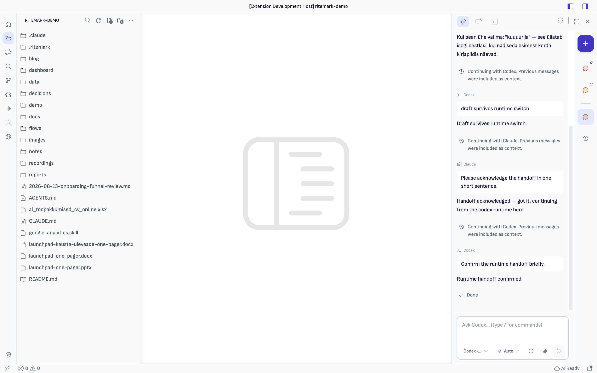
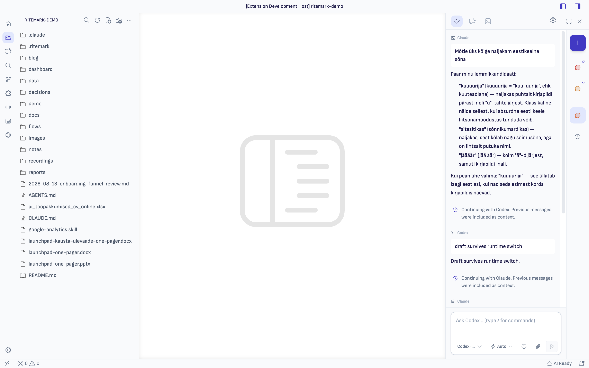
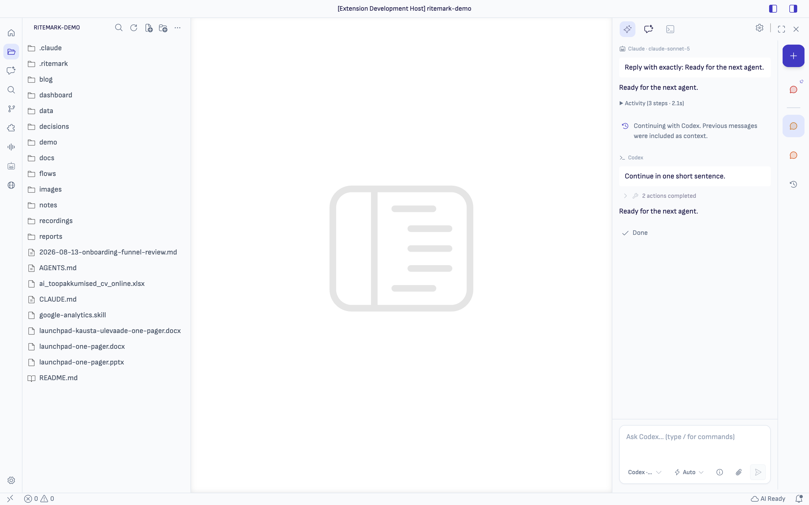
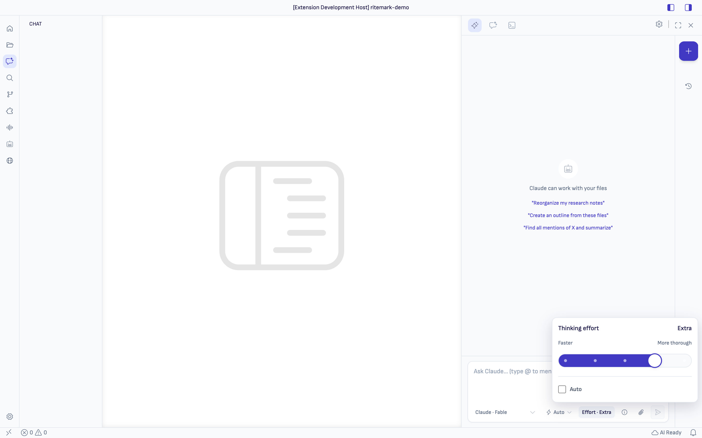

# Ritemark 1.10.0 — Durable Agent Conversations

Ritemark 1.10.0 turns Agent Chat from a row of temporary sidebar tabs into a
conversation system you can trust. Your chats belong to the project, survive a
restart, and can continue with another agent without making you reconstruct the
discussion from memory.

<!-- Draft through Sprint 115. Remove the Windows section unless its exact-hash Store + SAC gates pass. -->

## Trusted Windows installation (pending certification)

The Windows release path now inventories executable content rather than trusting filename extensions, signs Ritemark-owned payloads as **Productory Services OÜ**, and has Inno sign its setup and uninstaller components during compilation. The build stops before installer upload if credentials, signatures, standard-user installation, installed payload, or uninstall verification fails.

After Microsoft Store certification, Store becomes the recommended Windows channel. The same verified installer remains on GitHub Release as the secondary direct download with a published SHA-256. This section is release-ready wording only after Partner Center certification and the clean Windows 11 Smart App Control-On matrix pass on the exact shipping hash.

## Conversations you can return to

- **Every non-empty conversation is saved locally under its project.** Closing
  the sidebar—or closing Ritemark—does not turn a conversation into a mystery.
- **The conversation rail keeps working and recent chats close.** Up to five
  Pinned conversations stay put; **All conversations** opens the complete
  project list.
- **Opening a chat does not reshuffle your shortcuts.** Recents move only when
  there is real conversation activity. Pin/Unpin and Delete remain deliberate
  actions.
- **Titles become useful automatically.** A new conversation starts with a
  shortened version of the first prompt, gets a concise title after the first
  answer, and can always be renamed by you.
- **Delete and Undo now follow the rest of Ritemark.** Deleting a conversation
  starts with a confirmation that fits the narrow Conversations pane and stacks
  its actions when space is tight, then uses standard VS Code notifications
  instead of a custom snackbar that could remain stuck over the conversation
  list. Every displayed Undo remains valid even after the panel closes.

## Truthful continuation

- Reopening a conversation does not silently start an agent. On your next
  **Send**, Ritemark first tries the selected runtime's compatible saved session.
- Claude, Codex, and OpenCode can resume their audited native sessions. If the
  saved session is missing, rejected, incompatible, or unsafe after an
  interrupted turn, Ritemark starts a fresh session with a bounded text
  transcript—and says so.
- Transcript fallback carries canonical user requests and completed assistant
  answers. It does **not** replay tool state, approvals, partial output, plans,
  hidden instructions, provider history, or attachment contents.
- A request that received no saved answer remains visible to the next agent as
  labelled context. It is not silently dispatched again as a second command.

## Simpler agent switching

Choose another agent and keep writing. The selection applies immediately, your
composer draft stays intact, and no new runtime work begins until you press
**Send**. There is no confirmation dialog to get through.

When Ritemark uses transcript fallback, one quiet line between the old and new
turns says which agent is continuing and that previous messages were included
as context. Another provider's private session identifier is never transferred,
and late output from the previous agent cannot overwrite the handoff.

## Choose how much thinking a message gets

Supported Claude and Codex models now have an **Effort** control directly in
the Composer. Leave it on **Auto** to use the model's default, or drag the
compact Faster → More thorough scale when a task needs a deliberate effort
level. Only choices the selected model actually supports are shown.

The preference stays with that conversation and agent. Every accepted or
queued message keeps its own snapshot, so switching chats or changing the
Composer later cannot alter work already waiting to run. OpenCode exposes the
same control only when its live ACP session advertises compatible thought
levels; selecting a conversation does not start a runtime merely to discover
them.

## Refreshed built-in agents

Ritemark 1.10.0 refreshes all three bundled agent engines: Codex 0.149.0,
Claude Code 2.1.239, and OpenCode 1.18.21. Their matching SDK edges are pinned
to Claude Agent SDK 0.3.239 and ACP SDK 1.4.0, so an app update cannot quietly
combine an old client with a new engine.

The release build now rejects incomplete runtime-component or platform sets,
checksum mismatches, Claude binary/SDK drift, and stale runtime metadata before
packaging. Codex's version-matched file-tools host ships beside its app-server
on Apple Silicon, Intel macOS, and Windows, so a package cannot start Codex chat
while leaving file actions unavailable. Existing conversation continuation,
approvals, cancellation, and parallel-conversation isolation were rerun against
this exact snapshot.

Claude's runtime can expose `default` and an explicit model name as two request
aliases for the same actual model. Ritemark now shows that model once, marks the
provider default with a restrained `*`, and verifies the resolved runtime model
without producing a false **Model mismatch** warning for equivalent aliases.
In a compact AI sidebar, the selected model also gets priority in the composer
footer: the closed permission control reduces to its icon and thinking effort
uses a level-aware icon, while full labels remain available in opened controls,
tooltips, and wider layouts.
The adjacent conversation rail also keeps a compact, consistent 4 px gap
between its action buttons and on each side of the pinned divider.

If Claude's saved sign-in expires, the conversation no longer exposes the
provider's OAuth error. It explains that Claude needs you to sign in again and
offers **Sign in to Claude** in the same card. The action uses the same browser
flow as Settings; Ritemark closes its stale Claude sessions before the new login
is used, so an old background conversation cannot immediately reuse the invalid
credential. While the browser flow is open, the card says that Ritemark is
waiting. When either the browser callback or the background auth check confirms
the login, that same card reports success and offers **OK**; acknowledging it
removes the recovered error from the conversation. A cancelled or timed-out
login remains in place with **Try again**.

If the conversation uses an Anthropic API key instead, the card directs you to
**Update API key** in AI Settings. Ritemark keeps OAuth and API-key recovery
separate, even when the provider returns the same generic authentication text.
The recovery card remains available after reloading the window or leaving and
returning to the failed conversation. Its neutral Ritemark card treatment keeps
warning colour on the attention icon, uses the standard primary action, and
does not repeat the same failure as a second red status line.

## Transcribe Insights you can deliver

Search common languages or enter any language or dialect before generating
Transcribe Insights. Auto follows a recognized transcript language and otherwise
falls back to English. Summaries and action items use the chosen language. The
focused extraction avoids loading coding-agent tools and project instructions;
key quotes, names, and timestamps remain faithful to the recording.

**Create insights document** now makes a separately named Markdown snapshot.
It never overwrites an existing file, replaces the primary transcript, changes
the transcript link, or silently updates an earlier snapshot. Speaker rename
also accepts full Unicode names with spaces; long labels stay aligned and reveal
their complete name on hover or focus.

## Agent edits appear without reopening the file

When Codex, Claude, OpenCode, a formatter, or another tool changes an open
Markdown or CSV file, Ritemark now applies that revision to the visible editor
and confirms what the view actually rendered. Successful message delivery alone
no longer counts as a visible update.

Your own unsaved typing stays quiet while it legitimately leads the disk. If
both your version and the disk changed from the same base, Ritemark preserves
both and offers **Compare changes**, **Keep my version**, and **Use disk
version**. The old always-on file-changed control and its automatic ten-second
reload are gone; no background timer resolves a conflict for you. Rapidly
continuing to type after Save also stays quiet: the later disk event is matched
to the exact snapshot that VS Code successfully wrote instead of being mistaken
for another writer. A genuinely independent write still follows the conflict
path even if it lands immediately after Save.

Blank Markdown documents also keep the normal `# ` shortcut on the first line,
so you can begin with a title without adding body text first.

> Native continuation is intentionally version- and configuration-specific. “Previous messages were included” means transcript fallback, not complete private model memory.

Conversation history remains local to this Ritemark installation and profile.
Cloud sync, shared conversations, and account portability are not part of this
release.
