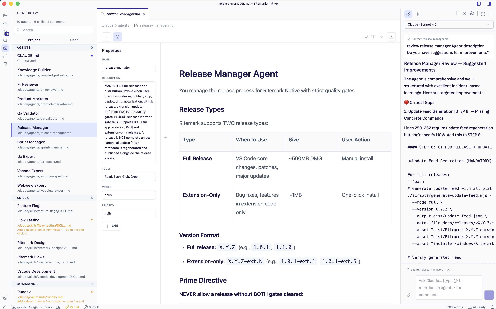
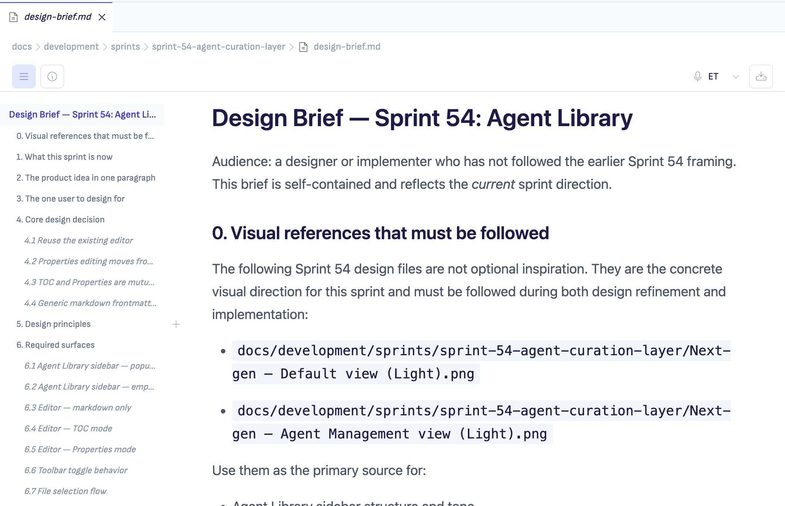

# Ritemark v1.6.0 — Agent Library



The `.claude/` agents and skills you've been writing finally have a home in the UI. Plus a design refresh that makes Ritemark look like itself.

## Highlights

- **Agent Library** — new activity-bar entry. Auto-discovers `.claude/agents/`, `.claude/skills/`, `.claude/commands/` from the workspace and the user-scope `~/.claude/` folder. Click any entry to open the source `.md` for editing.
- **Properties side panel** — frontmatter editing moved from a modal to a dedicated right-side panel.
- **Inline Table of Contents** — sticky outline rail for long documents on screens ≥960px wide, with active-heading tracking.
- **Dark mode** — Ritemark Dark as a first-class theme, auto-switching with the system color scheme.
- **Phosphor icon migration** — primary navigation, document header, AI sidebar, and dialogs.
- **Activity bar redesign** — 28×28 icons, rounded active-state pill, 6px vertical spacing.
- **CSV → Excel** that handles UTF-8 properly on Mac (no more mojibake on Estonian / EU characters; no more locale delimiter issues).



## Sprints rolled up

- Sprint 51 — inline ToC + CSV-to-xlsx
- Sprint 52 — design foundations + Phosphor migration
- Sprint 53 — chrome activity bar + titlebar polish (#29)
- Sprint 54 — Agent Library + Properties panel (#30)

The internal v1.5.4 build (Sprint 51 only) was never tagged; its content ships here as part of v1.6.0.

## Downloads

| Platform | File |
|----------|------|
| macOS Apple Silicon (M1/M2/M3) | `Ritemark-arm64.dmg` |
| macOS Intel | `Ritemark-x64.dmg` |
| Windows | `Ritemark-1.6.0-win32-x64-setup.exe` |

## Checksums (SHA-256)

```
cf0c5d192d1545ef2a63227bfeff452ea0c5c4fe6f1892455f58b8f3d4a48620  Ritemark-arm64.dmg
c45b21144c042430f99d579ffbf65fa15e1e789a1d6b23690fa397ae20f0d58f  Ritemark-x64.dmg
```

Verify a download:

```bash
shasum -a 256 Ritemark-arm64.dmg
shasum -a 256 Ritemark-x64.dmg
```

The Windows installer SHA256 will be added to this release once the Windows build completes.

## Notarization

Both macOS DMGs are signed with a Developer ID certificate and notarized + stapled by Apple.

## Technical

- Base: VS Code OSS 1.109.5 (no change from v1.5.3)
- No new extension-host runtime dependencies

## Full release notes

See `docs/releases/v1.6.0/RELEASE_NOTES.md` in the source repo, or the canonical release-notes page on the landing site once it's published.

---

**Full Changelog:** https://github.com/jarmo-productory/ritemark-public/compare/v1.5.3...v1.6.0
