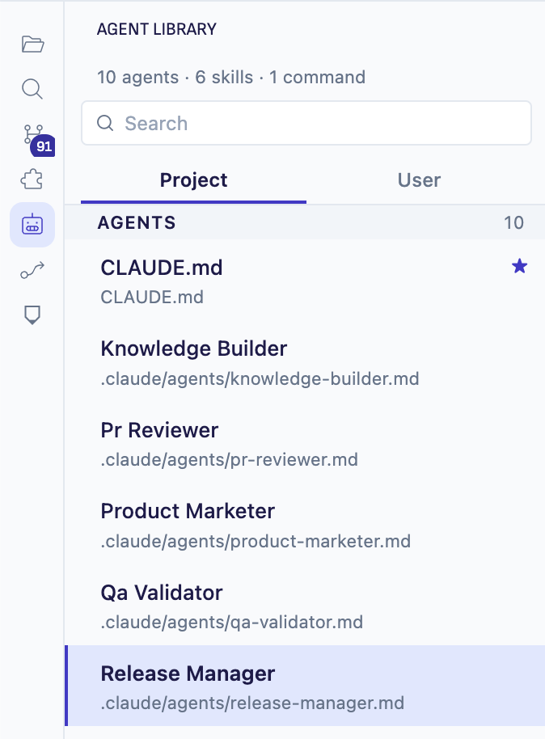
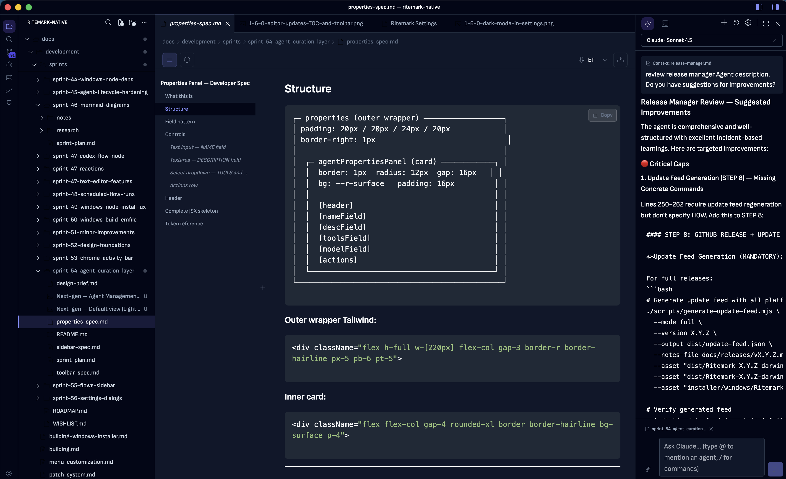
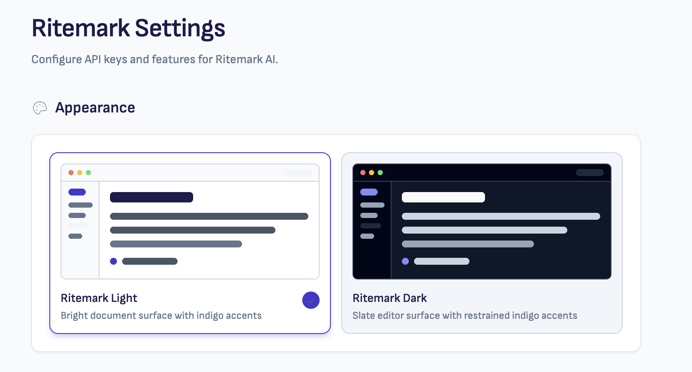

# Ritemark v1.6.0 — Agent Library

**Released:** 2026-04-28
**Type:** Minor release
**Theme:** Agents come to the front seat

---

## Downloads

| Platform | File |
|----------|------|
| macOS Apple Silicon (M1/M2/M3) | `Ritemark-arm64.dmg` |
| macOS Intel | `Ritemark-x64.dmg` |
| Windows | `Ritemark-1.6.0-win32-x64-setup.exe` |

Latest download links: <https://github.com/jarmo-productory/ritemark-public/releases/latest>

---

## Highlights

v1.6.0 makes Ritemark feel like a finished product.

- **Agent Library** — your `.claude/` agents and skills are now first-class citizens with their own activity-bar entry, instead of files buried in hidden folders.
- **Visual refresh** — a Phosphor-icon design system, a redrawn activity bar, dark mode as a first-class option, and consistent indigo accents replace the leftover VS Code chrome.
- **Properties side panel** — frontmatter editing moves from a modal to a dedicated panel that opens alongside the document.
- **Inline Table of Contents** — a sticky outline rail for long documents, with active-heading tracking.
- **CSV → Excel** that actually works on Mac for Estonian and other EU users.

If you used v1.5.x, the app will look noticeably more polished after updating. Nothing in your documents changes.

---

## What's New

### Agent Library

A new activity-bar entry that auto-discovers every agent, skill, and slash command you've written and lists them in one place.

**What it does:**

- Scans `.claude/agents/`, `.claude/skills/`, and `.claude/commands/` in the workspace, plus the same folders under `~/.claude/` for user-scope items
- Groups items by scope (workspace vs. user) so you can tell which library you're looking at
- Reads the YAML frontmatter (`name`, `description`) and shows it inline
- Click any entry to open the source `.md` file in the editor — the file is the source of truth, the panel is read-only
- Flags agents missing a `description` field with an inline warning so you can spot drift
- Refresh button picks up new files without restarting the app

**What it does not do (yet):** create, duplicate, delete, or run agents. This is the curation layer — editing workflows are future work.

The frontmatter parser is robust against the common edge cases that trip naive parsers:

- CRLF line endings (agents written or saved on Windows)
- YAML block scalar indicators (`>`, `>-`, `|`, `|-`) for multi-line descriptions
- Indented continuation lines

If you maintain a personal agent library, this is the screen you'll keep open.

### Properties side panel

The document Properties button used to open a modal dialog over the editor. It now opens a dedicated side panel to the right of the document, so you can edit frontmatter (status, tags, dates, custom fields) while still seeing your text.

### Inline Table of Contents

The Contents button in the document header opens a sticky 220px outline rail on the left side of the editor (on screens at least 960px wide). The rail stays in place as you scroll, highlights the heading you're currently reading in indigo, and clicking any heading jumps you to that section.

On narrow windows the Contents button still opens the classic dropdown — nothing breaks on small screens. The inline-vs-dropdown preference is remembered per machine.

### Dark mode, properly

Ritemark Dark ships as a first-class theme alongside Ritemark Light. Auto-switching follows the system color scheme by default. The theme was rebalanced so editor surfaces, the activity bar, and the AI sidebar share a consistent palette instead of looking like three different apps stacked together.

### Activity bar redesign

The activity bar was redrawn to look like Ritemark instead of VS Code:

- 28×28 icons with a rounded active-state pill instead of VS Code's left-edge bar
- 6px vertical spacing between icons (added in this release on top of Sprint 53)
- Phosphor icon set replaces Codicons across primary navigation
- Dedicated Agent Library and Flows entries

### Phosphor icon migration

Most user-facing icons across the editor, document header, AI sidebar, and dialogs were migrated from VS Code's Codicons to [Phosphor Icons](https://phosphoricons.com/). The visual weight and corner radius are now consistent throughout the app.

### CSV "Open in Excel" — encoding fixed on Mac

When you click **Open in Excel** on a CSV file, Ritemark now converts it to a temporary `.xlsx` file (via SheetJS) before handing it to Excel, instead of opening the raw CSV.

This fixes two real-world problems Mac users hit regularly:

- **Encoding mojibake with Estonian / EU characters:** Mac Excel's CSV importer assumes MacRoman and mangles UTF-8 (ä, õ, ü, ž, etc.). Going through .xlsx preserves the encoding.
- **Semicolon-delimiter locale issues:** In EU locales, Excel expects `;` as the CSV separator and may break columns when the source file uses `,`. The .xlsx conversion sidesteps the locale entirely.

The temporary .xlsx file is cleaned up automatically after 5 seconds.

---

## Improvements

- **Diagnostic noise suppression:** Markdown files no longer show red squiggles for missing link references, and the file tree no longer shows error decorations propagated from the editor.
- **AI panel default placement:** The Ritemark AI panel now reliably docks on the right side on first launch, regardless of any cached VS Code view positions.
- **Auxiliary bar icon tabs:** The right sidebar now shows compact icon-only tabs instead of full text labels when multiple panels are docked there.
- **Phosphor font loading:** Font loading was hardened in production builds so icons no longer briefly render as boxes during startup.
- **AI panel focus:** Focus restoration timeout was tightened so the chat input is reliably focused when you open the AI panel.

---

## Fixes

- **Activity bar spacing:** Restored 6px vertical spacing between activity-bar icons (regression introduced during Sprint 53 chrome work).
- **Frontmatter parser CRLF:** Agent files saved with Windows-style line endings are now parsed correctly.
- **Frontmatter parser block scalars:** YAML descriptions written with `>-`, `|`, `|-` indicators no longer break discovery.

---

## Sprints included

This release rolls up four sprints. The internal v1.5.4 build (Sprint 51 only) was never tagged or released; its content ships here as part of v1.6.0.

- **Sprint 51** — inline Table of Contents + CSV-to-Excel via xlsx conversion
- **Sprint 52** — design foundations + Phosphor icon migration
- **Sprint 53** — chrome activity bar + titlebar polish ([PR #29](https://github.com/jarmo-productory/ritemark-native/pull/29))
- **Sprint 54** — Agent Library + Properties panel + TOC simplification ([PR #30](https://github.com/jarmo-productory/ritemark-native/pull/30))

---

## Technical notes

**VS Code base:** 1.109.5 (no change from v1.5.3).

**No new runtime dependencies on the extension host.** The Agent Library is built on the existing webview infrastructure, and the CSV → Excel conversion uses SheetJS, which was already bundled for the spreadsheet viewer.

**Patch layout** (4 consolidated patches, unchanged from prior releases):

- `001-ritemark-branding.patch` — theme, fonts, icons, welcome page, about dialog, breadcrumbs
- `002-ritemark-ui-layout.patch` — sidebar, titlebar, tabs, explorer, panels (this is where activity-bar spacing and the icon-tab auxiliary bar live)
- `003-ritemark-menu-cleanup.patch` — hides VS Code dev features (chat, debug, go menu, etc.)
- `004-ritemark-build-system.patch` — jschardet, microphone permission, integrity-check skip
- `005-ritemark-windows-and-oss-fixes.patch`, `006-ritemark-dev-launch-fallback.patch` — platform fixes

---

## Upgrade

No migration steps. No new settings to configure. If you've customized your `.claude/` folder structure, the Agent Library will discover everything automatically — your `.md` files remain the source of truth and are never modified.

Auto-update will pick up v1.6.0 from the update feed at next launch. To update immediately, download from the link at the top of this document.

---

## Screenshots

All images above live in `docs/releases/v1.6.0/screenshots/`:

- `1-6-0-agent-management-fullscreen.png` — Agent Library full view (headline image)
- `1-6-0-focus-on-agents-list.png` — close-up of the agent list
- `1-6-0-editor-updates-TOC-and-toolbar.png` — inline Table of Contents + refreshed toolbar
- `1-6-0-ritemark-dark-mode-full-screen.png` — dark mode full-screen
- `1-6-0-dark-mode-in-settings.png` — dark mode picker in Settings
