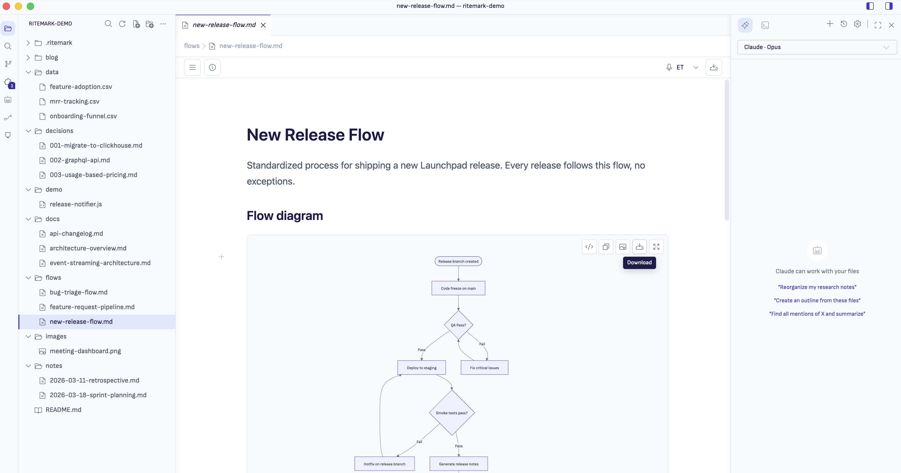
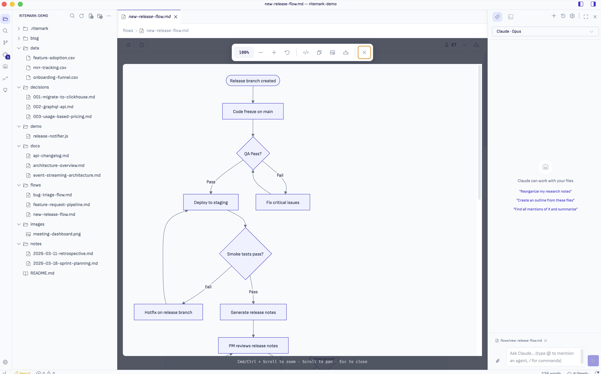
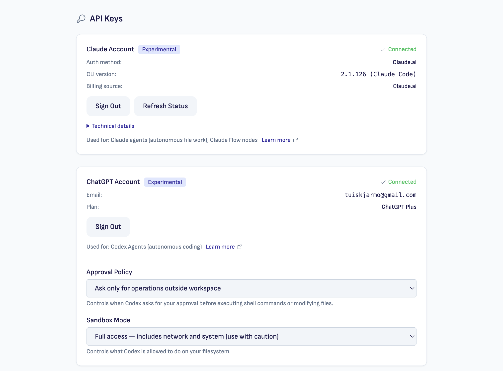
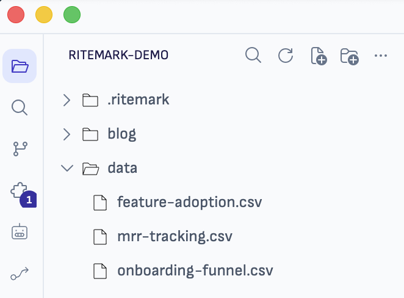

# Ritemark v1.6.1 — Foundation + Polish

**Status:** Released (2026-05-02)
**Type:** Patch release
**Focus:** VS Code engine upgrade, Windows onboarding, Mermaid diagram polish, bug fixes

* * *

## Downloads

| Platform | Download |
| --- | --- |
| macOS Apple Silicon (M1/M2/M3) | [Ritemark-arm64.dmg](https://github.com/jarmo-productory/ritemark-public/releases/latest/download/Ritemark-arm64.dmg) |
| macOS Intel | [Ritemark-x64.dmg](https://github.com/jarmo-productory/ritemark-public/releases/latest/download/Ritemark-x64.dmg) |

> Windows: coming soon — the installer will be added as a follow-up asset on the v1.6.1 release.

* * *

## What's New

### VS Code Engine Upgrade: 1.109.5 → 1.117.0

The underlying VS Code engine jumps from 1.109.5 to 1.117.0 — a major leap covering 8 upstream releases. This brings improved editor performance, updated Electron, and better platform support without changing anything in your Ritemark workflow.

All 6 Ritemark patches (branding, UI layout, menu cleanup, build system, Windows/OSS fixes, dev launch) have been rebased and validated against the new base.

### Mermaid Diagrams — Wider, Sharper, Exportable

Diagrams now render at the full content-container width (no more 680px cap), with reduced margins so they breathe inside the document rather than floating in whitespace. Complex diagrams that overflow scroll horizontally instead of getting clipped or shrunken.

New diagram toolbar:
- **Copy image** — copy the rendered SVG to the clipboard.
- **Download** — Save As dialog to write the diagram to disk.
- **Expand** — full-screen overlay with cursor-anchored Cmd/Ctrl+Scroll zoom (0.25×–4×). Press Esc to close.

### Friendlier Claude / Codex Onboarding (Windows + macOS)

- **Bundled agent runtime** — agent CLIs (Claude, Codex) can now be shipped inside the extension instead of relying on whatever's installed globally. Lays the groundwork for clean Windows onboarding.
- **Truthful Claude auth state** — Settings now queries the Claude CLI directly to determine sign-in state. Previously the env-var fallback could falsely report "Connected" after `claude logout`.
- **Terminal-free sign-in** — `claude /login` now runs as a background subprocess and opens your system browser. No terminal needed. There's also an "Use Anthropic API key" alternative path with input box + secret storage, and a Cancel button during in-progress sign-in (5-min timeout).
- **Codex sign-in unified** — the AI sidebar's "Sign in with ChatGPT" now opens your system browser instead of dropping into a terminal, matching the Settings flow. Sign in/out from one surface propagates to the other.
- **Workspace trust prompt removed** — first-launch friction gone; you can start editing immediately.

<!-- TODO: add AI sidebar Claude needs-auth wizard screenshot when shot -->
<!-- TODO: add AI sidebar Claude in-progress / ready screenshot when shot -->
<!-- TODO: add AI sidebar Codex needs-auth wizard screenshot when shot -->
<!-- TODO: add AI sidebar Codex ready screenshot when shot -->

### Visual Refresh — Phosphor Icon Weight

Chrome icons (titlebar, sidebar, toolbars, activity bar) bumped from thin (100) to regular (400) for better legibility, especially in light theme. The icons now read clearly at small sizes without the hairline-thin strokes washing out.

### Copilot Removed

VS Code 1.117 added a Microsoft Copilot first-run wizard which crashed Ritemark prod boot. We patched it out and removed the bundled GitHub Copilot Chat extension entirely. Ritemark uses Claude / Codex / Ritemark Agent — Copilot won't appear anywhere.

### Bug Fixes

- **Text selection visibility** — selection background in code blocks and table cells is now clearly distinguishable from row hover highlight.
- **Gitignored files in Explorer** — entries like `docs-internal/` and `node_modules/` are now readable in the File Explorer (the gitignored foreground was previously near-invisible against the sidebar background, in both light and dark themes).
- **AI Flow file writes** — Flow-generated files now route through `vscode.workspace.fs` instead of raw Node `fs`, fixing reliability issues with workspace file creation.
- **File explorer refresh after AI writes** — the explorer tree now auto-refreshes when Claude Code or other agents write files to the workspace, plus a manual refresh button in the explorer toolbar.
- **Document header hook** — replaced stale `document-header` sentinel with `ai-sidebar` to fix hook misfires.
- **GH #39 — spdlog x86_64 binary** — replaced an x86_64 native module that was leaking into arm64 builds, fixing a startup crash on Apple Silicon when the submodule was bumped.
- **GH #41 — JSON LSP `startFailed`** — cleaned stale CJS-compiled `out/` from the html/css/json language-features extensions after the upstream ESM flip; the JSON language server starts cleanly again.

* * *

## Also Included

- **Activity bar spacing** — 6px vertical spacing between activity-bar icons (post-v1.6.0 polish).
- **Sprint 54 contributions restored** — Agent Library panel adjustments that were dropped during the patch 002 rebase have been put back.

* * *

## For Developers

**VS Code base:** 1.117.0 (up from 1.109.5)

**Patches:** All 6 patches rebased cleanly onto 1.117.0. No new patches in this release.

**New utilities:**
- `bundledAgentRuntime` — resolves bundled CLI binaries from `extensions/ritemark/binaries/agents/`, with tests.
- `detectClaudeAuthMethod` — CLI-first auth detection in `agent/setup.ts`, with env-var demoted to last-resort fallback.

**Upgrade notes:** No breaking changes. No new runtime dependencies in the extension host.

* * *

## Sprints Rolled Up

- **Sprint 55** — VS Code 1.109.5 → 1.117.0 upgrade + bug bundle (text selection, AI file writes, explorer refresh, hook fix)
- **Sprint 56** — Mermaid diagram fixes (margins, toolbar polish, expand view, Save As download)
- **Sprint 57** — Windows onboarding (bundled agent runtime, truthful Claude auth, terminal-free sign-in)
- **Theme fix** — gitignored Explorer entries readability (PR #37)
