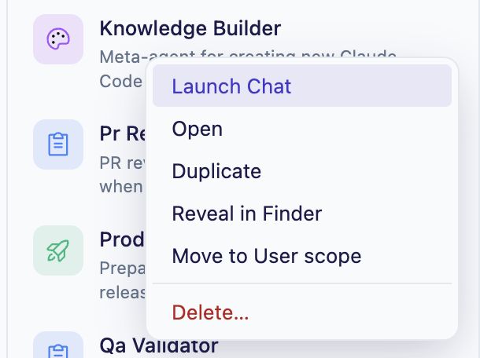
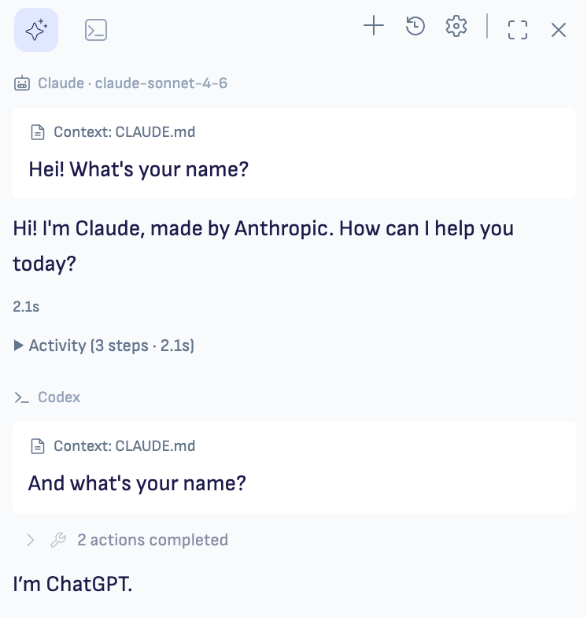

# Ritemark v1.6.3 — One Conversation, Many Runtimes; A Library You Can Talk To

> Draft release body for GitHub. Finalize after Gate 2 validation and checksum verification.

Conversations are now durable workspaces where each turn can use a different runtime (Claude or Codex), and the Agent Library is now something you can *author from* and *launch from* — not just browse.



## Highlights

- **Conversation runtime switching (per turn)** — switch Claude ↔ Codex inside one thread without starting over
- **Per-message provenance** — every assistant message shows runtime + model
- **Plan/Edit per turn** — Codex mode now lives in the composer footer per run
- **Agent Library authoring loop** — create new skills/agents in-app (modal flow + scaffolds)
- **Launch Chat from Agent Library** — right-click an agent and start chat with it pinned as hidden context
- **`AGENTS.md` + `.agents/` discovery** — project conventions from both Claude and Codex ecosystems are now first-class
- **Model fallback refresh** — Claude fallback IDs updated to current Sonnet/Opus/Haiku values



## Sprints rolled up

- Sprint 59 — Agent Authoring Loop
- Sprint 60 — Agent Harness Refactor (internal)
- Sprint 61 — Agent Library Icons & Colours
- Sprint 62 — Conversation Runtime + Agent Switching
- Sprint 63 — Minor Updates (Launch Chat, AGENTS/.agents discovery, model refresh)

## Downloads

| Platform | File |
|----------|------|
| macOS Apple Silicon (M1/M2/M3) | `Ritemark-arm64.dmg` |
| macOS Intel | `Ritemark-x64.dmg` |

> Windows installer is published as a follow-up release asset after the tag-triggered CI workflow and Windows packaging step.

## Checksums (SHA-256)

```text
TODO: fill after final artifacts are produced and verified.
Ritemark-arm64.dmg  <sha256>
Ritemark-x64.dmg    <sha256>
Ritemark-Setup.exe  <sha256>
```

## Notarization

Both macOS DMGs must be signed, notarized, and stapled before release publication.

## Technical

- No breaking changes
- No new extension/webview runtime dependencies
- Conversation storage migration is backward-compatible with existing records

## Full release notes

See `docs/releases/v1.6.3/release-notes.md`.

---

**Full Changelog:** https://github.com/jarmo-productory/ritemark-public/compare/v1.6.2...v1.6.3
