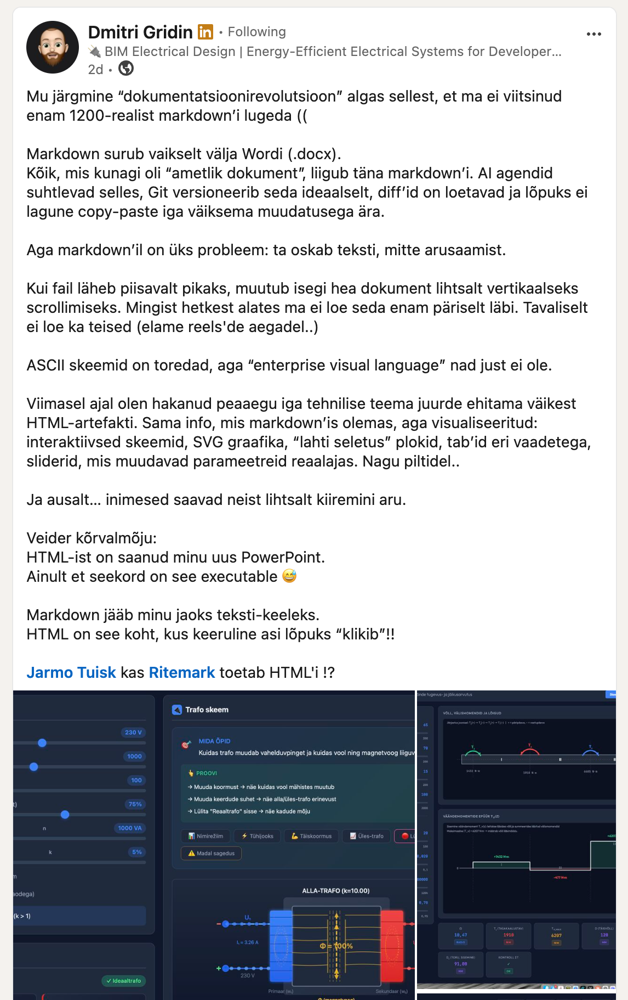
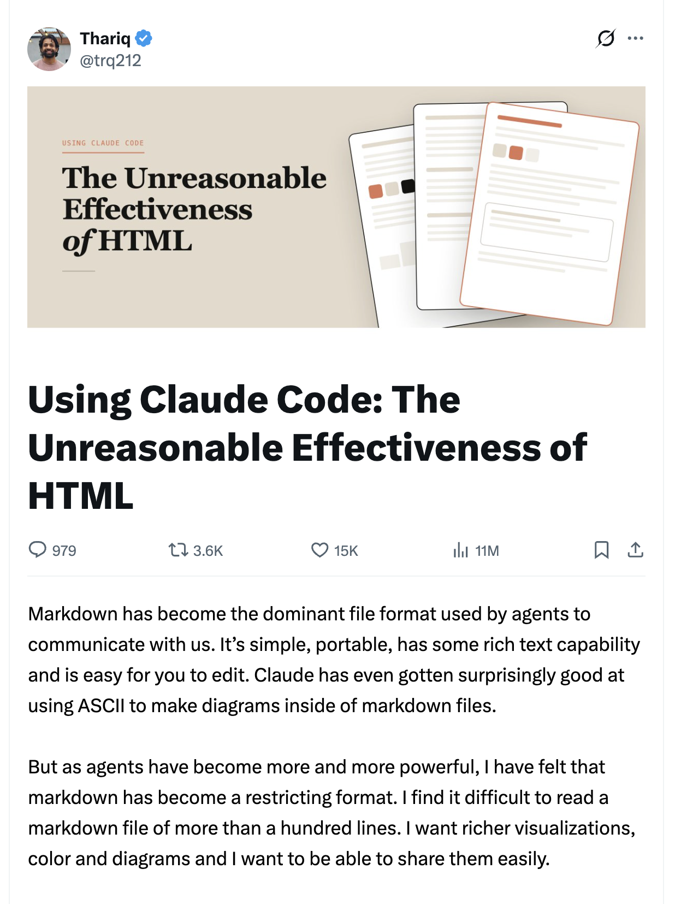

# v1.7.0 Marketing — The AI Can Finally Read Both Halves of Your Work

**Status:** Draft

## One-liner

Ritemark v1.7.0: the AI can finally read both halves of your work. Markdown is your prose. HTML is your executable PowerPoint. v1.7.0 makes the AI fluent in both.

## Positioning

**The AI used to be blind to half your work.**

Technical writers, marketers, designers, and developers have been quietly running a two-artifact workflow for years: a `.md` file for the prose, and an interactive HTML artifact for the part that needs to actually *do* something — a parameter slider, an animated SVG, a tabbed comparison, a rendered component. Two files, one idea.

The AI only ever saw the markdown half. The HTML — the part that proved the idea worked — lived in a separate browser tab, invisible to the model unless you copy-pasted it into chat.

v1.7.0 fixes that. The local `.html` next to your `.md` opens as a real editor pane in the same tab bar. The AI reads both. The workflow that always existed is finally first-class in one app.

Markdown is still the right tool for text. It is the new `.docx` for documentation, technical writing, AI prompts, runbooks — and Ritemark has been best-in-class there since v1.0, with Mermaid diagrams rendered inline inside the markdown editor. For roughly 90% of technical writing, prose + Mermaid in one `.md` file is the whole answer.

The remaining 10% is where ideas genuinely *need* an interactive surface. As Ritemark user **Dmitri Gridin** put it:

> *"HTML has become my new PowerPoint, except this time it's executable."*

That 10% is what v1.7.0 unlocks — not by inventing a new format, but by removing the seam between the markdown, the rendered artifact, and the AI that reads them.

**Markdown stays the text language. Mermaid stays the inline-diagram language. HTML is where the complex thing finally clicks. One app — Ritemark — holds all three, and the AI sees all three.**

The screenshot below is one of Dmitri's HTML artifacts — an interactive transformer schematic with parameter sliders, sitting alongside markdown documentation. v1.7.0 enables exactly this workflow natively.

## Who this is for

### Technical writers — prose explains, HTML proves

Static documentation describes behavior. Runnable documentation demonstrates it. With v1.7.0, an `.md` walkthrough sits next to an `.html` artifact in the same tab bar — interactive schematics, parameter playgrounds, "expand for the full derivation" blocks. The prose explains *why*; the HTML lets the reader verify *that it actually works*. And because the AI now reads both, "is the derivation in the markdown consistent with the simulation in the HTML?" becomes a real question with a real answer.

### Marketers — campaign brief and mockup in one AI context

The campaign brief lives in `brief.md`. The hero mockup lives in `hero.html`. Until v1.7.0, asking an AI "does this hero placement match the energetic tone we set in the brief?" required copy-pasting both into ChatGPT. Now both are open in the same editor, the AI reads both, and the answer comes back grounded in the actual mockup — not a description of one.

### Designers — spec and implementation, side by side

`button-spec.md` describes the component. `button-demo.html` renders it. With both open and the AI reading both, parity checks stop being manual: "Does the implementation match the spec's hover states?" "Is the contrast WCAG-AA at the rendered size?" "Are we using the spacing tokens the spec calls for?" The AI is looking at the actual rendered component, not a description of one.

### Developers — localhost is the artifact

The sleeper feature: the integrated browser handles `localhost:*`, and `localhost:3000` IS the artifact. Your running app is now something the AI can see. Hit the camera icon in the browser toolbar to add a viewport screenshot to the next chat turn, and "why is the sidebar layout broken at this width?" becomes a question the AI can actually answer — with the rendered DOM in front of it, not a guess at the CSS.

## Why this matters now

The timing isn't accidental. Thariq Shihipar — an engineer on the Claude Code team at Anthropic, the people who build the AI inside Ritemark — published *"The Unreasonable Effectiveness of HTML"* and watched it reach 11 million impressions. His argument: as agents become more powerful, markdown has become a restricting format. He wants richer visualizations, color, diagrams, things you can share and explore — and HTML delivers them.

We agree with the diagnosis. We differ on the prescription.

Thariq's take is "move beyond markdown." Ritemark's take is "markdown stays right for text — it always was — and HTML fills the 10% where markdown is genuinely restricting." Not a replacement; a complement. The editor that holds both is the one that meets the moment.

-   The 10% case is happening more often. Individual writers, designers, and engineers are already manually building executable HTML alongside their markdown. v1.7.0 makes the workflow first-class instead of a workaround.
    
-   The people building AI agree HTML is where richer communication lives. Ritemark is the editor that lets you write both and lets the AI read both.
    
-   Writing apps don't know what's on your screen. Ritemark does — and it asks consent before sharing the page with the model.
    
-   Agentic workflows already touch the browser (Claude Computer Use, Codex CLI sessions). Ritemark gives them a first-class, consented, read-aware surface inside the same app you write in.
    
-   "Ask AI about this page" used to mean copy-paste-into-chat. v1.7.0 makes it a chip in the composer.
    

## Consent and privacy

The AI never reads anything until you say so. The first time per session that you ask a question with the browser open, a **"Share with Agent?"** prompt fires. Decline and nothing leaks — not the URL, not the page title, not the DOM. Allow and a compact page summary flows to the next turn. Screenshot is a separate, explicit opt-in via the camera icon in the browser toolbar.

## The generation angle (what comes next)

v1.7.0 is the read side. Even today you can ask Claude to generate an HTML artifact, save it next to your markdown, open it in Ritemark, and have the AI read and iterate on what it just built. The loop closes — clunkily, but it closes.

**v1.7.1 will do this natively inside Ritemark:** HTML mini-apps generated *in* the editor, dropped into the same browser pane, ready for the next turn of feedback. v1.7.0 is the foundation that makes that possible.

## Social post (short)

The AI used to be blind to half your work. v1.7.0 fixes that.

Markdown is your prose. HTML is your executable PowerPoint. Ritemark v1.7.0 opens your local `.html` next to your `.md` and makes the AI fluent in both.

## Social post (thread)

1/ The AI used to be blind to half your work.

You write the prose in `.md`. You build the interactive part in `.html`. Two artifacts, one idea. But the AI only ever saw the markdown half.

Ritemark v1.7.0 ships today. It fixes that.

2/ A Ritemark user, Dmitri Gridin, put it best: *"HTML has become my new PowerPoint, except this time it's executable."*

Interactive schematics. Parameter sliders. Animated SVG. Tabbed comparisons. Things that don't compress to ASCII or a static image — things that want to be runnable.

3/ Until now, that workflow meant two apps: a markdown editor and a separate browser. The AI saw one and not the other. Copy-paste into ChatGPT was the bridge.

v1.7.0 collapses it. Your local `.html` opens as a real editor pane next to your `.md`. The AI reads both.

4/ For the 90% case — prose + Mermaid diagrams in one `.md` — Ritemark has been best-in-class since v1.0. Mermaid still renders inline. That doesn't change.

What changes is the 10% where the idea wants to be clickable. That part is finally in the same app.

5/ Technical writers: prose explains, HTML proves. Marketers: brief and mockup in the same AI context. Designers: spec and rendered component, parity-checked. Developers: `localhost:3000` IS the artifact — camera icon adds a viewport screenshot for "why is this broken?" questions.

6/ Consent stays explicit. First question per session triggers a "Share with Agent?" prompt. Decline = nothing leaks (not even the URL). Allow = compact page summary flows to the next turn.

7/ The chip is in the composer. Globe icon, page title, × to drop context for one turn. Indigo when annotation (screenshot) is on. One glance tells you what the AI is seeing.

8/ One data point on timing: Thariq Shihipar, an engineer on the Claude Code team at Anthropic, published *"The Unreasonable Effectiveness of HTML"* — 11M impressions. His take: markdown is restricting as agents get more powerful. HTML is richer.

We agree with the diagnosis. Ritemark's answer: markdown stays for text. HTML fills the 10% that's restricting. One editor, both, AI reads both.

9/ Next: v1.7.1 will generate the HTML *inside* Ritemark. Ask the AI for a parameter playground, get back a working `.html`, open it in the same browser pane, iterate. v1.7.0 is the read side. v1.7.1 closes the loop.

10/ Ritemark v1.7.0 — out now. Markdown for prose. Mermaid for inline diagrams. HTML for where the complex thing finally clicks. One AI that reads all three.

## Influencer angle / pitch lines

-   *"The AI used to be blind to half your work. v1.7.0 fixes that."*
    
-   *"Markdown is your prose. HTML is your executable PowerPoint. Ritemark makes the AI fluent in both."*
    
-   *"Prose explains. HTML proves. The AI now reads both."*
    
-   *"Your* `localhost:3000` *is now something the AI can see. Camera icon, one screenshot, real question."*
    
-   *"Spec in markdown. Rendered component in HTML. Parity check by AI. Same editor."*
    
-   *"Stop copy-pasting URLs into ChatGPT. Open the page, ask the question."*
    
-   *"Claude Computer Use sees the whole screen. Ritemark sees the markdown AND the HTML artifact YOU just authored. Different problem, cleaner solution."*
    
-   *"Mermaid for the static diagrams. HTML for the parameter sliders. v1.7.0 makes neither one a separate app."*
    
-   *"The engineer who builds Claude Code says HTML is more powerful than markdown for AI communication. Ritemark v1.7.0 is the editor that holds both — and the AI that reads both."*
    
-   *"Markdown isn't retiring. It's getting a complement. The 10% that markdown can't express — interactive, visual, stateful — is where HTML lives. v1.7.0 puts both in one editor."*
    

## Changelog bullets

-   Markdown + local HTML artifact workflow in one editor — `.html` files open as rendered pages alongside `.md` files in the same tab bar
    
-   In-app browser (Electron BrowserView) — external sites, localhost, workspace `.html`, with back/forward, reload, DevTools, history
    
-   Terminal `localhost:*` links route to the integrated browser
    
-   `.html` opens in the browser by default; "Open as Text" remains an explicit option
    
-   Browser-aware AI chat: Claude + Codex receive page URL/title + ARIA summary on every turn (when shared)
    
-   Per-turn dismiss chip in the composer
    
-   Annotation toggle (camera icon) adds viewport screenshot for visual questions
    
-   Consent boundary: nothing leaks until the user accepts "Share with Agent?"
    
-   Codex runtime hardening: system-runtime preference, compatibility probe fix, manifest bump
    
-   Settings page cleanup: orphaned dropdowns and dead toggles removed; Codex Integration promoted to `stable`
    
-   Agent Library: branded casing preserved (UX Expert, PR Reviewer, QA Validator, VS Code Expert)
    
-   Cross-platform pre-commit validator (Linux + macOS)
    

## Screenshots

### Captured (`screenshots/`)

| File | Use |
| --- | --- |
| `1-7-0-html-dashboard.png` | **Hero candidate** — local analytics dashboard HTML open with AI answering business questions about it. Full two-artifact workflow visible. |
| `1-7-0-html-interactive-documentation.png` | API reference HTML + AI sidebar. Technical writer use case. |
| `1-7-0-html-openai-dev-docs.png` | External site (OpenAI Agents SDK docs) in the integrated browser, multiple tabs, AI sidebar active. Shows real-world browsing breadth. |
| `1-7-0-browser-screenshot-mode-active-full.png` | Annotation mode on, AI analyzing ritemark.app layout — full view. Good for feature deep-dives. |
| `1-7-0-browser-screenshot-mode-focused-button.png` | Close-up of tab bar + camera icon. Clean detail shot for annotation explainer. |
| `1-7-0-settings-agent-runtime-picker.png` | Agent Runtime settings — bundled vs system, Claude + Codex paths. |

### Still to capture (if needed)

-   `Share with Agent?` consent prompt
    
-   Browser context chip in composer (globe icon + × dismiss)
    
-   Indigo chip state (annotation active)