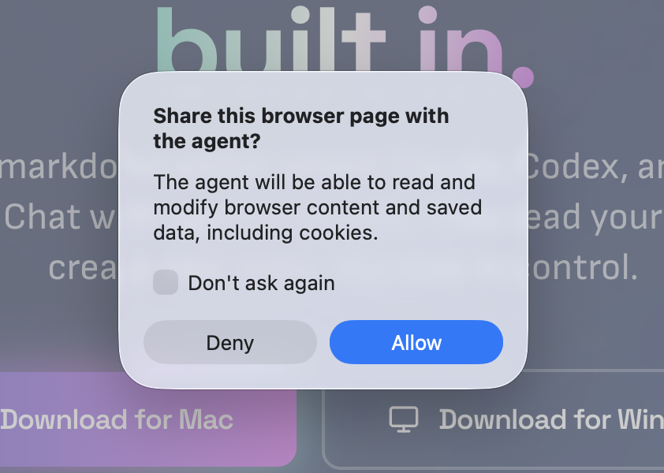
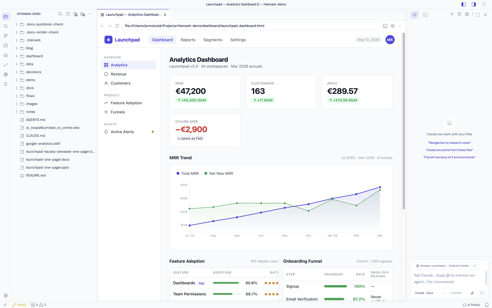

# Ritemark v1.7.1 — The AI Can Now Drive the Browser

**Status:** Released
**Type:** Feature + patch release
**Focus:** v1.7.0 taught the AI sidebar to *read* the integrated browser. v1.7.1 lets it *act* — navigate, click, fill forms, type, scroll — with an explicit per-tab consent gate that's distinct from the read prompt. Plus the v1.7.0 follow-up fixes that didn't ship as their own release: clipboard inside the webview, chat history showing every conversation, HTML files opening cleanly into the browser without a text-tab flicker, and Marketplace-installed GitHub Copilot support for teams that need the Microsoft/GitHub-approved path.

* * *

## Downloads

| Platform | Download |
| --- | --- |
| macOS Apple Silicon (M1/M2/M3) | [Ritemark-arm64.dmg](https://github.com/jarmo-productory/ritemark-public/releases/latest/download/Ritemark-arm64.dmg) |
| macOS Intel | [Ritemark-x64.dmg](https://github.com/jarmo-productory/ritemark-public/releases/latest/download/Ritemark-x64.dmg) |

> Windows: coming as a follow-up asset on the v1.7.1 release.

* * *

## First-Launch on macOS: Open Anyway

This release is **signed but not notarized by Apple**. The DMG is signed with our Developer ID certificate (Team JKBSC3ZDT5) and uses the hardened runtime — the same signing posture as every previous release. Apple's notarization service is currently holding our submissions in a team-eligibility review (case 102892219755, open since 2026-05-15), so we are shipping the v1.7.1 binaries without the notarization staple this one time.

What you will see on first launch:

- **macOS will refuse to open the app** with the message *"Ritemark.app can't be opened because Apple cannot check it for malicious software."* This is Gatekeeper's standard response to an unnotarized Developer ID app — it is **not** a "this app is unsafe" warning.
- Click **Done** to dismiss the dialog.
- Open **System Settings → Privacy & Security**.
- Scroll to the *Security* section. You will see a line: *"Ritemark.app was blocked to protect your Mac."*
- Click **Open Anyway** (you may need to authenticate with Touch ID or your password).
- macOS will show the original dialog again with an **Open** button. Click it.
- From this point onward, Ritemark opens normally — macOS remembers the approval for this exact build.

If you upgraded from v1.7.0 via the in-app update prompt, you will still see this dialog: the v1.7.1 DMG is downloaded to a fresh location, mounted, and the new Ritemark.app inherits a fresh quarantine attribute that triggers Gatekeeper one more time. After approving once, future launches work without any prompts.

We expect to ship a notarized re-upload to this same release page (no version bump, no new tag) as soon as Apple clears the case. If you prefer to wait, v1.7.0 remains available on the [previous release](https://github.com/jarmo-productory/ritemark-public/releases/tag/v1.7.0).

* * *

## Why This Release

v1.7.0 closed the seam between markdown and HTML and gave the AI sidebar a third context source: the page in the active browser tab. The AI could finally read both halves of the work. But it was still a passive reader — you opened the page, the AI commented on it, you clicked the next link.

The natural next question is what happens when the AI does the clicking. That question opens a different set of risks than "read the page." A model that types in your input fields and submits forms is operating with materially more authority than one that just summarizes the DOM. It needs a different consent gate, a different default (off), and a stronger expectation that you can see every action happen in real time.

v1.7.1 is that gate. Five focused browser tools — navigate, click, fill, type, scroll — wired into both Claude Code SDK and Codex App Server, gated behind an opt-in feature flag, and protected by a dedicated **"Allow AI to control this browser tab?"** prompt that fires the first time the AI tries to act on a tab. Decline and subsequent calls fail safely. Accept and the agent can drive the tab while you watch, with each action returning an updated page snapshot so the AI sees the result of its own work without needing to ask again.

This release also bundles three v1.7.0 follow-ups that were planned as a Sprint 68 patch but folded into v1.7.1 once Sprint 69 landed on schedule: clipboard operations now work inside the sandboxed webview, the Chat History panel shows every saved conversation (not just the most recent), and clicking an `.html` file no longer flickers through a text editor on its way to the browser. The flicker fix in particular changes how Ritemark opens `.html` files at the workbench level — the text editor never opens in the first place, instead of being opened and then redirected.

Closes [#67](https://github.com/ProductoryHQ/ritemark-native/issues/67) (AI Browser Control) and [#68](https://github.com/ProductoryHQ/ritemark-native/issues/68) (GitHub Copilot support).

* * *

## What's New

### AI Agent Browser Control

The AI sidebar can now drive the integrated browser. Five tools, both runtimes, one consent dialog.

The tools are deliberately narrow:

-   **`browser_navigate`** — go to a URL, or `back` / `forward` / `reload` the current page. If no browser tab is open, the agent auto-creates one; if a tab already exists, the agent reuses the first one rather than spawning a new tab for every navigation.
-   **`browser_click`** — click an element by ARIA reference or CSS selector. The ARIA reference comes from the same page outline the AI receives as Sprint 67 read context, so the AI is clicking on something it has already seen.
-   **`browser_fill`** — set the value of a form input. Used for typed text that the AI wants to submit as part of a form.
-   **`browser_type`** — send raw keystrokes or key combinations to the focused element. Used when the page expects keyboard events rather than a programmatic value set (rich text editors, search-as-you-type widgets, hotkey flows).
-   **`browser_scroll`** — scroll the page into the area the AI wants to inspect or interact with next.

Every tool call ends by returning the updated ARIA page summary, so the AI sees the result of its own action without spending another round-trip asking. The browser tab stays visible and interactive while the agent works — you can watch the cursor move, the input fill, and the page change. There is no headless mode, no off-screen browser, no shadow tab.

#### A dedicated control consent

The first time the AI tries to call any of these tools, Ritemark shows a workbench dialog distinct from the Sprint 67 read-share prompt:

> **Allow AI to control this browser tab?**
>
> The AI agent will be able to navigate, click elements, fill forms, and scroll in this browser tab. You will always see actions happening in real time.
>
> Grant control only for tabs where you trust the AI's actions.
>
> **[Allow Control]    [Cancel]**



Allow once per tab per session. Decline and any subsequent control call from the AI returns a typed error — the next call doesn't re-prompt, and Sprint 67 read context (URL, title, summary, screenshot) keeps working. Revoking read consent for a tab also revokes control consent: you can't accidentally end up in a state where the AI can act on a page it can't see.

This consent is intentionally separate from the read-share prompt. Reading the page is a different question from typing into it. The two prompts use different wording and different default buttons.

#### Experimental, opt-in, macOS only

The feature ships behind the `browser-agent-control` flag, status **experimental**, platform **darwin** only. It is **off by default**. To turn it on for v1.7.1, edit `settings.json` directly:

```json
{
  "ritemark.features.browser-agent-control": true
}
```

(The Settings UI's Features section was removed in this same release — see *What's Fixed* below — so the flag toggle lives in `settings.json` for now. A leaner Features panel returns in a later release.)

With the flag off, the browser-tool definitions are not registered with either runtime, the AI does not know they exist, and Sprint 67 read context behaves exactly as in v1.7.0.

#### How each runtime sees the tools

Same five capabilities, two protocols:

-   **Claude Code SDK** — Ritemark exposes the tools as an in-process MCP server. The model sees them as `mcp__ritemark_browser__browser_navigate`, `mcp__ritemark_browser__browser_click`, and so on.
-   **Codex App Server** — Ritemark uses Codex's experimental `dynamicTools` parameter on `thread/start`, with `item/tool/call` round-trips back to the workbench. The model sees the tools as the bare names `ritemark_browser_navigate`, `ritemark_browser_click`, and so on (no `mcp__` prefix on the Codex side).

Either way, the consent dialog, the page-summary readback, and the underlying Playwright-driven action layer are the same. Codex `thread/start` now waits up to 120 seconds for cold-start (was 60s) because the dynamic-tools attach occasionally exceeded the old limit.

#### What this is not (yet)

This sprint shipped the smallest control loop that proves the product value. Several adjacent capabilities were considered and deliberately deferred:

-   **Cross-origin iframe interaction** — embedded YouTube, Stripe Checkout, OAuth popups inside an iframe. Out of scope.
-   **Drag-and-drop** — gesture-based file uploads, sortable lists. Out of scope.
-   **Raw `run_playwright_code` / evaluate** — a general-purpose script-eval escape hatch. Deliberately not exposed; the five named tools are the surface.
-   **File upload picker handling** — `<input type="file">` interactions.
-   **Multi-tab orchestration** — the AI drives a single active tab; it does not open a tab, work in it, switch to another tab, and continue.
-   **Persistent recording / replay** — actions are not recorded for re-execution.
-   **Coordinate-based or vision-only clicking** — control is ARIA-first.

These are recorded in Sprint 69's *Deferred* section and are candidates for follow-up sprints.

### HTML files open in the browser without flicker

In v1.7.0, clicking an `.html` file in the Explorer briefly showed a text editor before the `BrowserHtmlOpenRedirector` listener noticed and closed it in favour of the browser. The flicker was harmless but visible, and on cold start the redirector occasionally lost the race entirely (tracked as [#63](https://github.com/ProductoryHQ/ritemark-native/issues/63)).

v1.7.1 replaces the reactive listener with a workbench-level editor resolver: `**/*.{html,htm}` routes to the BrowserEditor at `default` priority. The text editor is never opened in the first place, on cold start or otherwise. Right-click → **Open as Text** still works — it goes through an explicit `vscode.openWith(uri, 'default')` that bypasses the resolver and opens the source.

The same-URL reuse logic applies here too: opening the same `.html` file twice reuses the existing browser tab rather than stacking duplicates.



### Marketplace-installed GitHub Copilot support

Ritemark now allows users to install GitHub Copilot and Copilot Chat from the Marketplace and use them inside Ritemark without letting upstream VS Code Chat take over the Ritemark-owned AI surface.

This is deliberately a Marketplace path, not a bundled Copilot path. Ritemark still strips the bundled `extensions/copilot` package from production builds, and there is no separate Ritemark Copilot toggle. Installing or uninstalling the Marketplace extension is the user-facing control.

The support work restores the minimum VS Code compatibility Copilot needs:

-   GitHub auth metadata and trusted access for `github.copilot-chat`
-   Copilot Chat proposed API allow-listing for the compatible VS Code 1.117 extension package
-   Copilot inline completions and code actions no longer disabled by Ritemark defaults
-   Core Copilot Chat view registration restored while setup badges, command-center takeover, status-bar takeover, and debug-only Copilot containers remain suppressed
-   A narrow sign-in command path so Copilot's contained Sign In button works without restoring the full upstream Chat setup contribution
-   Production profiles with stale hidden Chat layout state are repaired, the real Chat panel stays in the Auxiliary Bar, and a primary Activity Bar launcher opens it when Marketplace Copilot Chat is installed

Ritemark AI remains the primary agentic UI. If Copilot Chat is installed, it appears beside Ritemark AI in the Auxiliary Bar, ordered after Ritemark AI and before Terminal; the Activity Bar only provides the launcher.

* * *

## What's Fixed

-   **Chat History shows every saved conversation.** The panel was loading the conversation list exactly once — on first open — and then never refreshing. Saved conversations from earlier sessions sat correctly in workspace-scoped storage but never made it into the panel; users saw a single entry where they should have seen a full list. Fixed: the list now reloads as soon as the workspace context is established, so every conversation in the current project appears, grouped by recency. Workspace scoping is unchanged — conversations from one project never appear when working in another. The redundant "New Chat" button in the history panel header was also removed; the `+` button in the AI sidebar toolbar starts a new chat. Fixes [#65](https://github.com/ProductoryHQ/ritemark-native/issues/65).

-   **Clipboard works inside the sandboxed webview.** Copy buttons on code blocks, "Copy as Markdown" in the export menu, and Cmd+C/Cmd+V inside table cells were silently failing under the hardened webview sandbox — the browser clipboard API was not available, and nothing landed on the system clipboard. Fixed by routing every clipboard operation through the VS Code extension host instead of the webview's `navigator.clipboard`. Fixes [#66](https://github.com/ProductoryHQ/ritemark-native/issues/66).

-   **HTML cold-start race is gone.** The Sprint 65 `BrowserHtmlOpenRedirector` had a window where it could lose the race on app cold-start and leave an `.html` file stuck as a blank text tab. Sprint 68 patched the redirector with an extra `onDidChangeVisibleTextEditors` listener; Sprint 69 then superseded the redirector entirely with the workbench editor resolver described above. Either way, the original symptom is gone. Fixes [#63](https://github.com/ProductoryHQ/ritemark-native/issues/63).

-   **Misleading Settings dropdown removed.** Settings had an "Open HTML files in…" dropdown with options *Open as Text (default)* and *Legacy: Browser default (disabled)*. The wording never matched actual behaviour since Sprint 65 — the integrated browser was already the real default — so the control was quietly removed in this release. The Features section in Settings (which housed the flag toggles) was removed in the same pass; flags are temporarily set via `settings.json` until a leaner Features panel returns.

* * *

## What Didn't Change

Markdown editing, the file explorer, file watcher, Mermaid rendering, the agent library, dictation, the Codex auth flow, the integrated browser's address bar / DevTools / back-forward / annotation toggle, Sprint 67's read-side AI context (URL, title, ARIA summary, optional screenshot) — everything outside the new browser-control surface, Copilot compatibility path, and the four fixes above behaves as in v1.7.0.

GitHub Copilot does not replace Ritemark AI, does not become the default Ritemark runtime, and is not bundled with the app. It is available only when the user installs it from the Marketplace.

A handful of adjacent capabilities were considered and deferred (see *What this is not (yet)* under AI Agent Browser Control). The deferred list is the Sprint 69 plan's *Deferred from Sprint 69* section.

* * *

## Upgrade

Auto-update will offer v1.7.1 to existing v1.7.0 users on next launch. You can also download the DMG directly. No settings migration is required.

The `browser-agent-control` flag is **off by default**. To try the new AI browser control, open `settings.json` (Cmd+, → "Open Settings (JSON)") and add:

```json
{
  "ritemark.features.browser-agent-control": true
}
```

Then restart Ritemark — the AgentSession reads feature flags only at session creation time.

The first AI action against a browser tab triggers the **"Allow AI to control this browser tab?"** dialog. This is a separate consent from the Sprint 67 read-share prompt; both can be required for a tab where you also want the AI to read it.

* * *

## Technical Notes

For developers and changelog readers.

**Sprints rolled up:**

-   [Sprint 68 — v1.7.1 Patch Fixes](../../development/sprints/sprint-68-v1.7.1-patch-fixes/sprint-plan.md)
-   [Sprint 69 — AI Agent Browser Control](../../development/sprints/sprint-69-ai-browser-control/sprint-plan.md)
-   [Sprint 71 — GitHub Copilot Support](../../development/sprints/sprint-71-github-copilot-support/sprint-plan.md)

**Highlights — AI Agent Browser Control (Sprint 69):**

-   New VS Code patch `patches/vscode/010-ritemark-browser-action-bridge.patch`. Adds five `BrowserViewCommandId` entries (`ClickElement`, `FillElement`, `Navigate`, `Scroll`, `TypeInPage`) plus `EnsureActiveBrowserControlShared` (the new consent command). Each tool action runs through `IPlaywrightService` and returns `{ summary, error? }` so the AI sees the post-action page state without an extra read call.
-   `IBrowserViewModel` gains `sharedWithAgentForControl: boolean` plus `setSharedWithAgentForControl()` / `onDidChangeSharedWithAgentForControl`. Cascade rule: revoking `sharedWithAgent` also flips `sharedWithAgentForControl` to false.
-   Claude Code SDK side: `extensions/ritemark/src/browser/BrowserActionTools.ts` registers an in-process MCP server. Tool names surface to the model as `mcp__ritemark_browser__*`. The `canUseTool` callback is the dispatch point; the action runs synchronously, the result is injected via `updatedInput._result`.
-   Codex side: `dynamicTools` is attached to `thread/start`; `item/tool/call` JSON-RPC requests are dispatched the same way through `BrowserActionTools`. Tool names surface as bare `ritemark_browser_*`. `thread/start` timeout bumped from 60s to 120s to accommodate the dynamic-tools attach.
-   New feature flag `browser-agent-control` — `experimental`, `darwin`-only — in `extensions/ritemark/src/features/flags.ts`. With the flag off, neither runtime sees the tools (no MCP server registered for Claude, no `dynamicTools` array for Codex).
-   `BrowserContextStore` extended with control-consent tracking; `ensureControlConsentForActiveTab()` is the helper the dispatch path calls before executing any tool.
-   E2E validation matrix in `docs/development/sprints/sprint-69-ai-browser-control/notes/e2e-validation.md`: Claude + Codex happy path, flag-off negative test, no-tab error path, consent revoke cascade.

**Highlights — HTML opens cleanly (Sprint 69 polish):**

-   Workbench editor resolver registers `**/*.{html,htm}` → BrowserEditor at `default` priority. The text editor is never opened for `.html` files; the old `BrowserHtmlOpenRedirector` reactive listener is deleted.
-   Right-click → **Open as Text** routes through `vscode.openWith(uri, 'default')`, which bypasses the resolver and opens the source.
-   Same-URL reuse: opening the same `.html` twice reuses the existing browser tab.

**Highlights — Sprint 68 carry-over:**

-   `webview/src/lib/clipboard.ts` routes every clipboard read/write through a new extension-host message (`webview:clipboard:write` / `webview:clipboard:read`). All call sites — code block copy, export → Copy as Markdown, table cell Cmd+C/Cmd+V — migrated to the helper.
-   `store.ts` `agent:config` handler calls `loadConversationList()` immediately after `setWorkspaceContext()` so the panel state is populated before first render.
-   `BrowserHtmlOpenRedirector` cold-start race fix from Sprint 68 (`onDidChangeVisibleTextEditors` subscription) is now redundant — superseded by the Sprint 69 editor resolver — but kept for one release as a belt-and-suspenders guard.

**Highlights — GitHub Copilot support (Sprint 71):**

-   `branding/product.json` now includes the Copilot-compatible `defaultChatAgent`, GitHub trusted auth access, and the `github.copilot-chat` proposed API allow-list required by the Marketplace Copilot Chat extension.
-   `extensions/ritemark/package.json` no longer disables Marketplace-installed Copilot inline completions, auto-completions, code actions, or chat-agent enablement by default.
-   Patch 003 restores the core Chat view registration and skips VS Code's builtin chat enablement migration, which otherwise disabled Marketplace-installed Copilot Chat when Ritemark suppresses the full upstream Chat setup UI.
-   Patch 007 registers only the Copilot sign-in/setup commands needed by the contained Copilot Chat flow, keeps the real Chat panel in the Auxiliary Bar, and routes the Activity Bar launcher to that panel while leaving setup agents, titlebar sign-in, account menus, and setup badges disabled.
-   Patch 002 keeps `ritemark-ai` first in the Auxiliary Bar for new and existing profiles, so Copilot Chat can coexist without replacing the Ritemark AI panel.
-   Production builds still remove bundled `extensions/copilot`; Sprint 71 supports Marketplace-installed Copilot only.

**Upgrade notes:** No breaking changes. Patch 010 applies cleanly on top of patches 001–009. The workbench `out/` directory needs a re-transpile on the first dev build after pulling v1.7.1 source. No new runtime dependencies — the MCP server runs in-process inside the extension host.

* * *

## Sprints Rolled Up

-   **Sprint 68** — v1.7.1 Patch Fixes (clipboard, chat history, HTML cold-start race)
-   **Sprint 69** — AI Agent Browser Control (user-facing marquee)
-   **Sprint 71** — GitHub Copilot Support (Marketplace install path, inline completions, contained Copilot Chat)

Plus the Sprint 69 cleanup items: removal of the misleading `htmlDefaultOpener` Settings dropdown and the Features section in Settings (the feature-flag toggle UI). The flag system itself is unchanged; only the in-Settings UI was removed.

* * *

v1.7.0 made the AI fluent in two languages at once: prose and rendered HTML. v1.7.1 takes the next step that question naturally asks — *if the AI can read the page, why can't it act on the page?* — and answers it carefully, with a consent gate that's distinct from reading, an opt-in flag, and a tool set that is small on purpose.
