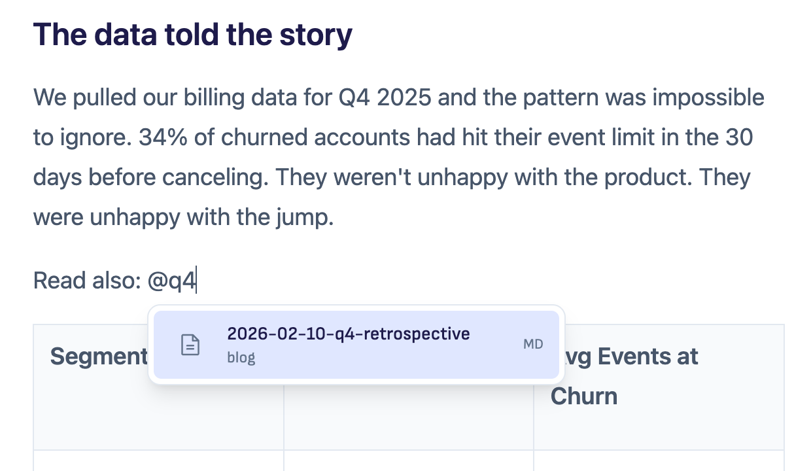
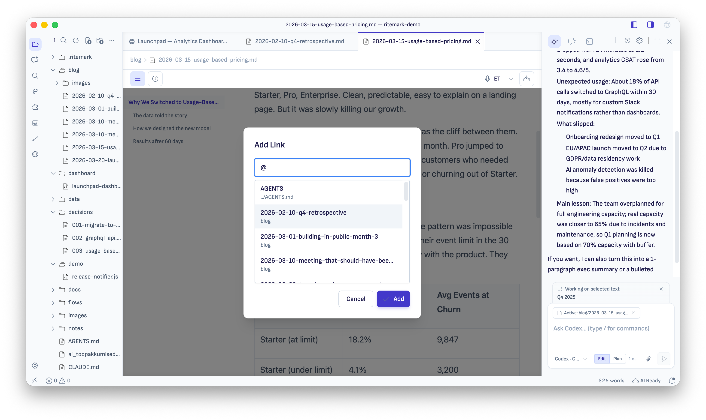
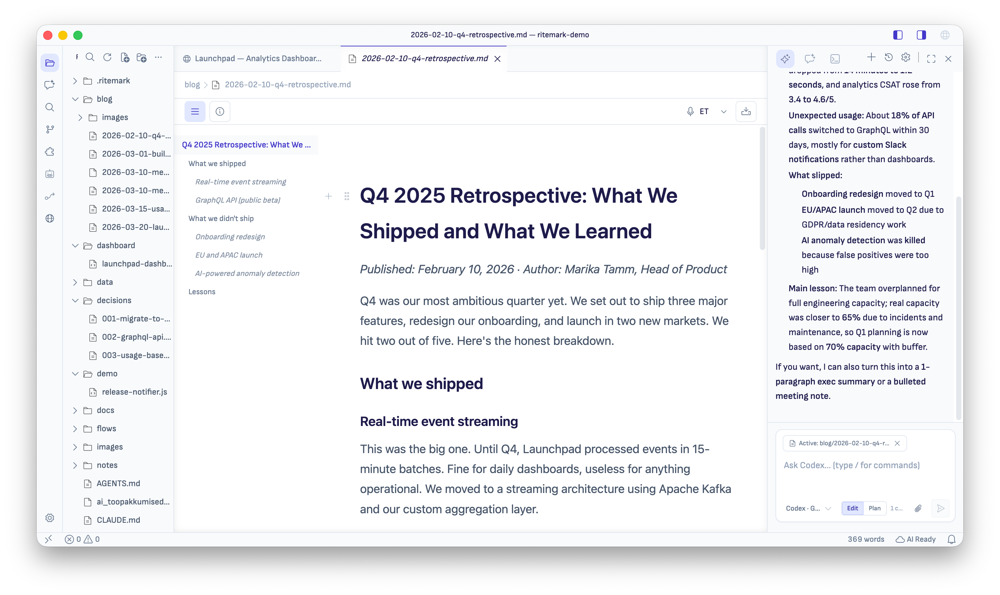

# Ritemark v1.7.2 — Link any file, restructure from the outline, leaner AI runtime

**Status:** Released  
**Type:** Feature release  
**Focus:** v1.7.2 sharpens the everyday Markdown loop and tidies the AI sidebar. Type `@` to link any file in your workspace, Cmd-click to follow those links, and change heading levels straight from the Table of Contents — all without leaving the keyboard. Behind the scenes, the AI sidebar now shows clearer model and runtime information, and a round of cleanup removed two unused subsystems so the app is leaner and the runtime is easier to trust.

* * *

## Downloads

| Platform | Download |
| --- | --- |
| macOS Apple Silicon (M1/M2/M3) | [Ritemark-arm64.dmg](https://github.com/jarmo-productory/ritemark-public/releases/latest/download/Ritemark-arm64.dmg) |
| macOS Intel | [Ritemark-x64.dmg](https://github.com/jarmo-productory/ritemark-public/releases/latest/download/Ritemark-x64.dmg) |

> **Windows:** The Windows installer is **coming shortly** as a follow-up asset on the v1.7.2 release page. The macOS Apple Silicon build is notarized and ready; the Windows build is the only platform still in progress.

* * *

## Why This Release

v1.7.2 started from one observation: the moment a writer wants to **link to another local file** is often the moment they have to leave Ritemark to find the path. They open Finder, click folders, count `..` segments, and return to type `../../briefs/q2-plan.md`. Later, following that link is equally clunky.

Sprint 72 closed that loop in three pieces:

-   **Type** `@` **anywhere in the editor** and a file-search picker opens. Type a few characters of any filename in the workspace. Press Enter — Ritemark inserts a Markdown link with the correct relative path and the basename as the visible text. The Add Link dialog (Cmd+K) understands the same `@`\-prefix so the two flows feel identical.
    
-   **Cmd-click that link to follow it.** Markdown targets open as Ritemark documents; PDFs, images, CSVs, source files open through VS Code's default opener so a doc-set can include diagrams, spreadsheets, and code references without dead links. Out-of-workspace traversal attempts and missing files surface non-blocking notifications instead of failing silently.
    
-   **Right-click any row in the persistent Table of Contents** and pick a heading level (H1–H6), or press `⌥⌘1-6` while a TOC row is focused. The whole change is a single undo step and the scroll position stays put — restructuring a long document no longer ricochets the viewport up and down.
    

This release also tidies the AI sidebar in two ways. First, model and runtime information is clearer: the model picker shows real available models as readable two-line rows with a proper scrollbar, and Settings reports the actual Claude and Codex runtime versions rather than guessing from a manifest. Second, a round of cleanup removed two subsystems that no longer earned their place — see *Cleanup* below.

Closes [#79](https://github.com/ProductoryHQ/ritemark-native/issues/79) (TOC heading-level changes from the context menu) and [#80](https://github.com/ProductoryHQ/ritemark-native/issues/80) (`@`\-mention local file links). Defers [#81](https://github.com/ProductoryHQ/ritemark-native/issues/81) (Markdown comment callouts) — an audit found the `marked` → TipTap → Turndown pipeline does not round-trip comments reliably enough to ship without rework.

* * *

## What's New

### Type `@` to link any local file

Anywhere in a Markdown document, type `@` and a search picker appears at the cursor. Start typing — results filter on the fly. Arrow keys move through the list, Enter inserts the file as a Markdown link with the basename as the visible text and a relative path as the target. Escape dismisses the picker without inserting anything.

Two important details from sprint owner feedback:

-   **All workspace files are searchable.** The original spec hard-coded a small allowlist (Markdown, txt, PDF, docx, xlsx, csv, images) and during dev verification typing `@test-utils.js` returned "No matching files." A technical writer cannot live with that. The allowlist is gone in v1.7.2 — any file outside heavy/generated folders (`node_modules`, `.git`, `dist`, `out`, `build`, `.next`, `.turbo`, `coverage`, `.app` bundles, `VSCode-*` outputs) is reachable. Markdown still ranks highest; docs/data/images rank next; code and configs come last but they exist.
    
-   **The Add Link dialog speaks the same** `@`**\-syntax.** Open the dialog with Cmd+K, type `@spec` in the URL field, pick `spec.md`, click Add. The relative path lands in the link the same way as the inline picker. The dialog hides the "open in browser" affordance for internal targets — relative paths are never silently auto-prefixed with `https://`.
    

### Cmd-click follows internal links

The `@`\-picker creates links that can finally be followed. Cmd-click (Ctrl-click on Windows/Linux) on any internal Markdown link in the editor:

-   **Markdown targets** (`.md`, `.markdown`, `.mdx`) open as Ritemark documents in a new tab.
    
-   **Everything else** — PDFs, images, CSVs, source files, configs — opens through VS Code's default opener, so the Markdown editor never tries to render a file it shouldn't.
    
-   **External URLs** (`http://`, `https://`) keep the existing system-browser behaviour.
    

The extension host validates every target. The resolved real path (symlinks followed) must lie inside the current workspace, or inside the document's parent directory when there is no workspace folder. Out-of-workspace traversal — including symlinks that escape the workspace at the real-path layer — surfaces a non-blocking warning "Link target is outside the workspace." Missing targets surface "File not found." Both refusals are visible by design; silent no-ops are not acceptable here.

Regular click on a link still opens the Edit Link dialog so you can edit or remove the link without modifier gymnastics. The dialog itself now has a small `↗` icon next to the URL input — works for both internal and external targets — that opens the current target without dismissing-then-clicking the link in the editor body.

### Heading levels from the Table of Contents

The persistent inline Table of Contents (the sticky 220-px rail to the left of the editor on screens ≥960px wide) now treats every row as more than a scroll anchor:

-   **Right-click any TOC row** and a context menu lists H1–H6 with the platform-correct shortcut hint (`⌥⌘1-6` on macOS, `Ctrl+Alt+1-6` elsewhere). The current heading's level is disabled — you can only move it, not toggle it back to itself.
    
-   `⌥⌘1-6` **works globally inside the editor.** A new TipTap extension catches the shortcut whether the cursor is inside a heading, at a heading boundary (the position the TOC click leaves the cursor in), or on focus inside a TOC row. The previous TipTap default kept extending text selections instead of changing levels; the new binding talks to a shared helper that uses `setNodeMarkup` so the change is a single undo step.
    
-   **Scroll position stays put.** Changing H2 to H4 on a heading that is currently off-screen no longer yanks the viewport. The helper captures the scroll container's `scrollTop` before the transaction and restores it after.
    
-   **Cmd+Z reverts the level in one step.** Heading-level changes are a single editor transaction by design — undo is not a multi-tap exercise.
    

The header-dropdown TOC variant (`components/header/TableOfContents.tsx`) is **removed** in this release. It was exported from `header/index.ts` but never imported by any consumer — dead code carried since Sprint 51's inline-ToC redesign.

### Clearer AI model and runtime information

The AI sidebar's model picker and Settings diagnostics now tell you what you're actually running:

-   **The model picker reflects real available models.** Claude options are warmed up from the bundled runtime, then rendered as a two-line row — model name/version on top, a short purpose line underneath — so you can tell models apart at a glance instead of scanning bare labels.
    
-   **Long model lists stay readable.** The picker has a constrained height with a thin vertical scrollbar and pointer-cursor rows, so a long list never pushes the rest of the sidebar off-screen and overflow is visually obvious.
    
-   **Settings shows the real runtime versions.** The Claude card shows CLI and SDK version together in one chip; the Codex card reports the app-server version read from the runtime itself (`--version`) rather than from a manifest file. No more "unknown" runtime strings when a runtime is actually present.
    

* * *

## Cleanup

v1.7.2 also retires two subsystems that no longer earned their place in the app. This is pure subtraction — Claude Code, Codex, Flows, API-key configuration, and saved conversations are all untouched.

-   **The "Legacy Agent" runtime is gone.** Ritemark used to offer a third chat runtime that called OpenAI/Gemini directly, separate from Claude Code and Codex. It had been deprecated for several releases. The agent selector now offers only **Claude Code** and **Codex** — the two canonical runtimes. Any conversation you previously had with the Legacy Agent still **opens read-only** so your history is preserved; you simply can't start a new Legacy Agent chat.
    
-   **Document search (RAG) is removed.** The semantic document-search / vector-index subsystem was no longer surfaced as a product feature but still shipped, signed, and notarized with every build. Removing it — and its `@orama/orama` dependency — slims the app and the AI dependency tree. There are no citation chips, no re-index affordance, and no index footer in the sidebar; none of those were doing anything for users.
    
-   **Windows packaging fix.** A dependency change in an earlier sprint had started pulling extra SDK packages into the production tree, which broke the Windows installer build (a file-handle / `EMFILE` failure during packaging). v1.7.2 stubs those unused peer dependencies so the Windows build packages cleanly again. This is invisible to users on macOS; it's what makes the forthcoming Windows installer possible.
    

* * *

## What's Not in This Release

-   **Markdown comment callouts (#81)** are deferred. The Sprint 72 audit found that the `marked` → TipTap → Turndown pipeline does not preserve `<!-- ... -->` comments reliably enough to ship editor-only callouts without a parser/export rework. The audit is in `docs/development/sprints/sprint-72-markdown-navigation-annotations/research/comment-callout-audit.md` and the precise blockers are recorded on the issue.
    
-   **No-workspace single-file mode for internal links** is functionally implemented and covered by unit tests in `internalLinkResolver.test.ts`, but the dev-mode manual smoke for that mode is intentionally deferred to a real bug report — the resolver tests cover both the "sibling inside doc parent" and "target escapes doc parent" cases.
    

* * *

## Under the Hood

-   Six new files in the webview side: `extensions/FileLinkSuggestions.tsx`, `extensions/FileLinkSuggestionList.tsx`, `extensions/HeadingLevelShortcuts.ts`, `components/ui/context-menu.tsx` (shadcn/Radix primitive), `lib/linkTargets.ts`, `lib/workspaceFileSearch.ts`.
    
-   Two new files on the extension-host side: `src/workspaceFileLinks.ts` (file enumeration + ranking) and `src/internalLinkResolver.ts` (path-traversal-safe resolution).
    
-   New TipTap extension `HeadingLevelShortcuts` re-binds `Mod-Alt-1..6` to a `setNodeMarkup`\-based heading-level change that works at heading boundaries — the StarterKit default `toggleHeading` failed silently when the cursor sat at the position the TOC click placed it.
    
-   One mid-sprint bug worth documenting because it is easy to repeat: `vscode.openWith` requires the **exact** `viewType` registered in `package.json`. Calling it with `ritemark.markdownEditor` (the descriptive name) silently falls back to the default text editor; the registered viewType is `ritemark.editor`. Any future `vscode.openWith` call should be cross-checked against the `customEditors` block in `extensions/ritemark/package.json`.
    
-   One macOS-specific gotcha: `fs.promises.realpath` ENOENTs for non-existent files, leaving the lexical path. When the parent dir is symlinked (the workspace lives under `/tmp` → `/private/tmp`), comparing the lexical missing path against a realpath'd workspace root rejects in-workspace missing files as out-of-workspace. The resolver now walks the parent chain to the deepest existing ancestor, realpath's that, and re-attaches the unresolved tail.
    

* * *

## Tests and Validation

-   `validate-qa.sh` passes on the sprint branch.
    
-   `cd extensions/ritemark/webview && npm run build` passes after model selector UI updates.
    
-   Unit tests (run via `npx tsx`): `workspaceFileLinks.test.ts`, `linkTargets.test.ts` (covers the `KNOWN_FILE_EXTENSIONS` regression — `spec.md`, `Notes.PDF`, `test-utils.js`, `Cargo.toml` all classify as internal; `example.com` and `foo.io` still classify as external), and `internalLinkResolver.test.ts` (11 cases including symlinked workspace root, symlink escape, path-traversal escape, missing file under symlinked parent, fragment/query stripping, URL-encoded paths).
    
-   Manual dev-mode QA matrix is recorded in `docs/development/sprints/sprint-72-markdown-navigation-annotations/tasks.md` Phase 7.5.
    
-   Sprint 73 dev-mode manual QA accepted: selector rows (model/version + tagline), visible vertical scrollbar for long lists, and pointer cursor on selectable model rows.
    
-   Sprint 74 (cleanup) verified: agent selector offers only Claude Code + Codex; a saved Legacy Agent conversation opens read-only without crashing; the AI sidebar loads with no console errors about removed `rag`/`openAIClient`/`ChatView` modules; Claude Code and Codex chats and Flows with LLM nodes all still run. The Windows packaging fix was validated on a real Windows build (`workflow_dispatch`) — macOS cannot reproduce the `EMFILE` failure locally.
    
-   The full v1.7.2 manual test checklist (all three platforms) lives in [`TEST-CHECKLIST.md`](./TEST-CHECKLIST.md).
    

* * *

## Sprints Rolled Up

-   **Sprint 72** — Markdown navigation + annotations: `@`-mention file links, Cmd-click internal-link navigation, TOC heading-level shortcuts (user-facing headline)
-   **Sprint 73** — Bundled runtime + AI model-selector clarity (user-facing)
-   **Sprint 74** — Legacy Agent + RAG removal (cleanup) — plus the Windows packaging dependency fix

* * *

## What's Coming Next

This is primarily a Markdown-editing-loop release, with the AI sidebar tidied up along the way. The next release will return to the AI/agent surface backlog (Agent Library polish, possibly the deferred Markdown comments work behind a proper parser rework). The `@`\-link feature is intentionally minimal — no backlinks, no graph view, no AI-suggested links — and we'll only expand from here if real usage shows the simpler version is missing something.

The Windows installer for v1.7.2 will be published to the same release page as a follow-up asset — no version bump, no new tag.
