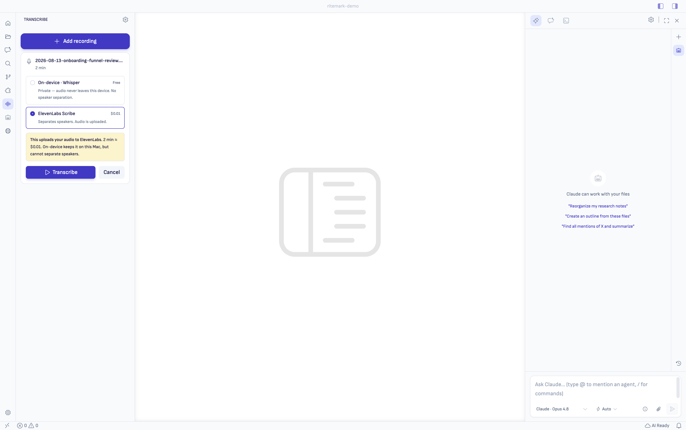
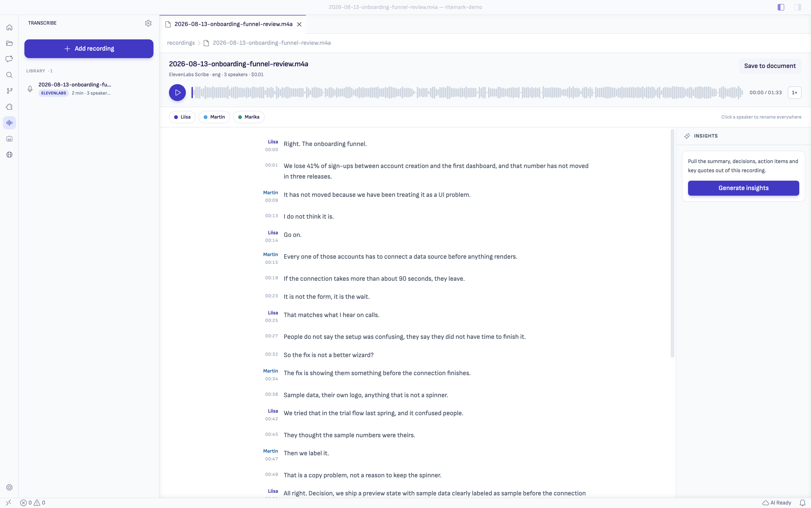
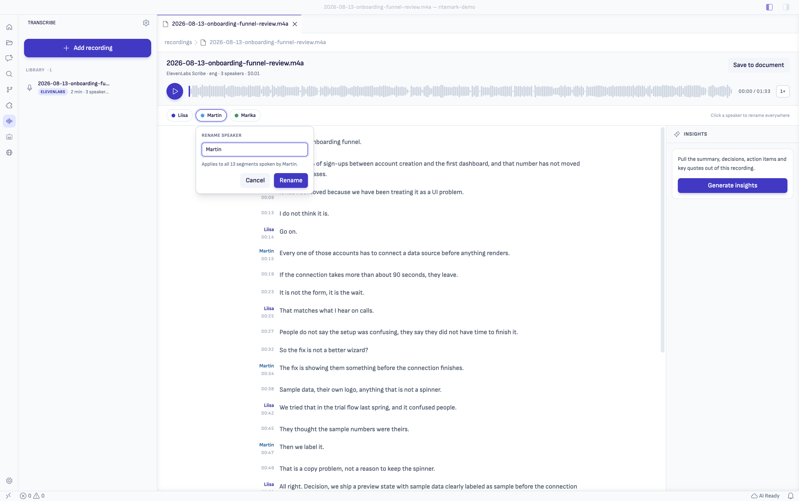
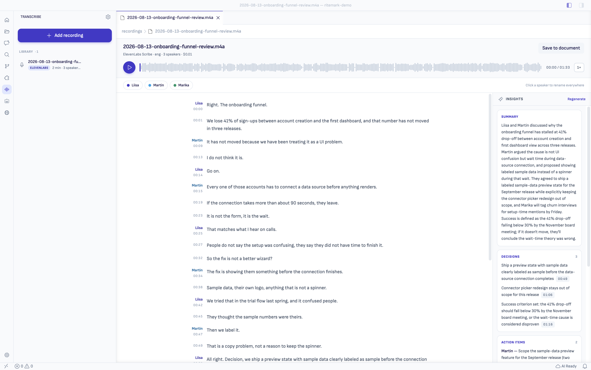
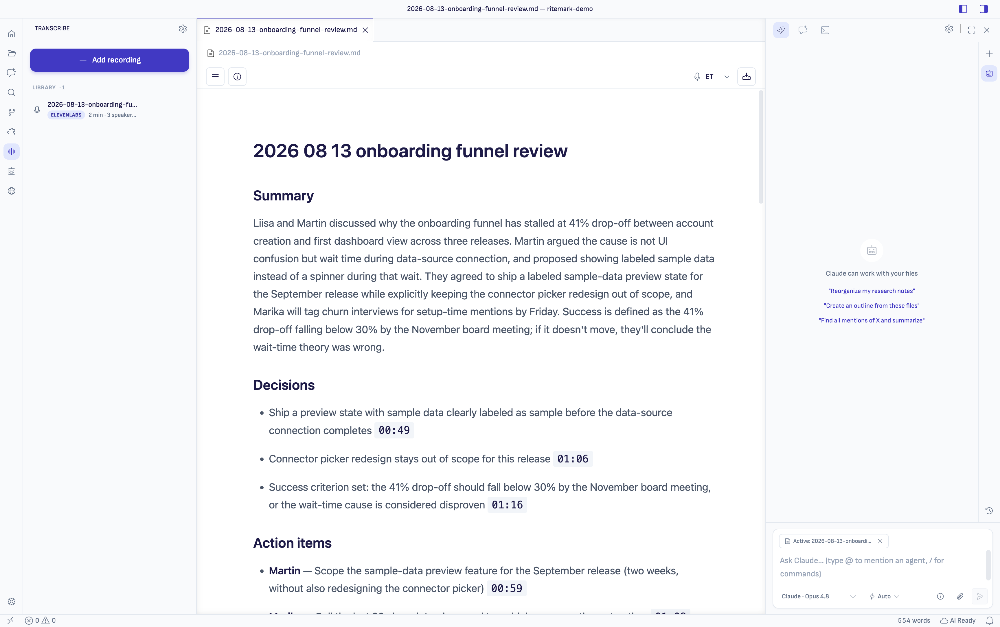
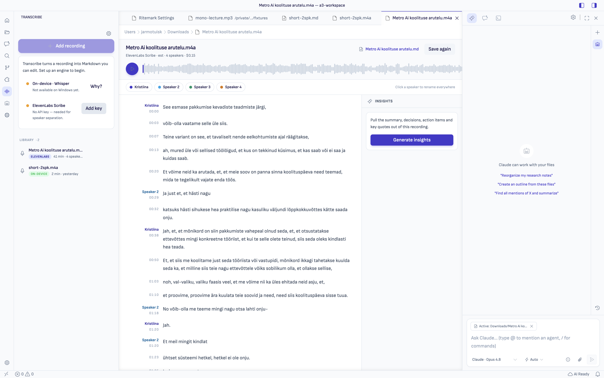

# Ritemark 1.9.0 — Transcribe

Ritemark 1.9.0 turns a recording into a document you can work with, without
leaving the app.

If you record meetings, interviews or workshops, the round trip has been the
same for years: upload the file somewhere, wait for a transcript, reformat it
by hand, bring it back. Ritemark now does all of it in one place — and lets you
decide, per recording, whether the audio leaves your machine at all.

## Highlights

**Drop in a recording, get a document.** A new **Transcribe** app in the
Activity Bar takes `.m4a`, `.mp3`, `.wav`, `.flac`, `.ogg` or `.aac` and
produces a transcript you can read, correct, play back and save as Markdown.

**Two engines, and you choose knowingly.** Nothing runs until you pick one, and
the trade is on screen when you do:

- **On-device (Whisper)** — free, the audio never leaves your machine, and it
  **cannot tell speakers apart**. Apple silicon only; on an Intel Mac the card
  says so and ElevenLabs is the route
- **ElevenLabs Scribe** — separates speakers, uploads the file, and shows the
  estimated cost before it does

We could have hidden that difference behind a settings toggle. We did not:
"private" and "knows who spoke" are genuinely exclusive today, and that belongs
in front of you at the moment you decide, not in a preferences pane.

**Click a line to hear it.** The Transcript Workbench is a real editor for a
recording — waveform, playback speed, speaker-separated text. Click any line
and the audio plays from exactly there.

That is the whole point. A quote you are about to send a client can be checked
against the recording in two seconds.

**Name the speakers once.** ElevenLabs returns "Speaker 1", "Speaker 2".
Rename one and every line follows — in the transcript, and in the document you
save.

**Words the engine was unsure about are marked.** Names, jargon, code-switching
between languages — the places transcripts usually go quietly wrong are
highlighted so you know where to look. Both engines report it.

**Insights, with receipts.** Pull the summary, decisions, action items, open
questions and key quotes out of a recording. Every item carries a timestamp
that plays the moment it came from, and anything the model cannot tie to a real
line is discarded rather than shown.

**Save to a document you own.** Choose the folder; Ritemark writes Markdown
with front matter, speaker headings and timestamps, and keeps it linked in the
workbench header. The AI sidebar treats it as the active file, so "ask Claude
about this recording" works on the transcript rather than on an audio file it
cannot read.

**Long recordings behave.** A 60-minute file transcribes on-device in about two
and a half minutes on Apple silicon. Close the panel and the job keeps running,
with progress on the Activity Bar icon. Cancel stops it immediately. If
Ritemark closes mid-transcription, the recording comes back marked
**Interrupted** rather than silently vanishing.

## Windows

Transcribe works on Windows with ElevenLabs. The on-device engine is macOS-only
for now — Ritemark says so plainly rather than hiding the feature.

Follow [#133](https://github.com/ProductoryHQ/ritemark-native/issues/133) for
on-device transcription on Windows.

## Getting started

1. Click the waveform icon in the Activity Bar
2. **Add recording**, or drag an audio file from the Folder view
3. Pick an engine — for speaker separation, add an ElevenLabs API key in
   **Settings → API Keys** first
4. **Transcribe**, then **Save to document** when you are happy with it

Full guide: [Transcribe](../../user/features/transcribe.md).

## Also in this release

- Waveform, playback speed (1× to 2×), keyboard control (space, ←, →)
- Transcripts are scoped to the folder they were made in — one project does not
  show another's recordings
- A recording that moves can be relinked without losing its transcript
- Stored transcript data is visible and clearable in **Settings**
