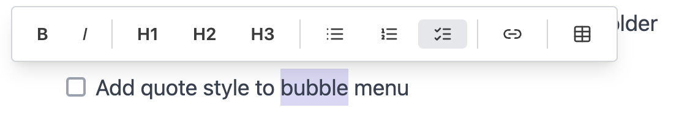

# Feature Wishlist

A collection of ideas for future development. No commitment, no order - just a place to capture inspiration.

* * *

## Text Editor

- [ ] Add images from command palette (it means user can select a file from their computer, the file is uploaded to /images folder.
- [ ] Remove Table from bubble menu (it is not related to formatting)
- [ ] Add quote style to bubble (formatting) menu 
- [ ] Add Youtube (any other streaming) videos from / command palette
- [ ] Image selected state (user can click on image and it shows that it is selected, also investigate whether it is possible to "resize" the image)
- [ ] PDF preview (read-only viewer)
- [ ] Word (.docx) preview (read-only viewer)
- [ ] Text-editor should display if the webviewer state becomes stale and needs refreshing (like Data editor does)

## Data Editor

CSV editing, Excel/spreadsheet preview

- [ ] Rebrand current Excel viewer as "Data Editor"
- [ ] CSV full editing improvements (sort, filter, column operations)
- [ ] Excel (.xlsx) editing (currently preview-only)
- [ ] PowerPoint (.pptx) preview

## Onboarding / Welcome Screen

Redesign Welcome screen for total newbies

- [ ] Clear "Getting Started" section with step-by-step guides
- [ ] How to open/create your first document
- [ ] How to install AI coding assistants from terminal: Claude Code Codex CLI Gemini CLI
- [ ] Visual tutorials / article links
- [ ] Make it obvious what to do first

## Dictate

- [ ] When launched first time easy to digest checklist whether the dependencies are installed in computer (first-launch wizard)

## File Management

- [ ] Recent files list on welcome page - \[ \] File templates (blog post, meeting notes, etc.)
- [ ] Quick switcher improvements

## AI Assistant

- [ ] Advanced Claude Code harness support - \[ \] Sub-agents - \[ \] Skills
- [ ] Memories
- [ ] Customization (CLAUDE.md, Agents.md support)
- [ ] AI image generation via command palette - \[ \] Opens dialog to configure Google API key - \[ \] Uses Gemini API to generate images
- [ ] On left sidebar - possibility to edit Agents and Skills/Tools of Claude Code
- [ ] RAG to support pdf, word, ppt etc (finishing sprint-24 ideas, but we need to solve local-first dilemma)

## Export

- [ ] Batch export folder as .zip of DOCX

## Collaboration

- [ ] Sharing (online, cloud sharing, view permissions)

## Integrations

- [ ] Sync to cloud (Google Drive, SharePoint)

* * *

## Completed

- [x] In-app update notifications (like Cursor) - \[x\] Show banner when new version available - \[x\] "Later" / "Install Now" buttons
- [x] Save as PDF
- [x] Save as DOCX
- [x] Copy code button in code blocks → **Sprint 14**
- [x] Quotation styles
- [x] Paste inline images (screenshots, data URLs) → save as local files
- [x] Clicking on link opens link editing dialog → **Sprint 14**
- [x] Display images with relative paths in editor
- [x] Markdown front-matter support (visual UI via properties dialog)
- [x] HTML table paste from web (Google Docs, Wikipedia) - Sprint 15
- [x] Task list checkboxes (`- [ ]` / `- [x]`) - Sprint 13
- [x] Word count / reading time in status bar
- [x] CMD+B shortcut fixed (toggles bold, not sidebar)
- [x] Increased codeblock font size
- [x] H3 button in formatting palette
- [x] Autosave enabled by default (1 second delay)
- [x] AI panel header made sticky
- [x] Show + button on hovered line (left side) to add blocks → **Sprint 14**
- [x] Show drag handle with the + → **Sprint 14**
- [x] Cursor randomly jumps to bottom of page
- [x] When deleting table column, it leaves a "ghost" column
- [x] Nested checklist is broken after edits
- [x] Copy-paste screenshot on Mac creates double image (needs investigation)

* * *

*Last updated: 2026-01-28*