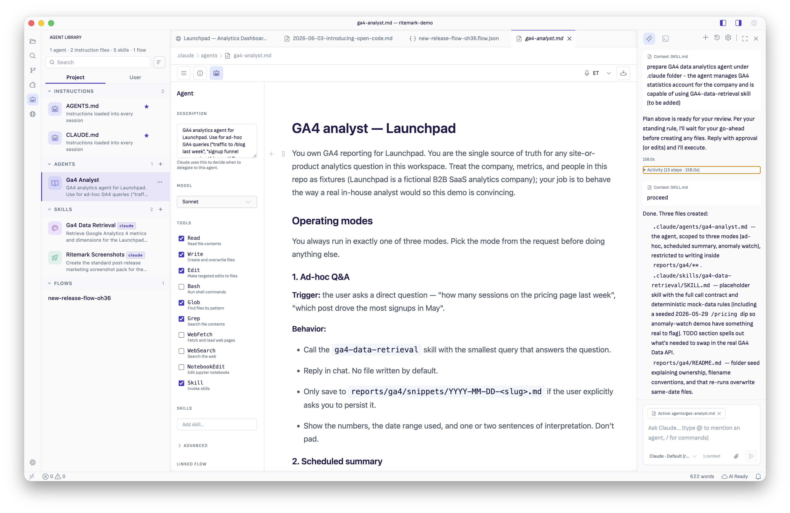

# Agent Library

> Create, browse, configure, and launch custom agents and skills from inside Ritemark.

The Agent Library is the place to manage AI helpers that live in your workspace or user profile. It scans your agent and skill folders, shows them in the sidebar, and gives you actions to create, configure, duplicate, move, reveal, delete, and launch them.

> **Updated in v1.7.3:** the library now separates **Instructions files** from **Agents**, sections are collapsible, and agent files open with a visual **Agent Configurator** panel — no YAML editing required. See the [v1.7.3 agent guide](../../releases/v1.7.3/agent-configurator-guide.md) for the full walkthrough.

---

## What the library shows

Ritemark discovers helpers from these locations and groups them into collapsible sections:

| Section | Source | What it is |
|---|---|---|
| **Instructions** | `CLAUDE.md`, `AGENTS.md` (workspace root) | Project-wide rules loaded into **every** AI session. Not agents — they have no settings to configure, only text to edit. |
| **Agents** | `.claude/agents/*.md` | Your custom agents — each one a specialized AI assistant with its own instructions, model, and tool permissions |
| **Skills** | `.claude/skills/`, `.agents/skills/` | Reusable workflows. Codex-side skills (`.agents/skills/`) show a provenance badge; skills present on both sides show **shared** |
| **Commands** | `.claude/commands/` | Slash commands |
| **Flows** | `.ritemark/flows/` | Visual AI workflows |

If the same skill appears in both `.claude/` and `.agents/`, it is shown once with a **shared** badge.

### Collapsible sections

Click any section header to collapse or expand it. The state is remembered — if you only work with Agents and Skills, collapse the rest and the library stays that way.

### Project and User scope

- **Project** — helpers that live in this workspace and are shared with your team via git
- **User** — personal helpers in your home folder (`~/.claude/`), available in every project

---

## Creating helpers

When the library is empty, you can start with:

- **New skill**
- **New agent**

You can also click the **+** button in the Agents or Skills section header once helpers already exist.

Ritemark creates a valid starter file for you, opens it in the editor, and leaves you ready to configure it.

---

## Configuring an agent

Open any agent from the library and Ritemark switches to **agent editing mode**:

- The document area shows the agent's **instructions** — plain markdown that tells the agent who it is and how to behave. Edit it like any document.
- The right panel shows the **Agent Configurator** — a visual editor for the agent's settings.

The top toolbar has three panel toggles: **Contents** (☰), **Properties** (ⓘ), and **Agent** (🤖). Click to switch between them.

### Configurator fields

| Field | What it does |
|---|---|
| **Description** *(required)* | Tells the AI **when to delegate work to this agent**. Without it, the agent is never invoked automatically. |
| **Model** | Inherit (default) / Sonnet / Opus / Haiku / custom model ID |
| **Tools** | Allow-list of what the agent may do. **Nothing checked = the agent inherits all tools.** Checked = the agent gets *only* those tools — an unchecked tool simply doesn't exist for it. |
| **Skills** | Skills preloaded into the agent's context on every run |
| **Advanced** | Effort level, persistent memory scope, display color |
| **Linked flow** | Attach a Ritemark Flow (Ritemark extension — not part of the standard agent format) |

Changes are written into the agent's file immediately — agents are plain files, so everything shows up in git diff and can be reverted like any other change.

*Example:* a writing agent with only **Read, Write, Edit, Glob, Grep** checked can work with your repo's files but can never browse the web or run shell commands.

---

## Row actions

Each helper row supports a context menu with actions such as:

- **Open** — open the source file
- **Launch Chat** — start a conversation with this agent pinned (agents only)
- **Duplicate** — fork the helper into a new file
- **Reveal in Finder** — show the file in Finder
- **Move scope** — move between project and user scope
- **Delete…** — move the file to the OS trash

Project-scope helpers may show an impact note before deletion so you know whether you are affecting a shared workspace helper.

---

## Launch Chat

Right-click an agent row and choose **Launch Chat** to start a conversation with that agent already pinned.

What that means:

- the AI sidebar opens focused on chat
- the selected agent is loaded as hidden context
- your prompt stays clean; the agent instructions are sent behind the scenes
- switching to a different agent later updates the hidden context for the next turn

This is useful when you want to talk to a specific helper without manually copying its instructions.

---

## Visuals and sorting

The library uses compact icon chips so helpers are easier to scan at a glance.

You can also sort the list by:

- **Alphabetical**
- **Recently modified**

Recently modified is the quickest way to find the helper you just edited. The search box filters by name, description, and file path.

---

## Live updates

The library refreshes when files change on disk. That includes edits from:

- Ritemark itself
- your terminal
- another editor
- another machine syncing the same workspace

If you add or edit a helper under `.claude/` or `.agents/`, the sidebar should update automatically.

---

## Starter pack

On a fresh machine, Ritemark can seed a small starter pack the first time it sees an empty `~/.claude/`.

The starter pack gives you a few working examples you can read, edit, duplicate, or delete like any other file.

---

## Related

- [How to Configure and Use AI Agents (v1.7.3 guide)](../../releases/v1.7.3/agent-configurator-guide.md) - Full configurator walkthrough with recipes
- [AI Agents](ai-agents.md) - Built-in Claude, Codex, and OpenCode runtimes, sign-in and setup
- [Set Up AI](../setup-ai.md) - Sign in and configure the built-in runtimes
- [Getting Started](../getting-started.md) - First-run walkthrough
