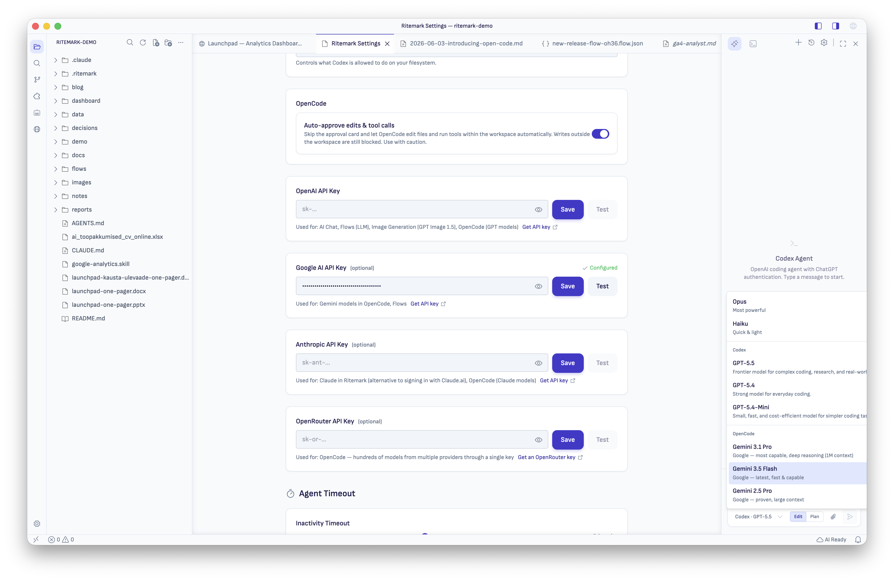
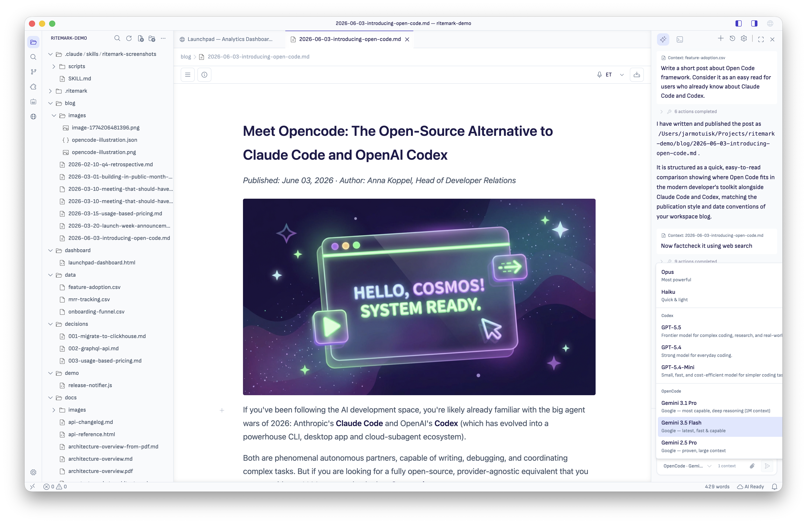

# Set Up AI

> Configure Ritemark's built-in AI and optional terminal AI tools.

Ritemark works great without any AI features. But if you want AI-powered editing, here's how to set everything up.

Ritemark's AI sidebar runs three agents — **Claude Code**, **Codex**, and **OpenCode**. Set up
whichever one you want to use below. If you use **Flows**, you'll also need an OpenAI API key (see
[OpenAI API Key for Flows](#openai-api-key-for-flows)).

> **New in v1.7.3:** **OpenCode** joins Claude Code and Codex as a third, bring-your-own-key chat
> runtime. Where Claude and Codex use their own sign-in, OpenCode points at any provider you already
> have an API key for. See [OpenCode (bring your own key)](#opencode-bring-your-own-key) below.

> **Changed in v1.7.2:** The earlier built-in "Ritemark Agent" — a direct OpenAI chat assistant with
> rephrase / find-and-replace / insert tools and document search — has been removed. The OpenAI API
> key is no longer used by a chat agent; it now only powers Flows LLM and Image nodes.

---

## Claude Code

Claude Code is Anthropic's coding agent. As of v1.6.3, you sign in entirely from inside Ritemark — no terminal commands required.

For the authoritative agent overview, see [AI Agents](features/ai-agents.md).
For custom helpers and Launch Chat, see [Agent Library](features/agent-library.md).

### In-app sign-in (recommended)

1. Open Ritemark.
2. Either:
   - Open **Settings** (gear icon) and find the Claude row, **or**
   - Open the **AI sidebar** and switch the agent to Claude.
3. Click **Sign in**. Your system browser opens with the Anthropic OAuth flow.
4. Approve, return to Ritemark — Settings and the AI sidebar both update to "Connected".

If you'd rather paste a key instead of using OAuth, click **Use Anthropic API key** in the same flow and paste your key. Ritemark stores it in your system's secure credential store.

You can cancel an in-progress sign-in from the same UI; sign-in times out after 5 minutes.

### Learn more

For Claude usage instructions (slash commands, planning, agent skills), see Anthropic's official documentation:
**[Claude Code Documentation](https://docs.anthropic.com/en/docs/claude-code/overview)**

### Advanced / fallback — manual install

If you prefer to manage Claude yourself (or you want to use a globally installed Claude alongside Ritemark's bundled runtime):

```bash
# npm
npm install -g @anthropic-ai/claude-code

# Homebrew (macOS)
brew install claude-code
```

Then authenticate from a terminal:

```bash
claude auth
```

Ritemark detects globally installed Claude binaries and uses them when present.

---

## OpenAI Codex

Codex is OpenAI's coding agent. As of v1.6.3, sign-in is unified across Settings and the AI sidebar — both surfaces open your system browser instead of dropping you into a terminal, and they stay in sync.

For the authoritative agent overview, see [AI Agents](features/ai-agents.md).
For custom helpers and Launch Chat, see [Agent Library](features/agent-library.md).

### In-app sign-in (recommended)

1. Open Ritemark.
2. Either:
   - Open **Settings** (gear icon) and find the ChatGPT row, **or**
   - Open the **AI sidebar** and switch the agent to Codex, then click **Sign in with ChatGPT**.
3. Your system browser opens with the OpenAI OAuth flow.
4. Approve, return to Ritemark — both Settings and the AI sidebar update.

Signing out from one surface signs you out everywhere.

### Learn more

For Codex usage instructions, see OpenAI's official documentation:
**[Codex CLI Documentation](https://github.com/openai/codex)**

### Advanced / fallback — manual install

If you prefer to manage Codex yourself:

```bash
npm install -g @openai/codex
```

Set your API key (only needed for the standalone CLI, not for in-app sign-in):

```bash
export OPENAI_API_KEY='your-key-here'
```

---

## OpenCode (bring your own key)

> Added in v1.7.3.

OpenCode is a third AI chat runtime, alongside Claude Code and Codex, integrated over the **Agent
Client Protocol (ACP)**. Unlike Claude and Codex, OpenCode has no sign-in of its own — it is
**bring-your-own-key**. You point it at any provider you already have an API key for and pick from
that provider's models.

The OpenCode runtime ships bundled with Ritemark; there is nothing to install.

### Step 1: Add a provider API key

1. Open **Settings** (gear icon).
2. Find the API-key fields and paste a key for any provider you want OpenCode to use:
   - **OpenAI** — GPT models
   - **Google AI** — Gemini models
   - **Anthropic** — Claude models
   - **OpenRouter** — a wide range of models from many providers (new in v1.7.3)
3. Keys are stored securely in your system's credential store.



You can configure more than one provider. Only providers with a saved key become available in
OpenCode.

### Step 2: Pick an OpenCode model

1. Open the **AI sidebar** and open the model picker.
2. Scroll to the **OpenCode** group (it appears after Codex).
3. The group lists models only from providers whose key you've configured — add a Google AI key and
   Gemini models appear, add OpenAI and GPT models appear, and so on. With no keys configured, the
   group prompts you to open Settings.



> The OpenCode group refreshes the moment you save or remove a provider key — no window reload
> needed (fixed in v1.7.3).

### File edits and approval

When OpenCode wants to edit a file you have open, Ritemark shows a single **File Change Approval**
card with the target path. The file on disk is **untouched until you Approve**. Writes outside your
workspace are rejected automatically.

For hands-free runs, Settings → OpenCode has an **Auto-approve edits & tool calls** toggle. Even
with auto-approve on, out-of-workspace writes stay blocked.

### Learn more

For OpenCode usage and provider details, see the project's documentation:
**[OpenCode](https://opencode.ai)**

---

## OpenAI API Key for Flows

[Flows](features/flows.md) use an OpenAI API key for their **LLM Prompt** and **Image Generation**
nodes. This key is not needed for the Claude or Codex sidebar agents — only for running Flows.

### Step 1: Get an API Key

1. Go to [platform.openai.com](https://platform.openai.com)
2. Sign in or create an account
3. Navigate to **API Keys** (under your profile menu)
4. Click **Create new secret key**
5. Name it something like "Ritemark"
6. Copy the key (starts with `sk-`)

**Important:** You can only see the key once. Save it somewhere safe.

#### API Credits

OpenAI requires prepaid credits:
- New accounts may include free credits
- Add payment method and credits at the Billing section
- Typical usage costs pennies per session

### Step 2: Add Key to Ritemark

1. Open Ritemark
2. Open **Settings** (gear icon), or open the **Settings** panel inside Flows
3. Paste your API key in the OpenAI field
4. Your key is stored securely in your system's credential store

For Flows-specific configuration (default LLM and image models), see [Flows → Requirements](features/flows.md#requirements).

---

## Agent Runtime (v1.7.0+)

By default, Ritemark ships its own bundled Claude and Codex binaries. If you prefer to use your own system-installed versions:

1. Open **Settings** (gear icon).
2. Find the **Agent Runtime** section.
3. Switch from **Bundled** to **System**.

The "Currently active:" path shown below the dropdown tells you which binary Ritemark is actually running — useful for verifying your system install is being picked up.

**When to use System runtime:**
- You want to use a specific version of Claude or Codex you've installed yourself.
- You're testing a newer Codex or Claude CLI release before it ships bundled with Ritemark.

**When to use Bundled (default):**
- You haven't installed Claude or Codex manually.
- You want the exact version Ritemark has tested against.

---

## Privacy Notes

- API keys are stored in your system's secure credential store
- Text is sent to the respective AI provider's servers for processing
- Ritemark doesn't store or transmit your data elsewhere
- Browser page content is only shared with the AI after you explicitly allow it via the "Share with Agent?" prompt
- See each provider's usage policies for details

---

## Without AI

Ritemark works perfectly without any AI configured:
- All editing features work
- Export works
- CSV/Excel viewing works

You can always add AI later.

---

## Related

- [AI Agents](features/ai-agents.md) - Built-in Claude, Codex, and OpenCode agents
- [Flows](features/flows.md) - Visual AI workflows (use the OpenAI key)
- [Getting Started](getting-started.md) - Basic setup
